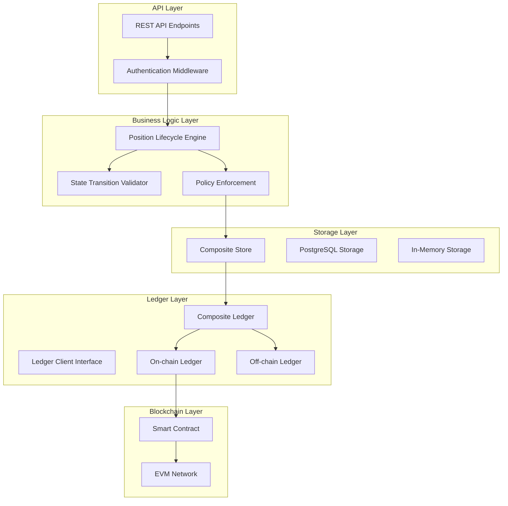
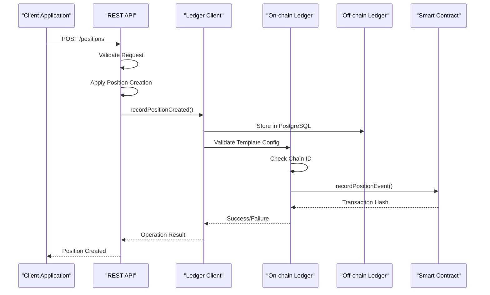
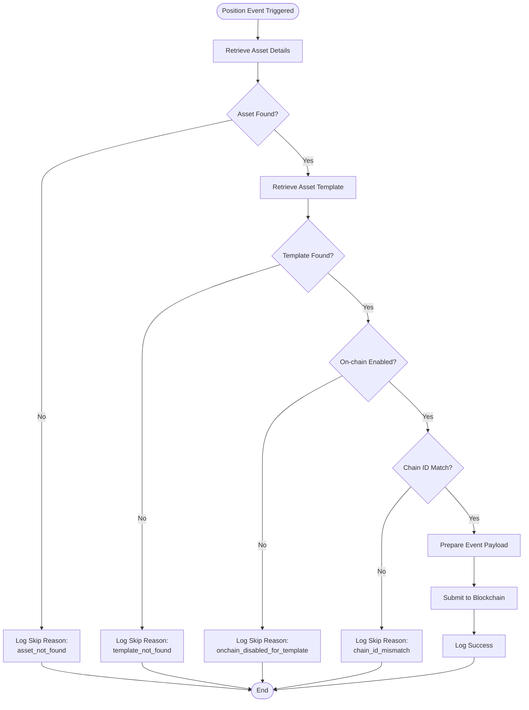
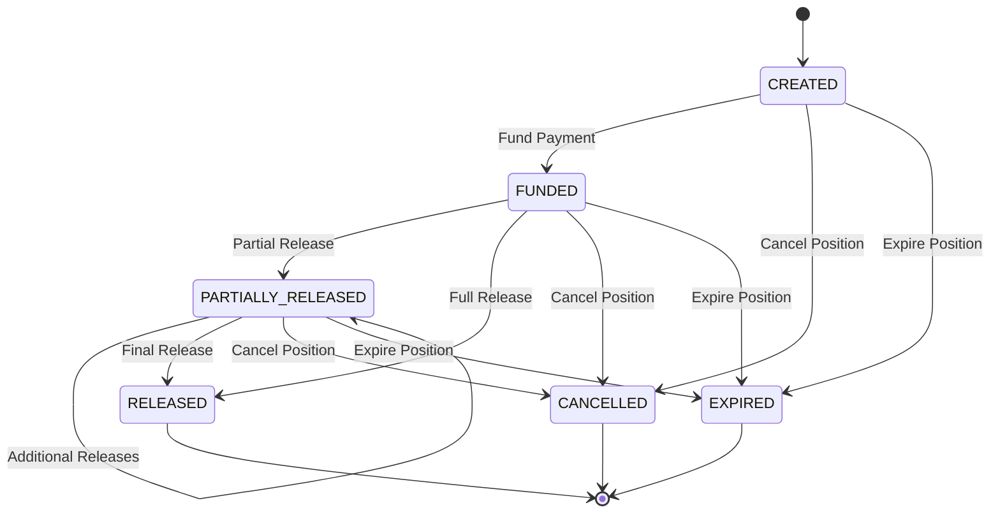
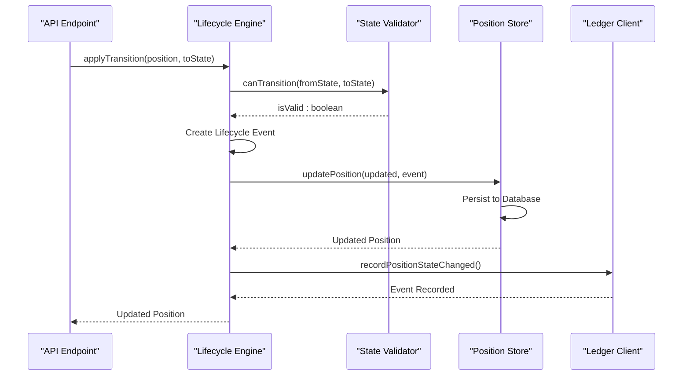
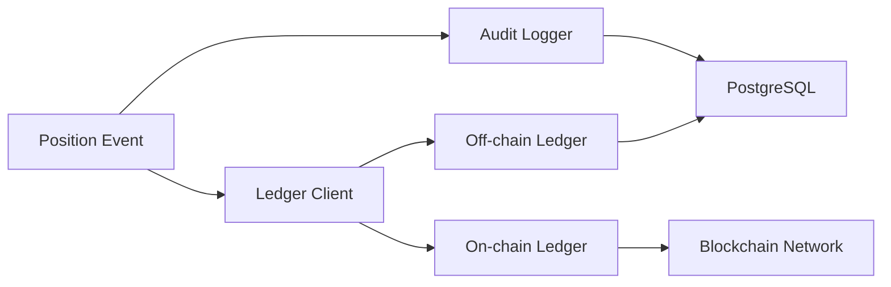
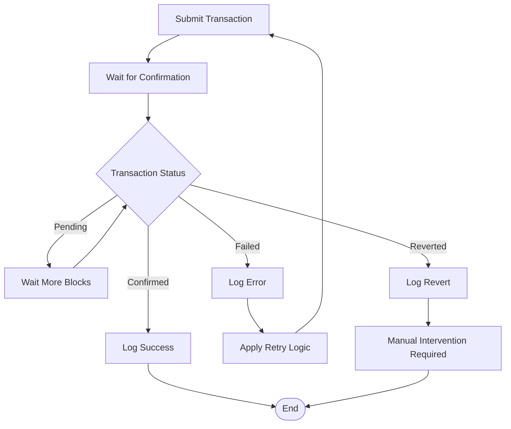
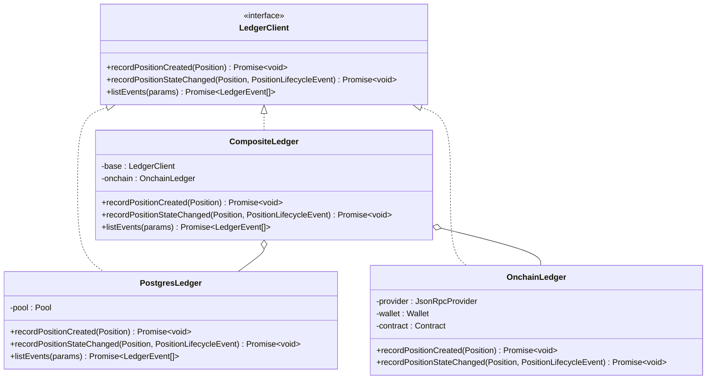
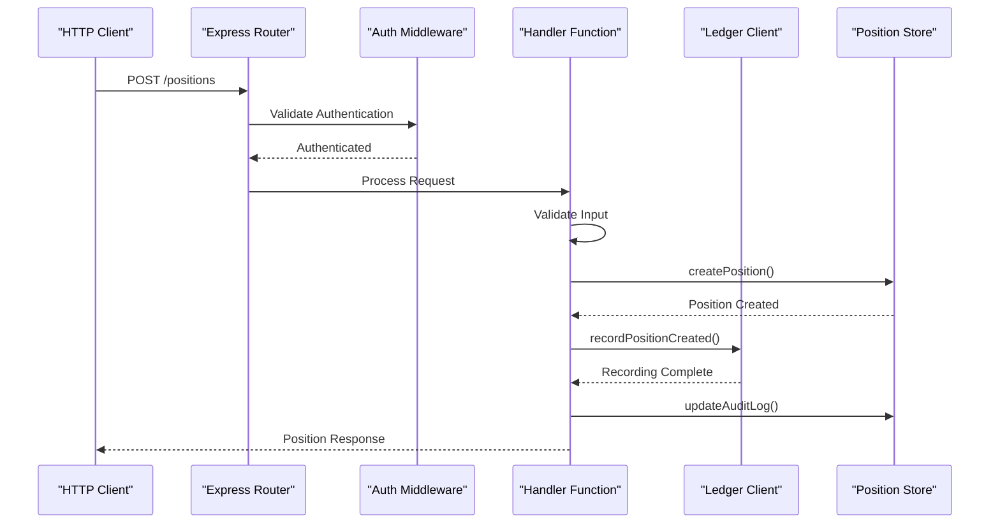

# Event Recording & Lifecycle Management

<cite>
**Referenced Files in This Document**
- [src/infra/onchainLedger.ts](file://src/infra/onchainLedger.ts)
- [src/infra/ledgerClient.ts](file://src/infra/ledgerClient.ts)
- [src/domain/ledger.ts](file://src/domain/ledger.ts)
- [src/domain/types.ts](file://src/domain/types.ts)
- [src/domain/lifecycle.ts](file://src/domain/lifecycle.ts)
- [src/api/positions.ts](file://src/api/positions.ts)
- [src/config.ts](file://src/config.ts)
- [src/store/postgresStore.ts](file://src/store/postgresStore.ts)
- [src/infra/auditLogger.ts](file://src/infra/auditLogger.ts)
- [db/schema.sql](file://db/schema.sql)
</cite>

## Table of Contents
1. [Introduction](#introduction)
2. [System Architecture Overview](#system-architecture-overview)
3. [Dual Ledger Design](#dual-ledger-design)
4. [On-chain Event Recording](#on-chain-event-recording)
5. [Event Payload Structure](#event-payload-structure)
6. [Position Lifecycle Management](#position-lifecycle-management)
7. [Error Handling and Logging](#error-handling-and-logging)
8. [Transaction Monitoring and Recovery](#transaction-monitoring-and-recovery)
9. [Integration Patterns](#integration-patterns)
10. [Best Practices and Idempotency](#best-practices-and-idempotency)
11. [Troubleshooting Guide](#troubleshooting-guide)

## Introduction

EscrowGrid implements a sophisticated dual-ledger architecture that combines traditional off-chain storage with on-chain event recording for position lifecycle management. This system ensures data integrity through blockchain attestations while maintaining high-performance transaction processing capabilities.

The event recording system handles two primary event types: `POSITION_CREATED` and `POSITION_STATE_CHANGED`, each with distinct payload structures and validation requirements. The architecture employs a composite pattern where both on-chain and off-chain ledgers operate concurrently, providing redundancy and auditability.

## System Architecture Overview

The event handling system follows a layered architecture with clear separation of concerns:



**Diagram sources**
- [src/api/positions.ts](file://src/api/positions.ts#L1-L298)
- [src/domain/lifecycle.ts](file://src/domain/lifecycle.ts#L1-L51)
- [src/infra/ledgerClient.ts](file://src/infra/ledgerClient.ts#L1-L64)

**Section sources**
- [src/api/positions.ts](file://src/api/positions.ts#L1-L298)
- [src/domain/lifecycle.ts](file://src/domain/lifecycle.ts#L1-L51)
- [src/infra/ledgerClient.ts](file://src/infra/ledgerClient.ts#L1-L64)

## Dual Ledger Design

EscrowGrid implements a dual-ledger architecture that maintains synchronization between on-chain and off-chain records. This design provides several benefits:

### Off-chain Ledger (Primary)
- **PostgreSQL Storage**: Persistent, ACID-compliant storage for high-performance operations
- **Position Events**: Comprehensive lifecycle tracking with full event history
- **Audit Trail**: Complete audit logs for compliance and debugging
- **Query Performance**: Optimized indexing for complex queries

### On-chain Ledger (Secondary)
- **Blockchain Attestation**: Immutable proof of position creation and state changes
- **Template-based Control**: Per-asset-template on-chain enablement toggles
- **Chain Validation**: Cross-chain ID verification for multi-chain deployments
- **Smart Contract Integration**: Standardized event recording interface



**Diagram sources**
- [src/api/positions.ts](file://src/api/positions.ts#L120-L144)
- [src/infra/ledgerClient.ts](file://src/infra/ledgerClient.ts#L17-L32)
- [src/infra/onchainLedger.ts](file://src/infra/onchainLedger.ts#L25-L119)

**Section sources**
- [src/infra/ledgerClient.ts](file://src/infra/ledgerClient.ts#L1-L64)
- [src/infra/onchainLedger.ts](file://src/infra/onchainLedger.ts#L1-L221)
- [src/infra/postgresLedger.ts](file://src/infra/postgresLedger.ts#L1-L106)

## On-chain Event Recording

The `OnchainLedger` class implements the `recordPositionEvent` smart contract function to handle on-chain event recording. The system validates multiple configuration layers before attempting blockchain transactions.

### Initialization and Configuration

The on-chain ledger requires specific environment variables for proper initialization:

| Configuration Parameter | Description | Required |
|------------------------|-------------|----------|
| `ONCHAIN_RPC_URL` | Ethereum JSON-RPC endpoint | Yes |
| `ONCHAIN_PRIVATE_KEY` | Wallet private key for signing | Yes |
| `ONCHAIN_CONTRACT_ADDRESS` | Smart contract address | Yes |
| `ONCHAIN_CHAIN_ID` | Target blockchain network ID | No |

### Template-based Validation

Each position undergoes comprehensive validation against asset template configurations:



**Diagram sources**
- [src/infra/onchainLedger.ts](file://src/infra/onchainLedger.ts#L25-L119)
- [src/infra/onchainLedger.ts](file://src/infra/onchainLedger.ts#L121-L219)

**Section sources**
- [src/infra/onchainLedger.ts](file://src/infra/onchainLedger.ts#L16-L23)
- [src/config.ts](file://src/config.ts#L1-L47)

## Event Payload Structure

EscrowGrid defines distinct payload structures for each event type, optimized for both on-chain storage and off-chain processing.

### POSITION_CREATED Event Structure

The `POSITION_CREATED` event captures initial position attributes and institutional context:

| Field | Type | Description | Required |
|-------|------|-------------|----------|
| `institutionId` | string | Associated institution identifier | Yes |
| `assetId` | string | Asset identifier within institution | Yes |
| `currency` | string | ISO currency code | Yes |
| `amount` | number | Numeric position amount | Yes |
| `externalReference` | string | External system reference | No |
| `state` | string | Initial position state | Yes |

### POSITION_STATE_CHANGED Event Structure

The `POSITION_STATE_CHANGED` event tracks lifecycle transitions with comprehensive metadata:

| Field | Type | Description | Required |
|-------|------|-------------|----------|
| `institutionId` | string | Associated institution identifier | Yes |
| `assetId` | string | Asset identifier within institution | Yes |
| `fromState` | string | Previous position state | Yes |
| `toState` | string | New position state | Yes |
| `reason` | string | Transition justification | No |
| `at` | string | Timestamp of transition | Yes |

### Smart Contract Interface

The on-chain contract exposes a standardized interface for event recording:

```typescript
// Smart contract interface definition
function recordPositionEvent(
    string positionId,
    string kind,           // "POSITION_CREATED" or "POSITION_STATE_CHANGED"
    string payloadJson     // JSON-encoded event payload
) public payable;
```

**Section sources**
- [src/infra/onchainLedger.ts](file://src/infra/onchainLedger.ts#L84-L119)
- [src/infra/onchainLedger.ts](file://src/infra/onchainLedger.ts#L183-L219)
- [src/infra/ledgerClient.ts](file://src/infra/ledgerClient.ts#L8-L11)

## Position Lifecycle Management

The position lifecycle system enforces strict state transition rules and maintains comprehensive audit trails.

### State Transition Matrix



**Diagram sources**
- [src/domain/lifecycle.ts](file://src/domain/lifecycle.ts#L3-L10)

### Lifecycle Event Processing

The lifecycle engine applies state transitions with comprehensive validation:



**Diagram sources**
- [src/domain/lifecycle.ts](file://src/domain/lifecycle.ts#L16-L49)
- [src/api/positions.ts](file://src/api/positions.ts#L258-L296)

**Section sources**
- [src/domain/lifecycle.ts](file://src/domain/lifecycle.ts#L1-L51)
- [src/api/positions.ts](file://src/api/positions.ts#L220-L296)

## Error Handling and Logging

The system implements comprehensive error handling and structured logging for operational visibility and debugging.

### Error Categories

| Error Type | Severity | Recovery Strategy | Logging Level |
|------------|----------|-------------------|---------------|
| Asset Not Found | Warning | Skip on-chain recording | Console Error |
| Template Not Found | Warning | Skip on-chain recording | Console Error |
| On-chain Disabled | Info | Skip on-chain recording | Console Log |
| Chain ID Mismatch | Info | Skip on-chain recording | Console Log |
| Contract Method Error | Error | Retry with exponential backoff | Console Error |
| Transaction Failure | Error | Manual intervention required | Console Error |

### Structured Logging Format

The system emits structured JSON logs for operational monitoring:

#### On-chain Ledger Skip Events
```json
{
  "type": "onchain_ledger_skip",
  "reason": "asset_not_found",
  "positionId": "pos_abc123",
  "assetId": "ast_xyz789"
}
```

#### On-chain Ledger Success Events
```json
{
  "type": "onchain_ledger",
  "kind": "POSITION_CREATED",
  "positionId": "pos_abc123",
  "txHash": "0x123..."
}
```

#### On-chain Ledger Error Events
```json
{
  "type": "onchain_ledger_error",
  "operation": "recordPositionCreated",
  "positionId": "pos_abc123",
  "error": "Contract method not available"
}
```

### Audit Trail Integration

All ledger operations integrate with the audit logging system for comprehensive compliance tracking:



**Diagram sources**
- [src/infra/auditLogger.ts](file://src/infra/auditLogger.ts#L1-L109)
- [src/api/positions.ts](file://src/api/positions.ts#L128-L143)

**Section sources**
- [src/infra/onchainLedger.ts](file://src/infra/onchainLedger.ts#L25-L119)
- [src/infra/onchainLedger.ts](file://src/infra/onchainLedger.ts#L121-L219)
- [src/infra/auditLogger.ts](file://src/infra/auditLogger.ts#L1-L109)

## Transaction Monitoring and Recovery

The on-chain ledger implements robust transaction monitoring and recovery mechanisms to handle various failure scenarios.

### Transaction Status Monitoring



### Recovery Strategies

#### Immediate Failure Recovery
- **Contract Method Unavailable**: Fail gracefully with detailed logging
- **Network Connectivity Issues**: Implement exponential backoff retry
- **Insufficient Gas**: Automatically increase gas limit on retry

#### Deferred Recovery Mechanisms
- **Transaction Reverts**: Manual review required with detailed error context
- **Gas Price Spikes**: Dynamic gas pricing adjustment
- **Smart Contract Updates**: Graceful degradation with fallback mechanisms

### Idempotency Considerations

The system handles potential duplicate events through multiple strategies:

1. **Event Deduplication**: Unique event IDs prevent duplicate processing
2. **State Validation**: Verify current state before applying transitions
3. **Timestamp Checking**: Prevent replay attacks with temporal validation
4. **Blockchain Confirmation**: Ensure transaction uniqueness through nonce management

**Section sources**
- [src/infra/onchainLedger.ts](file://src/infra/onchainLedger.ts#L92-L119)
- [src/infra/onchainLedger.ts](file://src/infra/onchainLedger.ts#L191-L219)

## Integration Patterns

The ledger system integrates seamlessly with various components through well-defined interfaces and patterns.

### Composite Pattern Implementation

The `CompositeLedger` class demonstrates the composite pattern for managing multiple ledger implementations:



**Diagram sources**
- [src/infra/ledgerClient.ts](file://src/infra/ledgerClient.ts#L8-L37)
- [src/domain/ledger.ts](file://src/domain/ledger.ts#L15-L22)

### API Integration Flow

The REST API endpoints demonstrate proper integration patterns:



**Diagram sources**
- [src/api/positions.ts](file://src/api/positions.ts#L22-L144)

**Section sources**
- [src/infra/ledgerClient.ts](file://src/infra/ledgerClient.ts#L1-L64)
- [src/api/positions.ts](file://src/api/positions.ts#L1-L298)

## Best Practices and Idempotency

### Idempotency Implementation

The system implements multiple layers of idempotency protection:

#### Event ID Generation
- **Random Suffix**: Unique identifiers prevent accidental duplicates
- **Timestamp Prefix**: Temporal ordering prevents replay attacks
- **Position Context**: Event IDs include position context for scoping

#### State Validation
- **Current State Check**: Verify position state before applying transitions
- **Transition Validation**: Ensure valid state progression
- **Event Ordering**: Maintain chronological event sequences

#### Transaction Isolation
- **Database Transactions**: Atomic operations prevent partial updates
- **Smart Contract Reentrancy**: Prevent recursive calls during event processing
- **Concurrency Control**: Handle simultaneous updates appropriately

### Performance Optimization

#### Batch Operations
- **Bulk Event Recording**: Group related events for efficient processing
- **Connection Pooling**: Reuse database connections for high throughput
- **Async Processing**: Non-blocking event recording for responsive APIs

#### Caching Strategies
- **Template Caching**: Cache asset template configurations
- **Asset Resolution**: Cache asset-to-institution mappings
- **Chain ID Validation**: Cache blockchain configuration checks

### Security Considerations

#### Access Control
- **Role-based Permissions**: Restrict position operations by user roles
- **Institution Isolation**: Prevent cross-institution access
- **API Key Validation**: Secure authentication and authorization

#### Data Integrity
- **Immutable Events**: Prevent modification of recorded events
- **Cryptographic Signatures**: Verify event authenticity
- **Audit Trails**: Complete logging for compliance requirements

**Section sources**
- [src/domain/lifecycle.ts](file://src/domain/lifecycle.ts#L33-L49)
- [src/infra/onchainLedger.ts](file://src/infra/onchainLedger.ts#L25-L119)

## Troubleshooting Guide

### Common Issues and Solutions

#### On-chain Ledger Initialization Failures

**Symptoms**: `On-chain ledger requires ONCHAIN_RPC_URL, ONCHAIN_PRIVATE_KEY, and ONCHAIN_CONTRACT_ADDRESS`

**Causes**:
- Missing environment variables
- Incorrect RPC URL format
- Invalid private key format
- Non-existent contract address

**Solutions**:
1. Verify all required environment variables are set
2. Test RPC connectivity with `curl` or similar tools
3. Validate private key format (hexadecimal with 0x prefix)
4. Confirm contract address exists on target network

#### Template Configuration Issues

**Symptoms**: Events skipped with reason `onchain_disabled_for_template`

**Causes**:
- Template missing on-chain configuration
- Incorrect template configuration format
- Chain ID mismatch between template and deployment

**Solutions**:
1. Review asset template configuration for `onchain.enabled` flag
2. Verify chain ID matches between template and deployment
3. Update template configuration if necessary

#### Transaction Submission Failures

**Symptoms**: `Contract method recordPositionEvent is not available`

**Causes**:
- Smart contract not deployed at specified address
- ABI mismatch between contract and client
- Insufficient gas for transaction

**Solutions**:
1. Verify contract deployment at specified address
2. Confirm ABI matches contract interface
3. Increase gas limit or gas price
4. Check contract ownership and permissions

### Debugging Tools and Techniques

#### Log Analysis
- Enable debug logging for detailed operation traces
- Monitor structured log output for error patterns
- Use log correlation IDs for request tracking

#### Database Queries
- Query `ledger_events` table for off-chain records
- Examine `position_events` for lifecycle history
- Check `audit_events` for complete audit trail

#### Blockchain Monitoring
- Monitor transaction confirmations on blockchain explorer
- Track gas usage and transaction fees
- Verify event emissions in contract logs

### Performance Monitoring

#### Key Metrics
- **Event Throughput**: Events processed per second
- **Latency**: Time from API request to event recording
- **Error Rate**: Percentage of failed operations
- **Chain Availability**: Blockchain connectivity status

#### Alerting Configuration
- Set up alerts for high error rates
- Monitor transaction confirmation times
- Track on-chain ledger availability
- Alert on template configuration changes

**Section sources**
- [src/infra/onchainLedger.ts](file://src/infra/onchainLedger.ts#L16-L23)
- [src/config.ts](file://src/config.ts#L28-L34)
- [db/schema.sql](file://db/schema.sql#L66-L88)