# On-chain Integration

<cite>
**Referenced Files in This Document**
- [src/infra/onchainLedger.ts](file://src/infra/onchainLedger.ts)
- [src/infra/ledgerClient.ts](file://src/infra/ledgerClient.ts)
- [src/domain/ledger.ts](file://src/domain/ledger.ts)
- [src/api/ledger.ts](file://src/api/ledger.ts)
- [src/config.ts](file://src/config.ts)
- [src/infra/postgresLedger.ts](file://src/infra/postgresLedger.ts)
- [src/infra/inMemoryLedger.ts](file://src/infra/inMemoryLedger.ts)
- [src/domain/types.ts](file://src/domain/types.ts)
- [src/store/store.ts](file://src/store/store.ts)
- [src/server.ts](file://src/server.ts)
- [db/schema.sql](file://db/schema.sql)
- [README.md](file://README.md)
</cite>

## Table of Contents
1. [Introduction](#introduction)
2. [System Architecture Overview](#system-architecture-overview)
3. [Dual Ledger Design](#dual-ledger-design)
4. [Ethereum Integration Layer](#ethereum-integration-layer)
5. [Configuration Management](#configuration-management)
6. [Transaction Lifecycle Management](#transaction-lifecycle-management)
7. [Event Recording Patterns](#event-recording-patterns)
8. [Security Considerations](#security-considerations)
9. [Failure Recovery Mechanisms](#failure-recovery-mechanisms)
10. [Monitoring and Observability](#monitoring-and-observability)
11. [Best Practices](#best-practices)
12. [Troubleshooting Guide](#troubleshooting-guide)

## Introduction

The EscrowGrid platform implements a sophisticated dual-ledger architecture that combines traditional off-chain data persistence with immutable on-chain event recording. This hybrid approach ensures regulatory compliance while maintaining high-performance transaction processing capabilities. The on-chain integration leverages Ethers.js to connect to Ethereum-compatible networks, enabling secure and verifiable recording of position lifecycle events on distributed ledgers.

The system supports configurable on-chain ledger participation per asset template, allowing institutions to selectively enable blockchain recording based on regulatory requirements, cost considerations, or operational preferences. This granular control enables flexible deployment strategies while maintaining data integrity across both on-chain and off-chain systems.

## System Architecture Overview

The on-chain integration follows a layered architecture pattern that separates concerns between transaction processing, ledger management, and blockchain communication:


**Diagram sources**
- [src/infra/ledgerClient.ts](file://src/infra/ledgerClient.ts#L8-L62)
- [src/infra/onchainLedger.ts](file://src/infra/onchainLedger.ts#L11-L221)
- [src/infra/postgresLedger.ts](file://src/infra/postgresLedger.ts#L14-L108)

**Section sources**
- [src/infra/ledgerClient.ts](file://src/infra/ledgerClient.ts#L1-L64)
- [src/domain/ledger.ts](file://src/domain/ledger.ts#L1-L24)

## Dual Ledger Design

The platform implements a composite ledger pattern that maintains two separate but synchronized event streams:

### Off-chain Ledger (Primary Storage)

The off-chain ledger serves as the primary transactional store, providing high-performance data persistence with ACID guarantees. It supports both PostgreSQL and in-memory backends, enabling flexible deployment scenarios from development environments to production clusters.

**Key Features:**
- **High Performance**: Optimized for frequent read/write operations
- **ACID Compliance**: Full transaction support with rollback capabilities
- **Flexible Backend**: Supports both persistent (PostgreSQL) and volatile (memory) storage
- **Rich Query Capabilities**: Complex filtering and aggregation support

### On-chain Ledger (Immutable Audit Trail)

The on-chain ledger provides immutable, verifiable event recording for regulatory compliance and audit requirements. Events are recorded as smart contract transactions, ensuring cryptographic immutability and transparency.

**Key Features:**
- **Immutability**: Once recorded, events cannot be altered or deleted
- **Transparency**: All transactions are publicly verifiable
- **Regulatory Compliance**: Meets legal and auditing requirements
- **Cross-Verification**: Enables independent verification of off-chain data

### Synchronization Mechanism

The composite ledger ensures eventual consistency between the two ledgers through a coordinated write pattern:


**Diagram sources**
- [src/infra/ledgerClient.ts](file://src/infra/ledgerClient.ts#L17-L31)
- [src/infra/onchainLedger.ts](file://src/infra/onchainLedger.ts#L25-L119)

**Section sources**
- [src/infra/ledgerClient.ts](file://src/infra/ledgerClient.ts#L8-L33)
- [src/infra/postgresLedger.ts](file://src/infra/postgresLedger.ts#L22-L71)
- [src/infra/inMemoryLedger.ts](file://src/infra/inMemoryLedger.ts#L12-L49)

## Ethereum Integration Layer

The Ethereum integration layer provides seamless connectivity to blockchain networks through the Ethers.js library, managing all aspects of contract interaction and transaction lifecycle.

### Ethers.js Configuration

The integration establishes secure connections to Ethereum-compatible networks using JsonRpcProvider:


**Diagram sources**
- [src/infra/onchainLedger.ts](file://src/infra/onchainLedger.ts#L12-L22)

### Smart Contract Interface

The platform interacts with a standardized smart contract interface that defines the event recording protocol:

**Contract ABI Definition:**
```typescript
const ledgerAbi = [
  'function recordPositionEvent(string positionId, string kind, string payloadJson)'
] as const;
```

**Contract Method Signature:**
- `recordPositionEvent(string positionId, string kind, string payloadJson)`
- **positionId**: Unique identifier for the position
- **kind**: Event type (POSITION_CREATED or POSITION_STATE_CHANGED)
- **payloadJson**: JSON-encoded event payload

### Network Configuration

The system supports multiple Ethereum-compatible networks through configurable RPC endpoints:

| Configuration Parameter | Description | Environment Variable |
|------------------------|-------------|---------------------|
| RPC URL | JSON-RPC endpoint | `ONCHAIN_RPC_URL` |
| Private Key | Transaction signing key | `ONCHAIN_PRIVATE_KEY` |
| Contract Address | Deployed contract address | `ONCHAIN_CONTRACT_ADDRESS` |
| Chain ID | Network identification | `ONCHAIN_CHAIN_ID` |

**Section sources**
- [src/infra/onchainLedger.ts](file://src/infra/onchainLedger.ts#L16-L22)
- [src/config.ts](file://src/config.ts#L28-L34)

## Configuration Management

The platform implements comprehensive configuration management for on-chain ledger functionality, supporting both global and per-template customization.

### Global Configuration

Global on-chain ledger settings control system-wide behavior and network connectivity:


**Diagram sources**
- [src/infra/ledgerClient.ts](file://src/infra/ledgerClient.ts#L48-L60)

### Per-Template Configuration

Asset templates support granular on-chain ledger control through template-specific configuration:

**Template Configuration Schema:**
```typescript
interface TemplateConfig {
  currency: string;
  onchain?: {
    enabled?: boolean;
    chainId?: number;
  };
}
```

**Configuration Validation Logic:**
- **Enabled Flag**: Controls whether on-chain recording is active for the template
- **Chain ID Matching**: Ensures transactions occur on the correct network
- **Fallback Behavior**: Graceful degradation when on-chain functionality is unavailable

### Environment Variables

Complete configuration is managed through environment variables for security and flexibility:

| Variable | Purpose | Required | Default |
|----------|---------|----------|---------|
| `ONCHAIN_LEDGER_ENABLED` | Enable/disable on-chain functionality | No | `false` |
| `ONCHAIN_RPC_URL` | Blockchain network endpoint | Yes (when enabled) | - |
| `ONCHAIN_PRIVATE_KEY` | Transaction signing key | Yes (when enabled) | - |
| `ONCHAIN_CONTRACT_ADDRESS` | Smart contract address | Yes (when enabled) | - |
| `ONCHAIN_CHAIN_ID` | Network identifier | No | - |

**Section sources**
- [src/config.ts](file://src/config.ts#L28-L34)
- [src/infra/ledgerClient.ts](file://src/infra/ledgerClient.ts#L48-L60)
- [src/infra/onchainLedger.ts](file://src/infra/onchainLedger.ts#L25-L82)

## Transaction Lifecycle Management

The on-chain ledger integrates seamlessly with the platform's position lifecycle management, ensuring comprehensive event coverage throughout position evolution.

### Position Creation Events

When a new position is created, the system performs comprehensive validation before recording on-chain events:

```mermaid
flowchart TD
CreatePosition[Position Creation Request] --> ValidateAsset[Validate Asset Exists]
ValidateAsset --> AssetExists{"Asset Found?"}
AssetExists --> |No| LogSkip1[Log Asset Not Found Skip]
AssetExists --> |Yes| ValidateTemplate[Validate Template Exists]
ValidateTemplate --> TemplateExists{"Template Found?"}
TemplateExists --> |No| LogSkip2[Log Template Not Found Skip]
TemplateExists --> |Yes| CheckOnchainConfig[Check On-chain Configuration]
CheckOnchainConfig --> Enabled{"On-chain Enabled?"}
Enabled --> |No| LogSkip3[Log Disabled Skip]
Enabled --> |Yes| CheckChainId[Validate Chain ID Match]
CheckChainId --> ChainMatch{"Chain ID Matches?"}
ChainMatch --> |No| LogSkip4[Log Chain ID Mismatch Skip]
ChainMatch --> |Yes| PreparePayload[Prepare Event Payload]
PreparePayload --> RecordEvent[Record POSITION_CREATED Event]
RecordEvent --> Success[Event Recorded Successfully]
LogSkip1 --> End[End]
LogSkip2 --> End
LogSkip3 --> End
LogSkip4 --> End
Success --> End
```



**Diagram sources**
- [src/infra/onchainLedger.ts](file://src/infra/onchainLedger.ts#L25-L119)

### Position State Transition Events

State transitions trigger on-chain recording with comprehensive payload capture:

**Event Payload Structure:**
```typescript
interface StateChangeEventPayload {
  institutionId: string;
  assetId: string;
  fromState: PositionState;
  toState: PositionState;
  reason: string;
  at: string;
}
```

**State Transition Validation:**
- **Valid State Transitions**: Only predefined state changes are recorded
- **Reason Validation**: Mandatory reason field for audit trail completeness
- **Timestamp Accuracy**: Precise timing for event ordering

### Transaction Confirmation Handling

The system implements robust transaction confirmation mechanisms:


**Diagram sources**
- [src/infra/onchainLedger.ts](file://src/infra/onchainLedger.ts#L92-L108)

**Section sources**
- [src/infra/onchainLedger.ts](file://src/infra/onchainLedger.ts#L25-L219)
- [src/domain/types.ts](file://src/domain/types.ts#L38-L54)

## Event Recording Patterns

The platform implements sophisticated event recording patterns that ensure comprehensive coverage while maintaining performance and reliability.

### Event Types and Structure

The system recognizes two primary event types with distinct payload structures:

**POSITION_CREATED Events:**
- **Purpose**: Initial position establishment
- **Payload Content**: Position metadata, institutional context, asset details
- **Trigger Conditions**: Successful position creation

**POSITION_STATE_CHANGED Events:**
- **Purpose**: Lifecycle state transitions
- **Payload Content**: State change details, reason, timing information
- **Trigger Conditions**: Valid state transitions

### Payload Serialization

Events are serialized using JSON encoding for maximum compatibility and readability:

```typescript
// POSITION_CREATED payload example
{
  institutionId: "inst_123",
  assetId: "asset_456",
  currency: "USD",
  amount: 100000,
  externalReference: "ref_789",
  state: "CREATED"
}

// POSITION_STATE_CHANGED payload example
{
  institutionId: "inst_123",
  assetId: "asset_456",
  fromState: "CREATED",
  toState: "FUNDED",
  reason: "Funds received into escrow",
  at: "2024-01-15T10:30:00Z"
}
```

### Event Ordering and Timestamping

The system maintains strict event ordering through multiple mechanisms:

**Temporal Consistency:**
- **Creation Timestamps**: Precise ISO 8601 timestamps
- **Sequential Processing**: Ordered event handling pipeline
- **Network Confirmation**: Block-based ordering guarantee

**Event Correlation:**
- **Position References**: Unique position identifiers
- **Event Sequencing**: Logical ordering within position lifecycles
- **Cross-verification**: Ability to reconstruct position history

### Batch Processing Considerations

While individual events are processed synchronously, the system is designed to handle high-throughput scenarios efficiently:

**Performance Optimization:**
- **Connection Pooling**: Reuse of Ethers.js providers
- **Gas Optimization**: Efficient transaction gas estimation
- **Error Isolation**: Individual event failure isolation

**Section sources**
- [src/infra/onchainLedger.ts](file://src/infra/onchainLedger.ts#L84-L219)
- [src/domain/ledger.ts](file://src/domain/ledger.ts#L5-L13)

## Security Considerations

The on-chain integration implements multiple security layers to protect sensitive data and ensure transaction integrity.

### Private Key Management

Secure private key handling is critical for blockchain transaction signing:

**Key Storage Best Practices:**
- **Environment Variables**: Never hard-code private keys
- **Secret Management**: Use dedicated secret management systems
- **Access Control**: Principle of least privilege access
- **Rotation Policies**: Regular key rotation procedures

**Key Protection Mechanisms:**
- **Encrypted Storage**: Keys stored in encrypted form
- **Access Logging**: Comprehensive audit trails for key usage
- **Multi-signature Support**: Future enhancement for additional security

### Transaction Signing Security

The system implements secure transaction signing with multiple safeguards:


**Diagram sources**
- [src/infra/onchainLedger.ts](file://src/infra/onchainLedger.ts#L110-L118)

### Network Security

Blockchain network security involves multiple layers:

**RPC Endpoint Security:**
- **HTTPS/TLS**: Encrypted communication channels
- **Rate Limiting**: Protection against DDoS attacks
- **Authentication**: API key protection for RPC endpoints

**Contract Security:**
- **Immutable Contracts**: Prevent unauthorized modifications
- **Access Controls**: Role-based permissions
- **Upgrade Mechanisms**: Safe upgrade procedures

### Data Privacy Considerations

While blockchain provides transparency, privacy concerns must be addressed:

**Public Data Mitigation:**
- **Minimal Exposure**: Only essential data on-chain
- **Hashing Sensitive Data**: Use cryptographic hashes for sensitive information
- **Off-chain Storage**: Store detailed data off-chain with on-chain references

**Regulatory Compliance:**
- **GDPR Considerations**: Data minimization principles
- **KYC/AML Requirements**: Compliance with financial regulations
- **Audit Trail Preservation**: Maintaining regulatory requirements

**Section sources**
- [src/infra/onchainLedger.ts](file://src/infra/onchainLedger.ts#L16-L22)
- [src/config.ts](file://src/config.ts#L28-L34)

## Failure Recovery Mechanisms

The on-chain integration implements comprehensive failure recovery mechanisms to ensure system resilience and data integrity.

### Transaction Failure Handling

Individual transaction failures are handled gracefully with detailed logging:


**Diagram sources**
- [src/infra/onchainLedger.ts](file://src/infra/onchainLedger.ts#L109-L118)

### Network Connectivity Issues

Network-related failures are handled through robust retry mechanisms:

**Retry Strategy:**
- **Exponential Backoff**: Increasing delay between retries
- **Maximum Attempts**: Configurable retry limits
- **Circuit Breaker**: Temporary disabling on sustained failures
- **Graceful Degradation**: Continued operation with reduced functionality

### Contract Interaction Failures

Smart contract interaction failures require specialized handling:

**Common Failure Scenarios:**
- **Method Not Found**: Contract interface mismatches
- **Gas Estimation Failures**: Insufficient gas limits
- **Contract Reverts**: Business logic violations
- **Network Timeouts**: Connection issues

**Recovery Actions:**
- **Interface Validation**: Verify contract compatibility
- **Gas Adjustment**: Dynamic gas limit calculation
- **State Synchronization**: Reconciliation of on-chain/off-chain state
- **Manual Intervention**: Escalation procedures for complex failures

### Data Consistency Recovery

Ensuring data consistency across on-chain and off-chain systems:

**Consistency Checks:**
- **Event Verification**: Compare on-chain vs. off-chain events
- **State Reconciliation**: Resolve discrepancies between ledgers
- **Orphan Detection**: Identify missing or duplicate events
- **Repair Procedures**: Automated and manual repair processes

**Section sources**
- [src/infra/onchainLedger.ts](file://src/infra/onchainLedger.ts#L109-L118)
- [src/infra/onchainLedger.ts](file://src/infra/onchainLedger.ts#L121-L219)

## Monitoring and Observability

The on-chain integration provides comprehensive monitoring and observability features to ensure operational visibility and facilitate troubleshooting.

### Structured Logging

The system implements structured logging for all on-chain operations:

**Log Event Types:**
- **onchain_ledger**: Successful on-chain operations
- **onchain_ledger_error**: Transaction failures
- **onchain_ledger_skip**: Skipped operations
- **onchain_ledger_init_error**: Initialization failures

**Log Message Structure:**
```json
{
  "type": "onchain_ledger",
  "kind": "POSITION_CREATED",
  "positionId": "pos_123",
  "txHash": "0x123...",
  "timestamp": "2024-01-15T10:30:00Z"
}
```

### Metrics Collection

Key performance indicators are tracked for operational monitoring:

| Metric Category | Key Metrics | Purpose |
|----------------|-------------|---------|
| Transaction Success | Success/Failure Rate | Operational health |
| Latency | Average/95th Percentile | Performance monitoring |
| Gas Usage | Average/Gas Price | Cost optimization |
| Error Rates | Specific Error Types | Issue identification |
| Throughput | Transactions/Second | Capacity planning |

### Health Monitoring

Comprehensive health checks ensure system reliability:

**Health Check Endpoints:**
- **/health**: Basic service availability
- **/ready**: Full system readiness including blockchain connectivity
- **Custom Metrics**: Blockchain-specific health indicators

**Readiness Criteria:**
- **RPC Connectivity**: Active connection to blockchain network
- **Contract Availability**: Smart contract accessibility
- **Account Balance**: Sufficient funds for transactions
- **Network Status**: Network synchronization status

### Alerting and Notifications

Proactive alerting ensures rapid issue resolution:

**Alert Categories:**
- **Critical Failures**: Transaction submission failures
- **Performance Degradation**: Increased latency or error rates
- **Resource Exhaustion**: Gas limit exceeded, balance depletion
- **Configuration Changes**: Invalid configuration updates

**Notification Channels:**
- **Operational Dashboards**: Real-time monitoring interfaces
- **Incident Management**: Integration with incident response systems
- **Team Communication**: Slack, email, or SMS notifications

**Section sources**
- [src/infra/onchainLedger.ts](file://src/infra/onchainLedger.ts#L101-L118)
- [src/infra/onchainLedger.ts](file://src/infra/onchainLedger.ts#L200-L216)
- [src/infra/onchainLedger.ts](file://src/infra/onchainLedger.ts#L50-L58)

## Best Practices

Implementing the on-chain ledger integration effectively requires adherence to established best practices for blockchain development and system architecture.

### Configuration Management

**Environment Separation:**
- **Development**: Use test networks with faucet funding
- **Staging**: Mirror production configuration with test data
- **Production**: Secure, monitored production networks

**Secret Management:**
- **Never Commit Secrets**: Use environment variables or secret management systems
- **Regular Rotation**: Implement automated key rotation procedures
- **Access Auditing**: Maintain detailed logs of key usage

### Performance Optimization

**Gas Efficiency:**
- **Batch Operations**: Group related operations when possible
- **Gas Limit Tuning**: Optimize gas estimates for different scenarios
- **Network Selection**: Choose appropriate networks for different use cases

**Throughput Management:**
- **Rate Limiting**: Implement appropriate rate limiting for blockchain operations
- **Queue Management**: Use message queues for high-volume scenarios
- **Caching Strategies**: Cache frequently accessed blockchain data

### Error Handling

**Graceful Degradation:**
- **Fallback Mechanisms**: Ensure system continues operating during blockchain issues
- **Circuit Breakers**: Temporarily disable blockchain operations on sustained failures
- **Retry Logic**: Implement intelligent retry mechanisms with exponential backoff

**Monitoring and Alerting:**
- **Comprehensive Logging**: Log all on-chain operations and errors
- **Real-time Alerts**: Immediate notification of critical failures
- **Performance Metrics**: Track key performance indicators continuously

### Security Hardening

**Access Control:**
- **Principle of Least Privilege**: Grant minimal necessary permissions
- **Multi-factor Authentication**: Require additional authentication for sensitive operations
- **Regular Audits**: Conduct periodic security reviews

**Data Protection:**
- **Encryption**: Encrypt sensitive data both at rest and in transit
- **Privacy Considerations**: Minimize on-chain data exposure
- **Compliance**: Ensure regulatory compliance for data handling

## Troubleshooting Guide

This section provides systematic approaches to diagnosing and resolving common issues with the on-chain ledger integration.

### Common Configuration Issues

**Problem: On-chain ledger fails to initialize**
- **Symptoms**: Error messages about missing configuration
- **Diagnosis**: Check environment variables and configuration loading
- **Resolution**: Verify all required environment variables are set correctly

**Problem: Transaction submission failures**
- **Symptoms**: "Contract method not available" errors
- **Diagnosis**: Verify contract address and ABI compatibility
- **Resolution**: Confirm contract deployment and interface match

### Network Connectivity Problems

**Problem: RPC connection timeouts**
- **Symptoms**: Network connectivity errors
- **Diagnosis**: Test RPC endpoint accessibility
- **Resolution**: Verify network connectivity and endpoint configuration

**Problem: Insufficient funds for transactions**
- **Symptoms**: Gas estimation failures
- **Diagnosis**: Check account balance and gas price
- **Resolution**: Top up account or adjust gas settings

### Contract Interaction Issues

**Problem: Method signature mismatches**
- **Symptoms**: "Contract method not available" errors
- **Diagnosis**: Verify contract ABI and method signatures
- **Resolution**: Update contract interface definition

**Problem: Gas estimation failures**
- **Symptoms**: Transaction rejection due to gas limits
- **Diagnosis**: Analyze gas consumption patterns
- **Resolution**: Increase gas limits or optimize transaction data

### Performance Issues

**Problem: High transaction latency**
- **Symptoms**: Slow event recording
- **Diagnosis**: Monitor network congestion and gas prices
- **Resolution**: Adjust gas prices or batch operations

**Problem: Memory leaks in long-running processes**
- **Symptoms**: Gradual memory increase
- **Diagnosis**: Profile memory usage patterns
- **Resolution**: Implement proper cleanup and connection pooling

### Debugging Tools and Techniques

**Logging Analysis:**
- Enable debug logging for detailed transaction traces
- Analyze log patterns for recurring issues
- Use structured logging for automated analysis

**Blockchain Explorer Integration:**
- Verify transaction receipts on blockchain explorers
- Check transaction status and confirmations
- Validate event data on-chain

**Local Testing:**
- Use local blockchain environments for development
- Test with simulated transactions
- Validate error handling scenarios

**Section sources**
- [src/infra/onchainLedger.ts](file://src/infra/onchainLedger.ts#L16-L22)
- [src/infra/onchainLedger.ts](file://src/infra/onchainLedger.ts#L109-L118)
- [src/infra/onchainLedger.ts](file://src/infra/onchainLedger.ts#L121-L219)