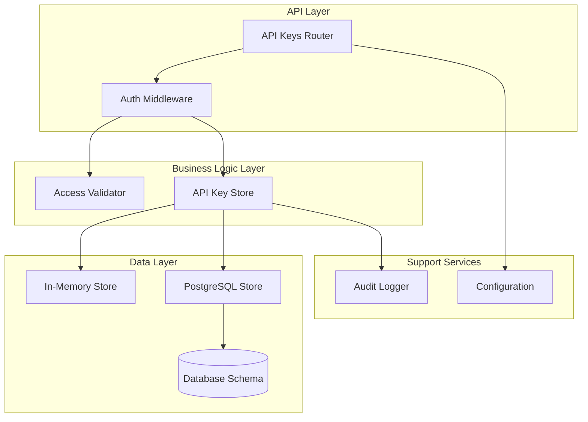
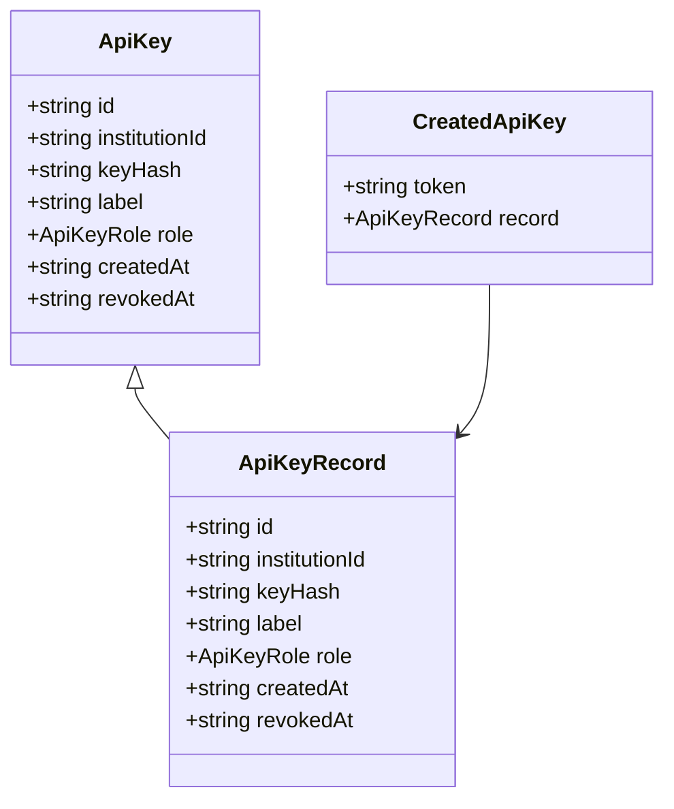
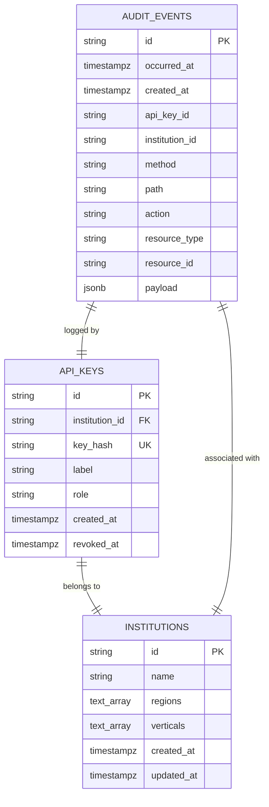
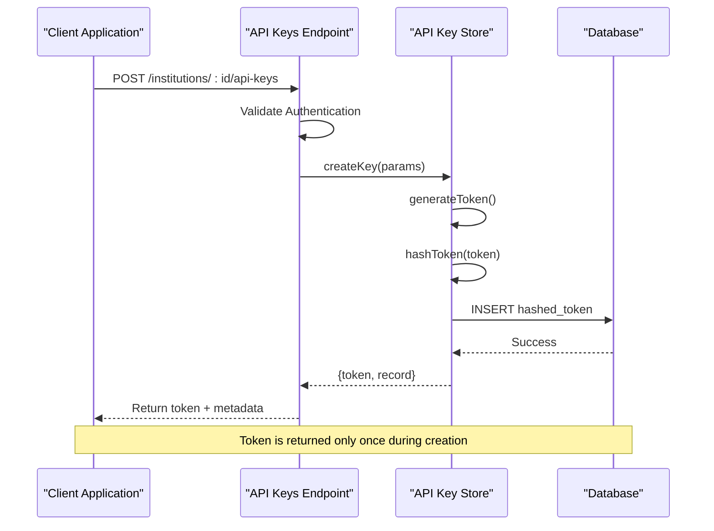
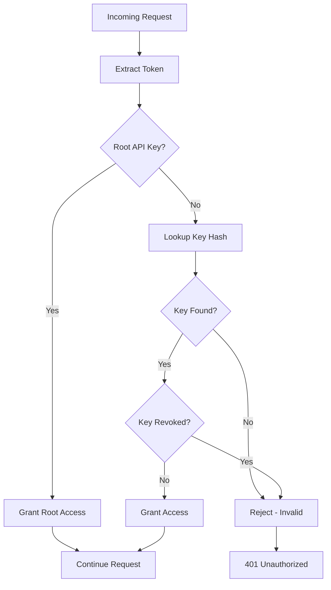
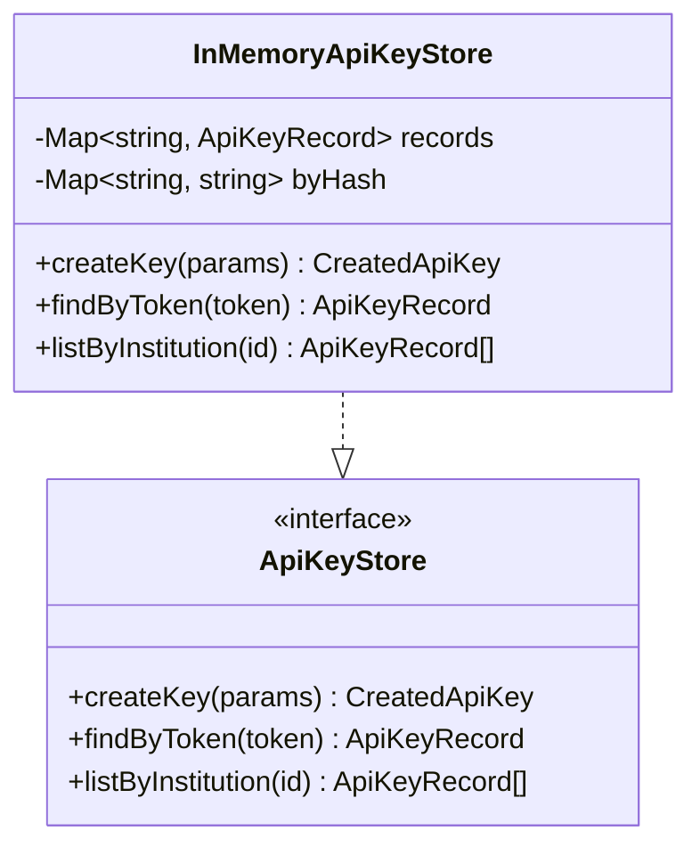
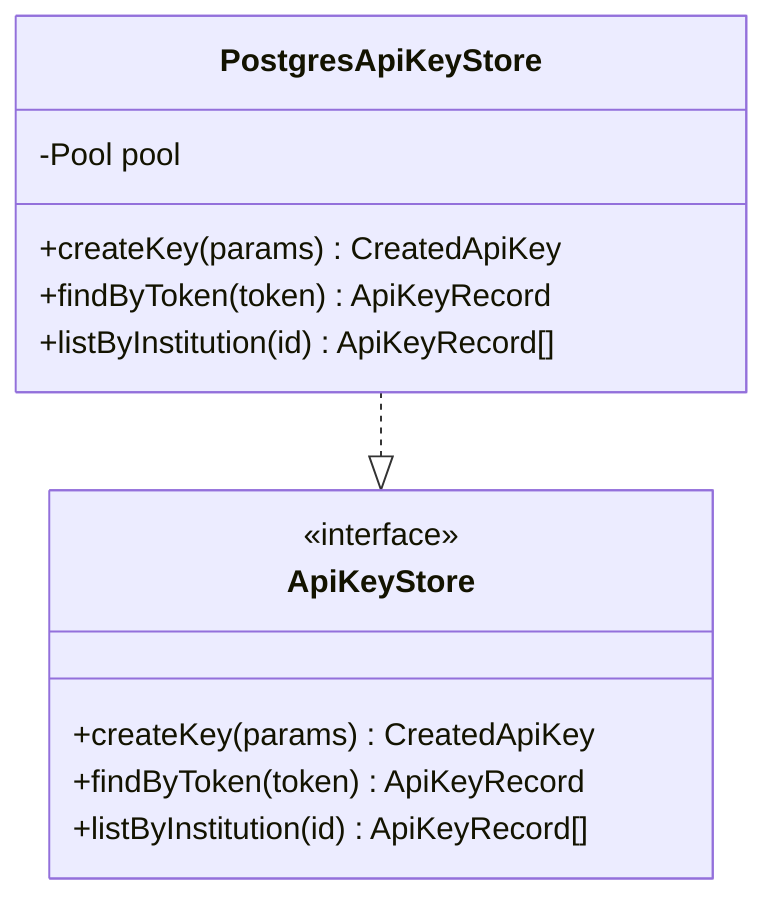
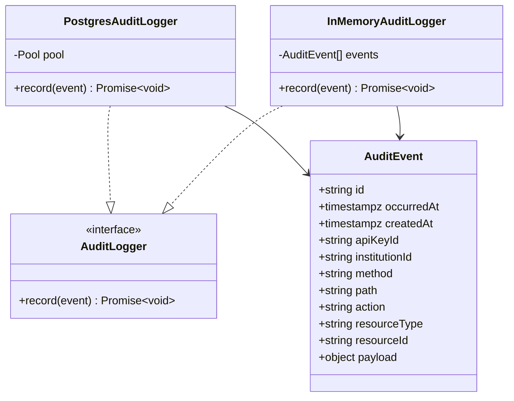
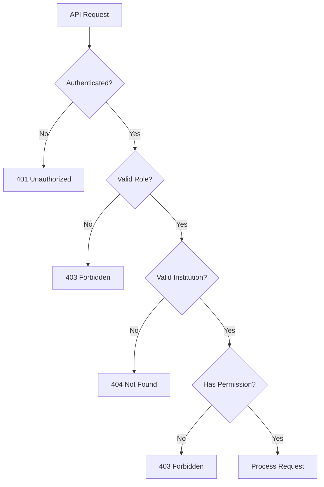

# API Key Management

<cite>
**Referenced Files in This Document**
- [src/api/apiKeys.ts](file://src/api/apiKeys.ts)
- [src/infra/apiKeyStore.ts](file://src/infra/apiKeyStore.ts)
- [src/domain/types.ts](file://src/domain/types.ts)
- [src/middleware/auth.ts](file://src/middleware/auth.ts)
- [src/infra/auditLogger.ts](file://src/infra/auditLogger.ts)
- [src/store/postgresStore.ts](file://src/store/postgresStore.ts)
- [src/openapi.ts](file://src/openapi.ts)
- [src/config.ts](file://src/config.ts)
- [db/schema.sql](file://db/schema.sql)
- [src/server.ts](file://src/server.ts)
</cite>

## Table of Contents
1. [Introduction](#introduction)
2. [System Architecture](#system-architecture)
3. [Data Model](#data-model)
4. [API Endpoints](#api-endpoints)
5. [Security Implementation](#security-implementation)
6. [Storage Backends](#storage-backends)
7. [Audit Logging](#audit-logging)
8. [Implementation Details](#implementation-details)
9. [Common Issues and Troubleshooting](#common-issues-and-troubleshooting)
10. [Best Practices](#best-practices)

## Introduction

The API key management system in escrowgrid provides secure authentication and authorization mechanisms for institutional access to the Tokenization-as-a-Service (TAAS) platform. The system enables creation, listing, and revocation of API keys with role-based permissions and institution-level scoping.

API keys serve as the primary authentication mechanism for accessing escrowgrid's REST API endpoints. They support two distinct roles: `admin` and `read_only`, each with different permission levels and access scopes. The system implements robust security measures including token hashing, audit logging, and comprehensive access control validation.

## System Architecture

The API key management system follows a layered architecture with clear separation of concerns:



**Diagram sources**
- [src/api/apiKeys.ts](file://src/api/apiKeys.ts#L1-L110)
- [src/middleware/auth.ts](file://src/middleware/auth.ts#L35-L95)
- [src/infra/apiKeyStore.ts](file://src/infra/apiKeyStore.ts#L13-L184)

**Section sources**
- [src/api/apiKeys.ts](file://src/api/apiKeys.ts#L1-L110)
- [src/middleware/auth.ts](file://src/middleware/auth.ts#L1-L95)
- [src/infra/apiKeyStore.ts](file://src/infra/apiKeyStore.ts#L1-L184)

## Data Model

The API key system is built around several core data structures that define the key lifecycle and access control:

### API Key Entity

The fundamental API key entity contains essential attributes for authentication and authorization:



**Diagram sources**
- [src/domain/types.ts](file://src/domain/types.ts#L70-L78)
- [src/infra/apiKeyStore.ts](file://src/infra/apiKeyStore.ts#L6-L11)

### Role-Based Permissions

The system implements two distinct roles with different permission levels:

| Role | Permission Level | Access Scope | Write Operations |
|------|------------------|--------------|------------------|
| `admin` | Full Access | Complete institution access | Yes |
| `read_only` | Read-Only Access | Read operations only | No |

### Database Schema

The PostgreSQL schema defines the persistent storage structure:



**Diagram sources**
- [db/schema.sql](file://db/schema.sql#L93-L101)
- [db/schema.sql](file://db/schema.sql#L106-L118)

**Section sources**
- [src/domain/types.ts](file://src/domain/types.ts#L5-L78)
- [db/schema.sql](file://db/schema.sql#L93-L101)

## API Endpoints

The API key management system exposes two primary REST endpoints for key lifecycle operations:

### Create API Key

**Endpoint:** `POST /institutions/:id/api-keys`

Creates a new API key for a specific institution with configurable role and label.

#### Request Format

```json
{
  "label": "string",
  "role": "admin" | "read_only"
}
```

#### Response Format

```json
{
  "id": "string",
  "institutionId": "string",
  "label": "string",
  "role": "admin" | "read_only",
  "createdAt": "string",
  "apiKey": "string"
}
```

#### Authentication Requirements

- Root users: Can create keys for any institution
- Institution admins: Can create keys for their own institution
- Read-only users: Cannot create keys
- Unauthenticated: Returns 401 Unauthorized

### List API Keys

**Endpoint:** `GET /institutions/:id/api-keys`

Retrieves all active API keys for a specific institution.

#### Response Format

```json
[
  {
    "id": "string",
    "institutionId": "string",
    "label": "string",
    "role": "admin" | "read_only",
    "createdAt": "string",
    "revokedAt": "string"
  }
]
```

#### Authentication Requirements

- Root users: Can list keys for any institution
- Institution admins: Can list keys for their own institution
- Read-only users: Cannot list keys
- Unauthenticated: Returns 401 Unauthorized

**Section sources**
- [src/api/apiKeys.ts](file://src/api/apiKeys.ts#L15-L108)
- [src/openapi.ts](file://src/openapi.ts#L436-L503)

## Security Implementation

The API key system implements multiple layers of security to ensure safe and controlled access:

### Token Generation and Storage



**Diagram sources**
- [src/infra/apiKeyStore.ts](file://src/infra/apiKeyStore.ts#L33-L39)
- [src/infra/apiKeyStore.ts](file://src/infra/apiKeyStore.ts#L96-L123)

### Authentication Middleware

The authentication system validates API keys through multiple channels:



**Diagram sources**
- [src/middleware/auth.ts](file://src/middleware/auth.ts#L35-L95)

### Access Control Validation

The system implements hierarchical access control:

| Access Level | Permitted Actions | Validation Criteria |
|--------------|-------------------|---------------------|
| Root | All operations across all institutions | `auth.role === 'root'` |
| Institution Admin | Operations within own institution | `auth.institutionId === institutionId && auth.role === 'admin'` |
| Read-Only | Read-only operations | `auth.role === 'read_only'` |
| None | No operations | Fails validation |

**Section sources**
- [src/middleware/auth.ts](file://src/middleware/auth.ts#L35-L95)
- [src/api/apiKeys.ts](file://src/api/apiKeys.ts#L25-L30)

## Storage Backends

The API key system supports multiple storage backends for flexibility and scalability:

### In-Memory Storage

The in-memory implementation provides fast access for development and testing scenarios:



**Diagram sources**
- [src/infra/apiKeyStore.ts](file://src/infra/apiKeyStore.ts#L41-L86)

### PostgreSQL Storage

The production-ready PostgreSQL implementation ensures persistence and reliability:



**Diagram sources**
- [src/infra/apiKeyStore.ts](file://src/infra/apiKeyStore.ts#L88-L182)

### Storage Backend Selection

The system automatically selects the appropriate backend based on configuration:

```typescript
// Configuration-driven backend selection
if (config.storeBackend === 'postgres') {
  apiKeyStoreInstance = new PostgresApiKeyStore();
} else {
  apiKeyStoreInstance = new InMemoryApiKeyStore();
}
```

**Section sources**
- [src/infra/apiKeyStore.ts](file://src/infra/apiKeyStore.ts#L41-L184)
- [src/config.ts](file://src/config.ts#L25-L26)

## Audit Logging

The system implements comprehensive audit logging for all API key operations:

### Audit Event Structure



**Diagram sources**
- [src/infra/auditLogger.ts](file://src/infra/auditLogger.ts#L13-L109)

### Logged Events

The system logs the following API key-related events:

| Event Type | Description | Payload Information |
|------------|-------------|-------------------|
| `API_KEY_CREATED` | New API key creation | Institution ID, label, role |
| `API_KEY_LISTED` | API key listing operation | Institution ID, requesting user |

### Log Sanitization

The audit system implements security-conscious logging practices:

- **Token Redaction**: API keys are never logged in plaintext
- **Sensitive Data Filtering**: Personal information is excluded from logs
- **Structured Logging**: JSON format for easy parsing and analysis

**Section sources**
- [src/infra/auditLogger.ts](file://src/infra/auditLogger.ts#L1-L109)
- [src/api/apiKeys.ts](file://src/api/apiKeys.ts#L47-L68)

## Implementation Details

### Request Validation

The system implements comprehensive request validation at multiple levels:



**Diagram sources**
- [src/api/apiKeys.ts](file://src/api/apiKeys.ts#L17-L108)

### Token Generation Algorithm

The system uses cryptographically secure token generation:

```typescript
// Secure token generation
function generateToken(): string {
  return `ak_${crypto.randomBytes(24).toString('hex')}`;
}

// SHA-256 hashing for secure storage
function hashToken(token: string): string {
  return crypto.createHash('sha256').update(token).digest('hex');
}
```

### Error Handling

The system implements graceful error handling with appropriate HTTP status codes:

| Error Condition | HTTP Status | Error Message |
|-----------------|-------------|---------------|
| Missing API key | 401 | "Missing API key" |
| Invalid API key | 401 | "Invalid API key" |
| Insufficient permissions | 403 | "Forbidden" |
| Institution not found | 404 | "Institution not found" |
| Authentication failure | 500 | "Authentication failed" |

**Section sources**
- [src/api/apiKeys.ts](file://src/api/apiKeys.ts#L17-L108)
- [src/middleware/auth.ts](file://src/middleware/auth.ts#L35-L95)
- [src/infra/apiKeyStore.ts](file://src/infra/apiKeyStore.ts#L33-L39)

## Common Issues and Troubleshooting

### Permission Denied Errors

**Problem**: Users receive 403 Forbidden errors when trying to create/list API keys.

**Causes and Solutions**:

1. **Insufficient Role Level**
   - **Cause**: Using a read-only API key for write operations
   - **Solution**: Use an admin-level API key or root access

2. **Cross-Institution Access Attempt**
   - **Cause**: Trying to access another institution's API keys
   - **Solution**: Ensure the API key belongs to the target institution

3. **Missing Authentication**
   - **Cause**: Not providing API key in request headers
   - **Solution**: Include `X-API-KEY` or `Authorization: Bearer <token>` header

### Invalid Institution References

**Problem**: Requests return 404 Not Found for valid-looking institution IDs.

**Diagnosis Steps**:

1. Verify institution exists in the system
2. Check institution ID format and validity
3. Confirm proper authentication context

### Token Retrieval Issues

**Problem**: Newly created API keys are not usable immediately.

**Resolution**:
- API keys are validated asynchronously
- Wait for immediate acknowledgment before testing
- Verify token format (`ak_` prefix)

### Database Connectivity Problems

**Problem**: API key operations fail with database errors.

**Troubleshooting**:
- Verify PostgreSQL connection string
- Check database schema availability
- Confirm table permissions

**Section sources**
- [src/api/apiKeys.ts](file://src/api/apiKeys.ts#L29-L36)
- [src/middleware/auth.ts](file://src/middleware/auth.ts#L64-L68)
- [src/infra/apiKeyStore.ts](file://src/infra/apiKeyStore.ts#L125-L149)

## Best Practices

### API Key Management

1. **Secure Storage**: Never log or transmit API keys in plaintext
2. **Rotation Schedule**: Implement regular API key rotation
3. **Least Privilege**: Use read-only keys when possible
4. **Monitoring**: Track API key usage through audit logs

### Development Guidelines

1. **Environment Separation**: Use different API keys for development and production
2. **Testing**: Utilize in-memory storage for unit tests
3. **Documentation**: Maintain clear documentation of key purposes and owners

### Production Deployment

1. **Backup Strategy**: Regular backups of API key metadata
2. **Monitoring**: Implement alerts for unusual API key activity
3. **Access Control**: Limit root API key usage to essential operations only

### Security Considerations

1. **Token Transmission**: Always use HTTPS for API key transmission
2. **Key Distribution**: Implement secure key distribution mechanisms
3. **Audit Trails**: Maintain comprehensive audit logs for compliance

The API key management system provides a robust foundation for secure access control in the escrowgrid platform, combining strong cryptographic practices with comprehensive audit capabilities and flexible storage options.