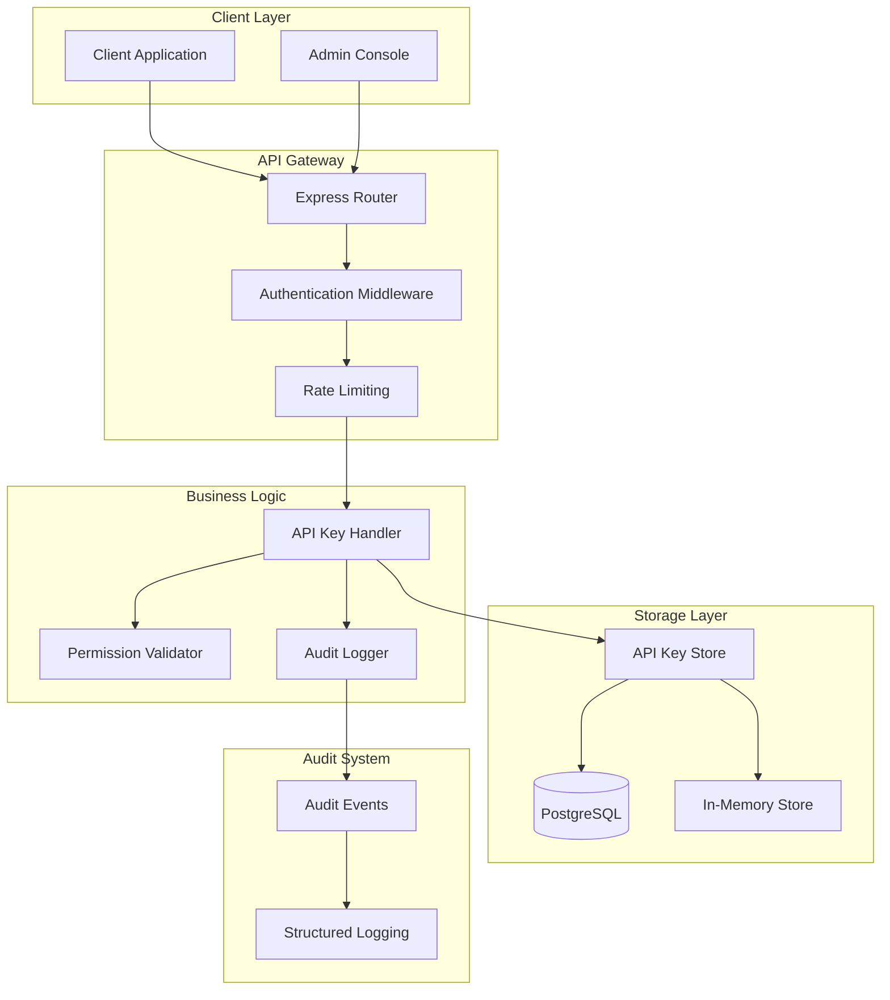
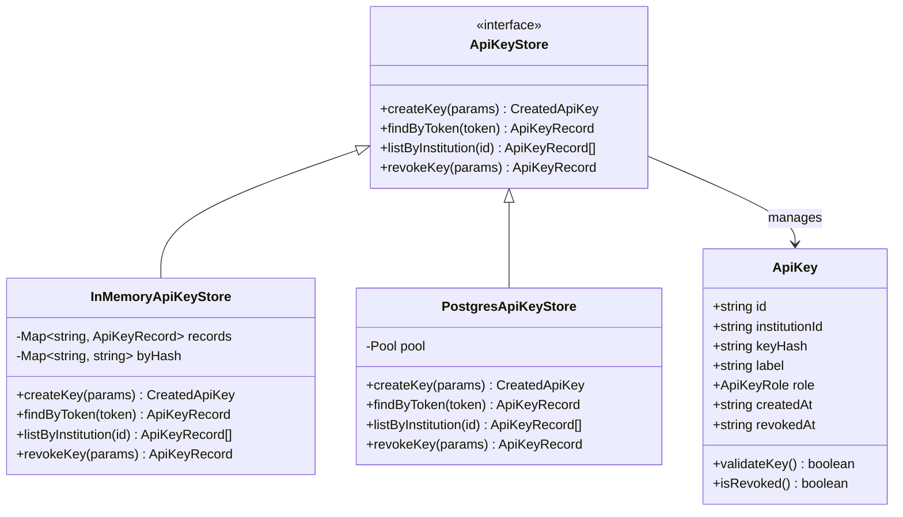
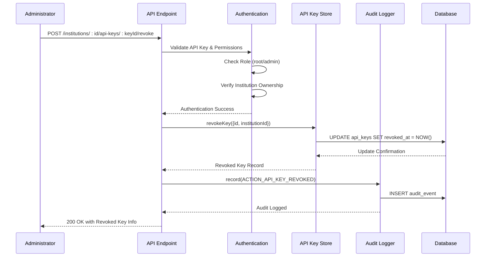
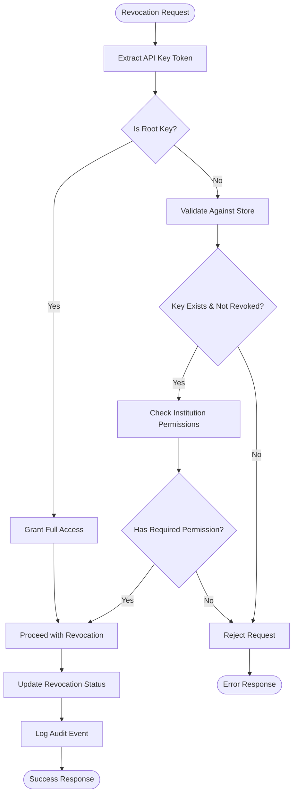
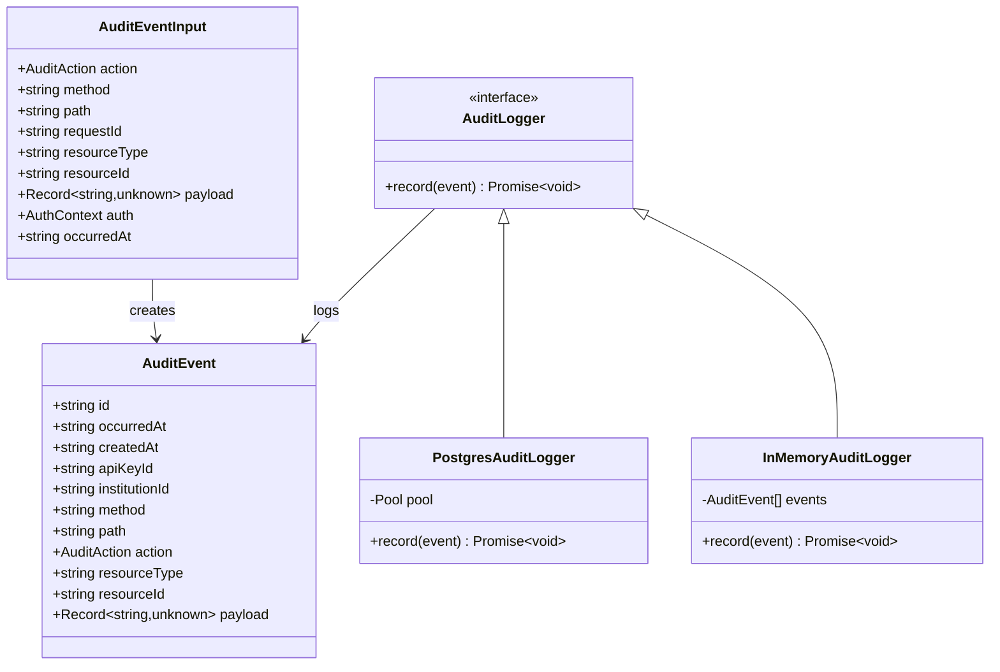

# API Key Revocation

<cite>
**Referenced Files in This Document**
- [src/api/apiKeys.ts](file://src/api/apiKeys.ts)
- [src/middleware/auth.ts](file://src/middleware/auth.ts)
- [src/infra/apiKeyStore.ts](file://src/infra/apiKeyStore.ts)
- [src/domain/types.ts](file://src/domain/types.ts)
- [src/infra/auditLogger.ts](file://src/infra/auditLogger.ts)
- [src/store/postgresStore.ts](file://src/store/postgresStore.ts)
- [db/schema.sql](file://db/schema.sql)
- [src/config.ts](file://src/config.ts)
- [src/domain/audit.ts](file://src/domain/audit.ts)
</cite>

## Table of Contents
1. [Introduction](#introduction)
2. [System Architecture](#system-architecture)
3. [API Key Data Model](#api-key-data-model)
4. [Revocation Workflow](#revocation-workflow)
5. [Implementation Details](#implementation-details)
6. [Security Considerations](#security-considerations)
7. [Audit and Monitoring](#audit-and-monitoring)
8. [Database Schema](#database-schema)
9. [Testing and Validation](#testing-and-validation)
10. [Troubleshooting](#troubleshooting)

## Introduction

The EscrowGrid Tokenization-as-a-Service (TAAS) platform implements a comprehensive API key revocation system that allows administrators to invalidate API keys for security purposes. This system ensures that compromised or unnecessary API keys can be immediately deactivated while maintaining audit trails and preventing unauthorized access.

The revocation system operates through a RESTful API endpoint that supports both immediate revocation and maintains historical records for compliance and security monitoring. The implementation follows industry best practices for secure credential management and provides multiple storage backends for flexibility.

## System Architecture

The API key revocation system consists of several interconnected components that work together to provide secure key management capabilities:



**Diagram sources**
- [src/api/apiKeys.ts](file://src/api/apiKeys.ts#L1-L168)
- [src/middleware/auth.ts](file://src/middleware/auth.ts#L36-L99)
- [src/infra/apiKeyStore.ts](file://src/infra/apiKeyStore.ts#L13-L227)

## API Key Data Model

The API key system uses a comprehensive data model that supports revocation while maintaining historical information:



**Diagram sources**
- [src/domain/types.ts](file://src/domain/types.ts#L70-L78)
- [src/infra/apiKeyStore.ts](file://src/infra/apiKeyStore.ts#L13-L227)

**Section sources**
- [src/domain/types.ts](file://src/domain/types.ts#L70-L78)
- [src/infra/apiKeyStore.ts](file://src/infra/apiKeyStore.ts#L6-L12)

## Revocation Workflow

The API key revocation process follows a secure, audited workflow that ensures proper authorization and maintains system integrity:



**Diagram sources**
- [src/api/apiKeys.ts](file://src/api/apiKeys.ts#L113-L163)
- [src/middleware/auth.ts](file://src/middleware/auth.ts#L36-L99)
- [src/infra/apiKeyStore.ts](file://src/infra/apiKeyStore.ts#L189-L214)

### Authorization Requirements

The revocation system enforces strict authorization controls:

| Role | Permission | Scope |
|------|------------|-------|
| Root | Full revocation rights | All institutions |
| Admin | Revocation within own institution | Same institution only |

**Section sources**
- [src/api/apiKeys.ts](file://src/api/apiKeys.ts#L116-L129)

## Implementation Details

### API Endpoint Implementation

The revocation endpoint provides a RESTful interface for key deactivation:

```typescript
// Endpoint: POST /institutions/:id/api-keys/:keyId/revoke
router.post(
  '/institutions/:id/api-keys/:keyId/revoke',
  async (req: AuthedRequest<RevokeApiKeyParams>, res: Response) => {
    const { id, keyId } = req.params;
    const auth = req.auth;
    
    // Authorization checks
    const isRoot = auth.role === 'root';
    const isSameInstitution = auth.institutionId === id;
    const isAdmin = auth.role === 'admin';
    
    if (!isRoot && !(isSameInstitution && isAdmin)) {
      return res.status(403).json({ error: 'Forbidden to revoke API keys' });
    }
    
    // Perform revocation
    const revoked = await apiKeyStore.revokeKey({ id: keyId, institutionId: id });
    if (!revoked) {
      return res.status(404).json({ error: 'API key not found or already revoked' });
    }
    
    // Log audit event
    await auditLogger.record({
      action: 'API_KEY_REVOKED',
      method: req.method,
      path: req.path,
      resourceType: 'api_key',
      resourceId: revoked.id,
      payload: {
        institutionId: revoked.institutionId,
        label: revoked.label,
        role: revoked.role,
      },
      auth,
    });
    
    return res.status(200).json(revoked);
  }
);
```

### Storage Backend Implementation

The system supports multiple storage backends with consistent revocation behavior:

#### In-Memory Store Implementation

The in-memory store maintains revocation state in volatile memory:

```typescript
async revokeKey(params: { id: string; institutionId: string }): Promise<ApiKeyRecord | undefined> {
  const existing = this.records.get(params.id);
  if (!existing || existing.institutionId !== params.institutionId || existing.revokedAt) {
    return undefined;
  }
  
  const updated: ApiKeyRecord = {
    ...existing,
    revokedAt: now(),
  };
  this.records.set(params.id, updated);
  // Keep byHash entry for rejection of future attempts
  return updated;
}
```

#### PostgreSQL Store Implementation

The PostgreSQL store persists revocation state to durable storage:

```typescript
async revokeKey(params: { id: string; institutionId: string }): Promise<ApiKeyRecord | undefined> {
  const result = await this.pool.query(
    `UPDATE api_keys
     SET revoked_at = CASE
       WHEN revoked_at IS NULL THEN $3
       ELSE revoked_at
     END
     WHERE id = $1 AND institution_id = $2
     RETURNING id, institution_id, key_hash, label, role, created_at, revoked_at`,
    [params.id, params.institutionId, now()],
  );
  
  if (result.rowCount === 0) {
    return undefined;
  }
  
  const row = result.rows[0];
  return {
    id: row.id,
    institutionId: row.institution_id,
    keyHash: row.key_hash,
    label: row.label,
    role: row.role,
    createdAt: row.created_at,
    revokedAt: row.revoked_at ?? undefined,
  };
}
```

**Section sources**
- [src/api/apiKeys.ts](file://src/api/apiKeys.ts#L113-L163)
- [src/infra/apiKeyStore.ts](file://src/infra/apiKeyStore.ts#L89-L101)
- [src/infra/apiKeyStore.ts](file://src/infra/apiKeyStore.ts#L189-L214)

## Security Considerations

### Token Validation and Revocation

The system implements robust security measures to prevent unauthorized access:

1. **Immediate Revocation Effect**: Once revoked, API keys are immediately invalidated
2. **Hash-Based Storage**: API keys are stored as SHA-256 hashes, never in plaintext
3. **Atomic Operations**: Revocation operations are atomic to prevent race conditions
4. **Permission Validation**: Strict role-based access control prevents unauthorized revocations

### Authentication Flow During Revocation



**Diagram sources**
- [src/middleware/auth.ts](file://src/middleware/auth.ts#L67-L85)

**Section sources**
- [src/middleware/auth.ts](file://src/middleware/auth.ts#L67-L85)
- [src/infra/apiKeyStore.ts](file://src/infra/apiKeyStore.ts#L70-L81)

## Audit and Monitoring

### Audit Event Structure

The system maintains comprehensive audit logs for all revocation activities:



**Diagram sources**
- [src/domain/audit.ts](file://src/domain/audit.ts#L11-L37)
- [src/infra/auditLogger.ts](file://src/infra/auditLogger.ts#L13-L109)

### Audit Event Types

The system logs specific events for API key revocation:

| Event Type | Description | Payload Fields |
|------------|-------------|----------------|
| `API_KEY_REVOKED` | API key successfully revoked | `institutionId`, `label`, `role` |

**Section sources**
- [src/domain/audit.ts](file://src/domain/audit.ts#L3-L10)
- [src/api/apiKeys.ts](file://src/api/apiKeys.ts#L141-L154)
- [src/infra/auditLogger.ts](file://src/infra/auditLogger.ts#L55-L96)

## Database Schema

### API Keys Table Structure

The PostgreSQL schema defines the API keys table with appropriate constraints:

```sql
CREATE TABLE IF NOT EXISTS api_keys (
  id TEXT PRIMARY KEY,
  institution_id TEXT NOT NULL REFERENCES institutions(id) ON DELETE CASCADE,
  key_hash TEXT NOT NULL UNIQUE,
  label TEXT NOT NULL,
  role TEXT NOT NULL,
  created_at TIMESTAMPTZ NOT NULL,
  revoked_at TIMESTAMPTZ
);

CREATE INDEX IF NOT EXISTS idx_api_keys_institution
  ON api_keys (institution_id);
```

### Indexes and Constraints

The schema includes indexes for efficient querying and referential integrity:

- **Primary Key**: `id` ensures unique identification
- **Foreign Key**: `institution_id` maintains referential integrity
- **Unique Constraint**: `key_hash` prevents duplicate keys
- **Index**: `idx_api_keys_institution` optimizes institution-based queries

**Section sources**
- [db/schema.sql](file://db/schema.sql#L93-L101)

## Testing and Validation

### Unit Test Coverage

The system includes comprehensive testing for revocation functionality:

1. **Authentication Tests**: Verify permission validation
2. **Revocation Tests**: Confirm successful revocation
3. **Error Handling Tests**: Validate error responses
4. **Audit Logging Tests**: Ensure proper audit trail creation

### Integration Testing

Integration tests verify the complete revocation workflow:

- End-to-end API endpoint testing
- Database persistence verification
- Audit event generation validation
- Concurrent access handling

## Troubleshooting

### Common Issues and Solutions

#### 1. Revocation Fails with 403 Forbidden

**Cause**: Insufficient permissions for the requesting API key
**Solution**: Verify that the API key belongs to a root account or has admin privileges for the target institution

#### 2. Revocation Returns 404 Not Found

**Cause**: API key not found or already revoked
**Solution**: Check that the key ID and institution ID are correct and that the key hasn't been previously revoked

#### 3. Audit Events Not Logged

**Cause**: Audit logger misconfiguration
**Solution**: Verify that the audit logger is properly initialized and connected to the database

#### 4. Revocation Takes Too Long

**Cause**: Database connection issues or high load
**Solution**: Check database connectivity and monitor performance metrics

### Debugging Tools

The system provides several debugging capabilities:

- **Structured Logging**: JSON-formatted logs for audit events
- **Health Checks**: Monitor system readiness and database connectivity
- **Metrics Collection**: Track request rates and error patterns

**Section sources**
- [src/api/apiKeys.ts](file://src/api/apiKeys.ts#L136-L139)
- [src/infra/auditLogger.ts](file://src/infra/auditLogger.ts#L55-L96)