# Access Control & Authorization

<cite>
**Referenced Files in This Document**
- [src/middleware/auth.ts](file://src/middleware/auth.ts)
- [src/api/apiKeys.ts](file://src/api/apiKeys.ts)
- [src/domain/types.ts](file://src/domain/types.ts)
- [src/infra/auditLogger.ts](file://src/infra/auditLogger.ts)
- [src/infra/apiKeyStore.ts](file://src/infra/apiKeyStore.ts)
- [src/domain/audit.ts](file://src/domain/audit.ts)
- [src/api/assets.ts](file://src/api/assets.ts)
- [src/api/positions.ts](file://src/api/positions.ts)
- [src/config.ts](file://src/config.ts)
- [src/server.ts](file://src/server.ts)
- [src/middleware/rateLimit.ts](file://src/middleware/rateLimit.ts)
</cite>

## Table of Contents
1. [Introduction](#introduction)
2. [Role-Based Access Control (RBAC) Model](#role-based-access-control-rbac-model)
3. [Authentication Mechanisms](#authentication-mechanisms)
4. [Authorization Middleware](#authorization-middleware)
5. [API Key Management](#api-key-management)
6. [Resource Protection](#resource-protection)
7. [Audit Logging](#audit-logging)
8. [Rate Limiting](#rate-limiting)
9. [Common Issues and Troubleshooting](#common-issues-and-troubleshooting)
10. [Best Practices](#best-practices)
11. [Conclusion](#conclusion)

## Introduction

EscrowGrid implements a comprehensive access control and authorization system built around a Role-Based Access Control (RBAC) model. The system enforces strict permissions across all API endpoints, ensuring that users can only access resources and perform operations appropriate to their assigned roles. This documentation covers the complete authorization framework, including authentication mechanisms, role enforcement, API key management, and audit logging.

The authorization system operates on multiple levels: API key validation, role-based permissions, institution-level access controls, and operation-specific write access restrictions. Every API request undergoes rigorous authorization checks before any business logic is executed.

## Role-Based Access Control (RBAC) Model

### Core Roles

The RBAC model implements three distinct roles with progressively restrictive permissions:

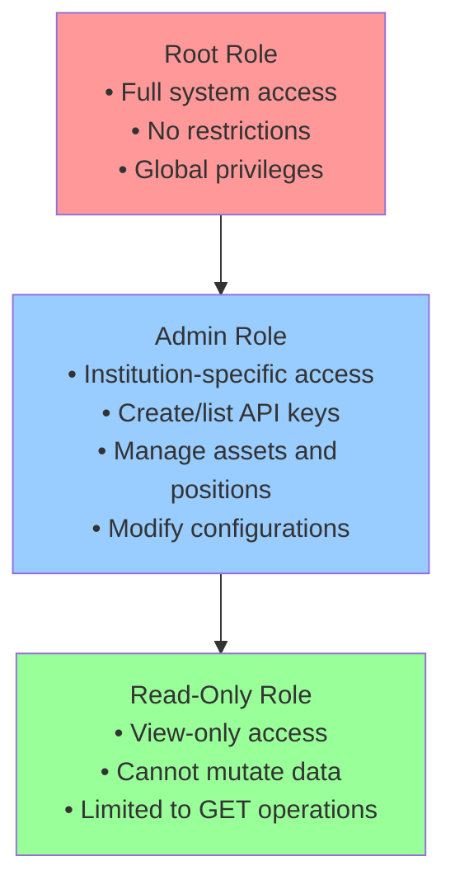

**Diagram sources**
- [src/middleware/auth.ts](file://src/middleware/auth.ts#L6)
- [src/domain/types.ts](file://src/domain/types.ts#L5)

### Role Definitions

| Role | Permissions | Restrictions | Use Cases |
|------|-------------|--------------|-----------|
| **Root** | Complete system access, global operations, unrestricted API key management | None | System administrators, superusers | 
| **Admin** | Institution-specific management, API key creation, resource modification | Must belong to target institution | Institution administrators, service accounts |
| **Read-Only** | View-only access to resources | Cannot modify, create, or delete anything | Monitoring systems, reporting tools |

**Section sources**
- [src/middleware/auth.ts](file://src/middleware/auth.ts#L6)
- [src/domain/types.ts](file://src/domain/types.ts#L5)

## Authentication Mechanisms

### Token Extraction and Validation

The authentication system supports two token formats for maximum flexibility:

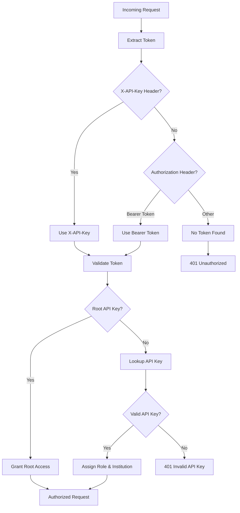

**Diagram sources**
- [src/middleware/auth.ts](file://src/middleware/auth.ts#L23-L33)
- [src/middleware/auth.ts](file://src/middleware/auth.ts#L52-L78)

### Authentication Context

The authentication system creates a comprehensive context object that tracks user identity and permissions:

```typescript
interface AuthContext {
  role: AuthRole;           // 'root' | ApiKeyRole
  institutionId?: string;   // Associated institution
  apiKeyId?: string;        // API key identifier
}
```

**Section sources**
- [src/middleware/auth.ts](file://src/middleware/auth.ts#L8-L12)

## Authorization Middleware

### Authentication Middleware

The primary authentication middleware handles token extraction, validation, and context population:

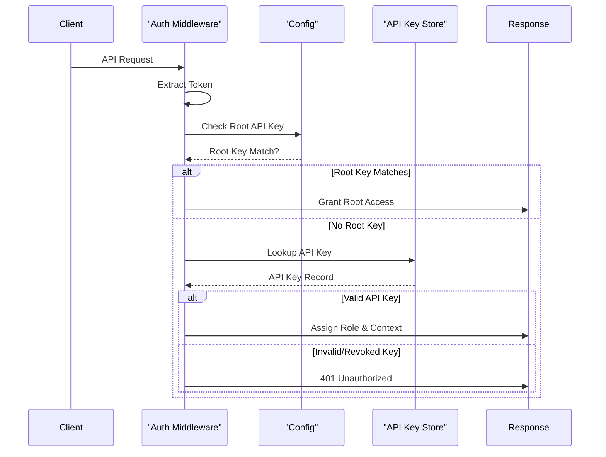

**Diagram sources**
- [src/middleware/auth.ts](file://src/middleware/auth.ts#L35-L78)

### Write Access Enforcement

The `requireWriteAccess` function provides granular control over mutation operations:

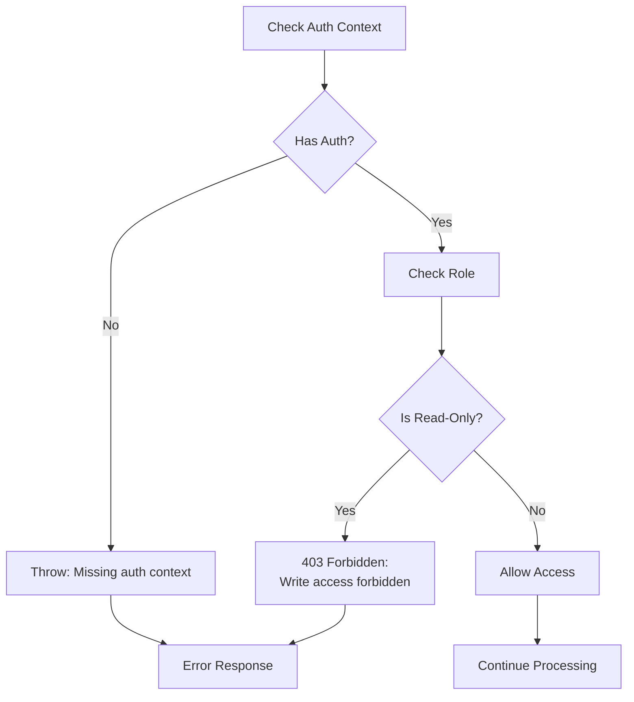

**Diagram sources**
- [src/middleware/auth.ts](file://src/middleware/auth.ts#L84-L93)

**Section sources**
- [src/middleware/auth.ts](file://src/middleware/auth.ts#L35-L93)

## API Key Management

### API Key Creation and Validation

API key management follows strict institutional boundaries and role-based restrictions:

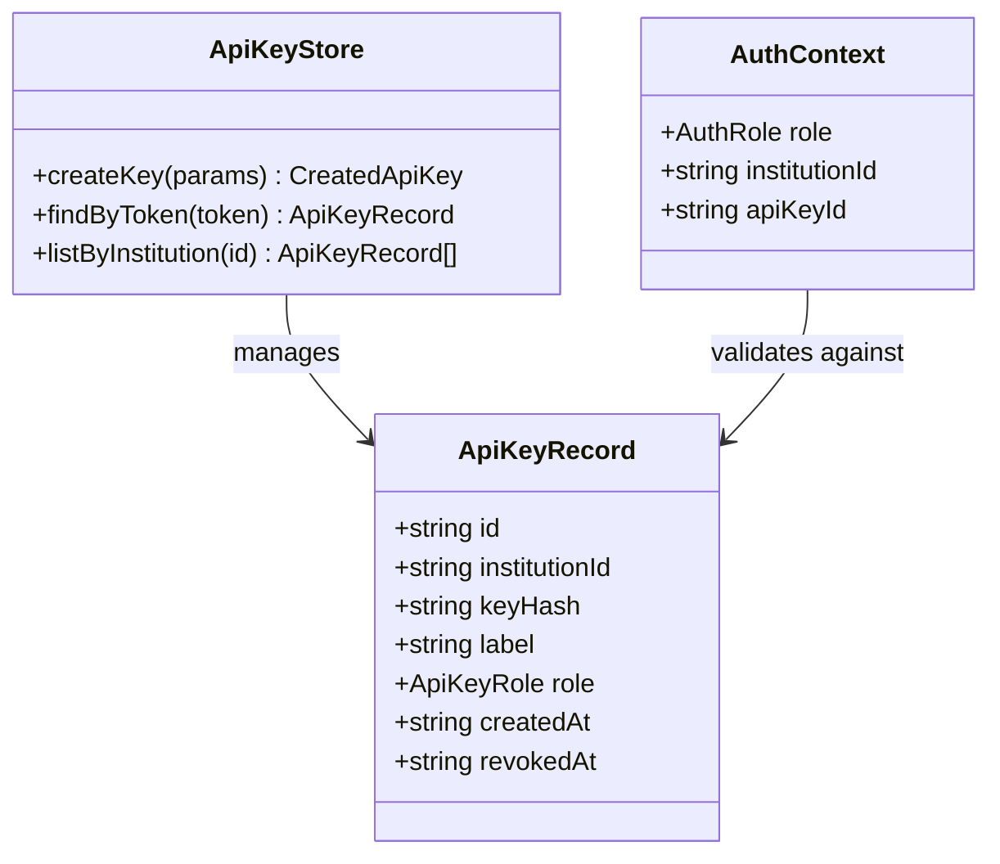

**Diagram sources**
- [src/infra/apiKeyStore.ts](file://src/infra/apiKeyStore.ts#L13-L23)
- [src/domain/types.ts](file://src/domain/types.ts#L70-L78)

### API Key Creation Authorization

API key creation is restricted to specific scenarios:

| Scenario | Permission Required | Validation Logic |
|----------|-------------------|------------------|
| **Root User** | Any institution | Can create keys for any institution |
| **Admin User** | Same institution only | Must match their own institution ID |
| **Read-Only User** | Never allowed | Write access blocked |

**Section sources**
- [src/api/apiKeys.ts](file://src/api/apiKeys.ts#L15-L45)

### API Key Listing Authorization

API key listing follows similar institutional restrictions:

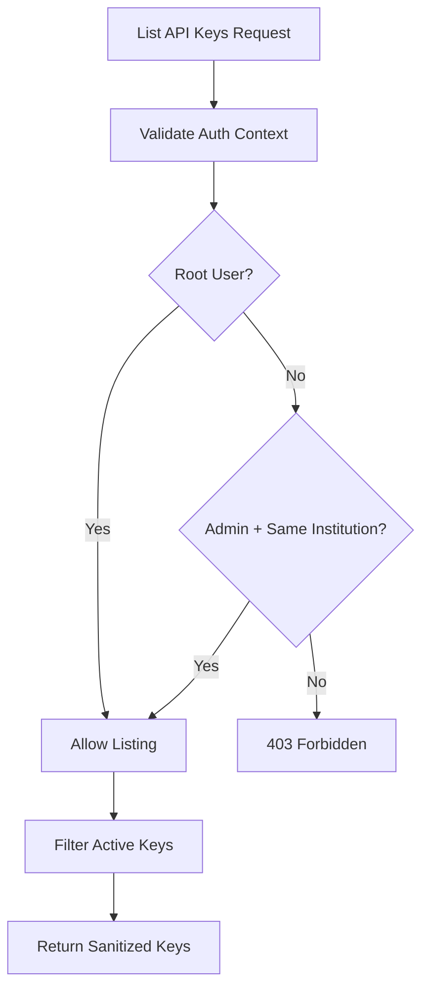

**Diagram sources**
- [src/api/apiKeys.ts](file://src/api/apiKeys.ts#L72-L105)

**Section sources**
- [src/api/apiKeys.ts](file://src/api/apiKeys.ts#L72-L105)

## Resource Protection

### Asset Management Authorization

Asset operations enforce both role and institution constraints:

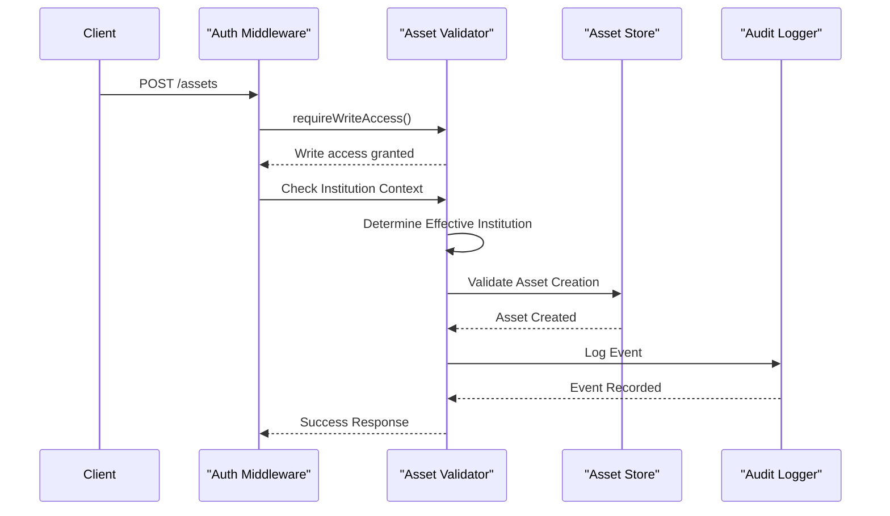

**Diagram sources**
- [src/api/assets.ts](file://src/api/assets.ts#L17-L81)

### Position Management Authorization

Position operations implement comprehensive validation including policy enforcement:

| Operation | Write Access Required | Institution Validation | Policy Checks |
|-----------|---------------------|----------------------|---------------|
| **Create Position** | Yes | Root/Admin: Same institution | Currency, amount limits |
| **List Positions** | No | Root/Admin: Same institution | None |
| **Get Position** | No | Root/Admin: Same institution | None |

**Section sources**
- [src/api/positions.ts](file://src/api/positions.ts#L22-L151)

### Cross-Resource Authorization Patterns

The system implements consistent authorization patterns across all resources:

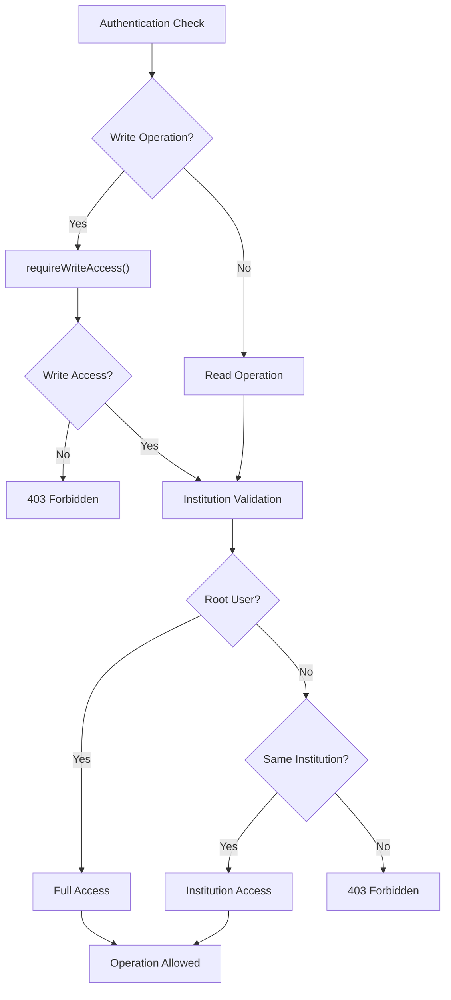

**Diagram sources**
- [src/api/assets.ts](file://src/api/assets.ts#L40-L60)
- [src/api/positions.ts](file://src/api/positions.ts#L54-L72)

**Section sources**
- [src/api/assets.ts](file://src/api/assets.ts#L40-L60)
- [src/api/positions.ts](file://src/api/positions.ts#L54-L72)

## Audit Logging

### Audit Event Structure

The audit logging system captures comprehensive information about authorization events:

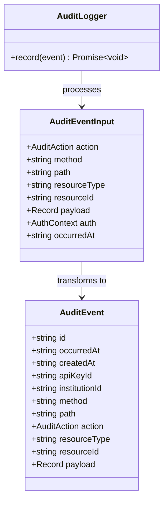

**Diagram sources**
- [src/domain/audit.ts](file://src/domain/audit.ts#L11-L35)
- [src/infra/auditLogger.ts](file://src/infra/auditLogger.ts#L13-L15)

### Audit Event Types

The system logs various authorization-related events:

| Action Type | Description | Triggers |
|-------------|-------------|----------|
| **API_KEY_CREATED** | New API key creation | Successful API key creation |
| **INSTITUTION_CREATED** | Institution creation | Institution management operations |
| **ASSET_CREATED** | Asset creation | Asset management operations |
| **POSITION_CREATED** | Position creation | Position management operations |
| **POSITION_TRANSITIONED** | Position state change | Lifecycle management operations |

**Section sources**
- [src/domain/audit.ts](file://src/domain/audit.ts#L3-L9)
- [src/infra/auditLogger.ts](file://src/infra/auditLogger.ts#L13-L109)

### Audit Logging Implementation

Each protected endpoint automatically logs authorization events:

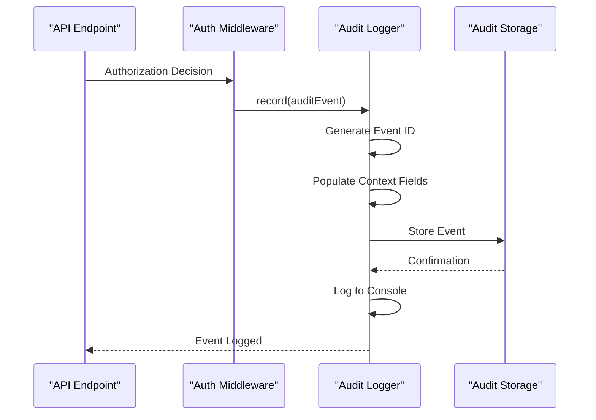

**Diagram sources**
- [src/infra/auditLogger.ts](file://src/infra/auditLogger.ts#L20-L44)
- [src/api/apiKeys.ts](file://src/api/apiKeys.ts#L47-L59)

**Section sources**
- [src/infra/auditLogger.ts](file://src/infra/auditLogger.ts#L20-L44)
- [src/api/apiKeys.ts](file://src/api/apiKeys.ts#L47-L59)

## Rate Limiting

### Rate Limiting Architecture

The rate limiting system provides an additional layer of protection:

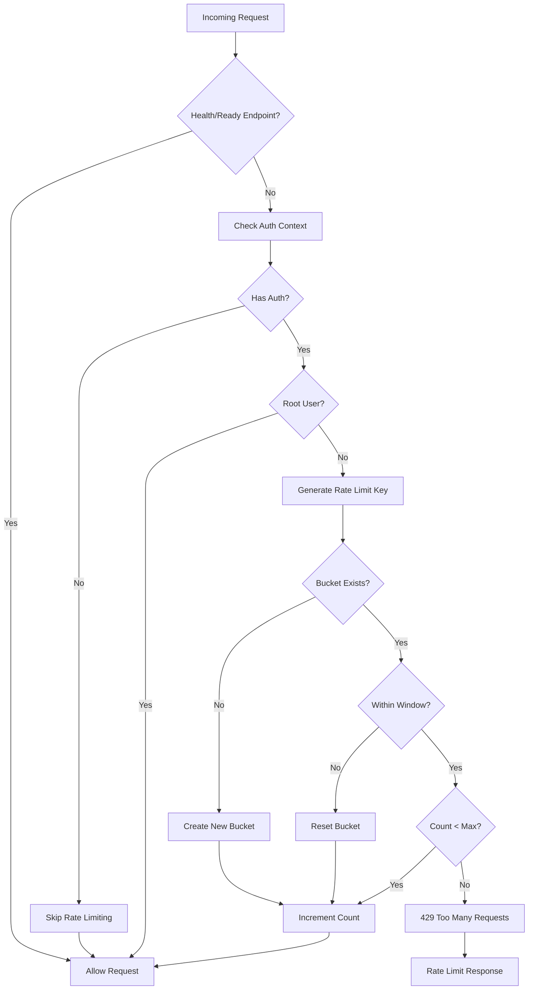

**Diagram sources**
- [src/middleware/rateLimit.ts](file://src/middleware/rateLimit.ts#L11-L65)

### Rate Limiting Configuration

| Parameter | Default Value | Environment Variable | Purpose |
|-----------|---------------|---------------------|---------|
| **Window Size** | 60,000 ms (1 minute) | RATE_LIMIT_WINDOW_MS | Time window for requests |
| **Max Requests** | 1,000 | RATE_LIMIT_MAX_REQUESTS | Requests per window |
| **Root Exemption** | Enabled | - | Root users bypass limits |
| **Enabled** | false | RATE_LIMIT_ENABLED | Global rate limiting toggle |

**Section sources**
- [src/middleware/rateLimit.ts](file://src/middleware/rateLimit.ts#L11-L65)
- [src/config.ts](file://src/config.ts#L13-L16)

## Common Issues and Troubleshooting

### Permission Denied Errors

#### Issue: "Write access forbidden for read_only API key"

**Cause**: Attempting to perform a mutation operation with a read-only API key.

**Solution**: 
1. Verify the API key role in the request headers
2. Use an admin or root API key for write operations
3. Check the `X-API-Key` or `Authorization` header format

**Example Fix**:
```bash
# Wrong - read_only key attempting POST
curl -H "X-API-Key: ak_read_only_token" -X POST ...

# Correct - admin/root key for POST
curl -H "X-API-Key: ak_admin_token" -X POST ...
```

#### Issue: "Forbidden to create API keys for this institution"

**Cause**: Non-root/admin users attempting to create API keys for institutions they don't manage.

**Solution**:
1. Verify the user's institution association
2. Ensure the target institution ID matches the user's institution
3. Use root credentials or admin credentials for the target institution

#### Issue: "No institution associated with API key"

**Cause**: Read operations requiring institution context using a read-only key.

**Solution**:
1. Use admin/root credentials for cross-institution queries
2. Specify institution ID in query parameters when authorized
3. Check API key role and institution association

### Authentication Failures

#### Issue: "Missing API key" or "Invalid API key"

**Troubleshooting Steps**:
1. Verify token format in headers
2. Check token validity in database
3. Confirm API key hasn't been revoked
4. Validate token hashing mechanism

#### Issue: "Unauthenticated" responses

**Common Causes**:
1. Missing or malformed `X-API-Key` header
2. Missing `Authorization: Bearer <token>` header
3. Network issues preventing header transmission
4. Middleware configuration problems

### Debugging Authorization Issues

#### Enable Debug Logging
```javascript
// Add to auth middleware for debugging
console.log('Auth context:', req.auth);
console.log('Request path:', req.path);
console.log('Token extracted:', token);
```

#### Verify API Key Records
```sql
-- Check API key validity
SELECT * FROM api_keys WHERE key_hash = md5('your_token_here');

-- Check revocation status
SELECT id, institution_id, role, revoked_at FROM api_keys WHERE id = 'key_id';
```

## Best Practices

### Least-Privilege Key Assignment

#### Principle: Assign the minimum role necessary

**Recommended Approach**:
```typescript
// For monitoring systems
const monitoringKey = await apiKeyStore.createKey({
  institutionId: 'inst_123',
  label: 'monitoring-system',
  role: 'read_only'  // Only view operations
});

// For administrative tasks
const adminKey = await apiKeyStore.createKey({
  institutionId: 'inst_123', 
  label: 'admin-service',
  role: 'admin'  // Full institution access
});

// For system administration
const rootKey = await apiKeyStore.createKey({
  institutionId: 'inst_root',
  label: 'system-admin',
  role: 'admin'  // Not root unless absolutely necessary
});
```

### Secure Session Management

#### API Key Rotation Strategy
1. **Regular Rotation**: Rotate API keys monthly
2. **Immediate Revocation**: Revoke compromised keys immediately
3. **Audit Trail**: Log all key creation and revocation events
4. **Documentation**: Maintain inventory of all API keys

#### Security Recommendations
1. **Environment Variables**: Store API keys in secure environment variables
2. **Access Logging**: Monitor all API key usage patterns
3. **Principle of Least Privilege**: Assign minimal required permissions
4. **Regular Audits**: Review API key usage and permissions quarterly

### Error Handling Best Practices

#### Graceful Degradation
```typescript
// Example from assets.ts
try {
  requireWriteAccess(auth);
} catch (err) {
  const status = (err as any).statusCode ?? 403;
  return res.status(status).json({ error: (err as Error).message });
}
```

#### Comprehensive Error Responses
```typescript
// Standardized error response format
interface ApiErrorResponse {
  error: string;
  details?: unknown;
  timestamp: string;
  requestId?: string;
}
```

### Monitoring and Observability

#### Key Metrics to Track
1. **Authentication Success/Failure Rates**
2. **Authorization Denial Patterns**
3. **API Key Usage Statistics**
4. **Rate Limiting Events**
5. **Audit Event Volume**

#### Alerting Thresholds
- **High Authorization Failures**: >5% failure rate
- **Unusual API Key Activity**: Sudden spikes in usage
- **Cross-Institution Access Attempts**: Blocked attempts
- **Rate Limit Violations**: >10% of requests

## Conclusion

EscrowGrid's access control and authorization system provides a robust, multi-layered security framework that protects sensitive financial data while enabling flexible API access. The RBAC model with root, admin, and read-only roles ensures appropriate privilege separation, while comprehensive audit logging provides visibility into all authorization decisions.

Key strengths of the system include:

- **Granular Permissions**: Operation-specific write access controls
- **Institution Boundaries**: Clear isolation between organizations
- **Comprehensive Logging**: Complete audit trail of all authorization events
- **Flexible Authentication**: Support for multiple token formats
- **Rate Limiting**: Additional protection against abuse
- **Consistent Patterns**: Uniform authorization logic across all endpoints

The system's design prioritizes security without sacrificing usability, making it suitable for production environments handling sensitive financial transactions. Regular review and monitoring of authorization patterns, along with adherence to the principle of least privilege, will ensure continued security effectiveness.

For optimal security, implement regular API key rotation, monitor authorization patterns, and maintain comprehensive audit trails. The modular design allows for future enhancements such as multi-factor authentication or advanced threat detection integration.