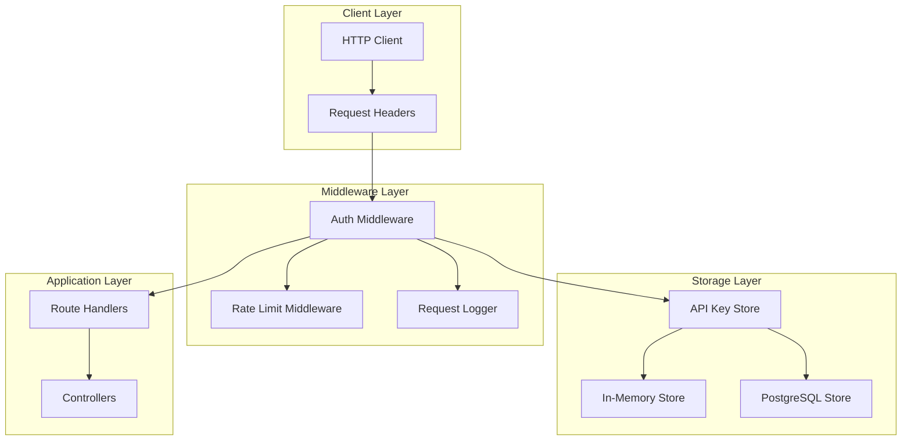
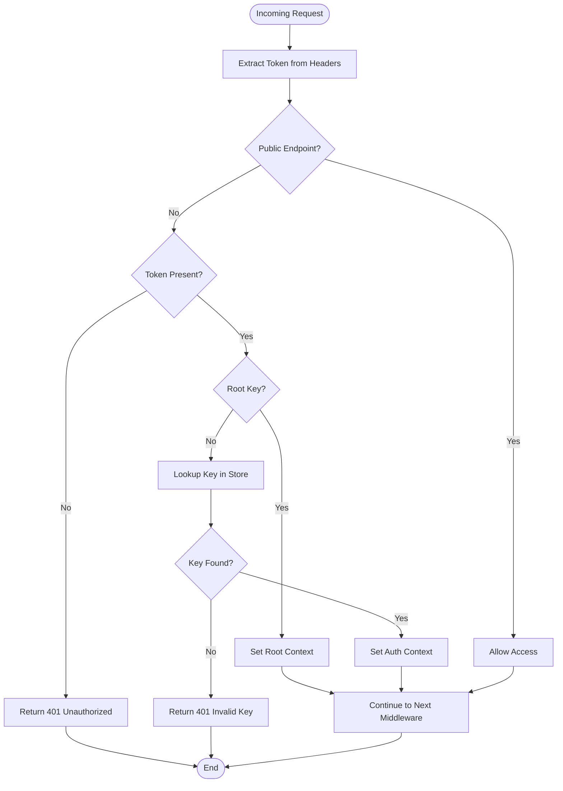
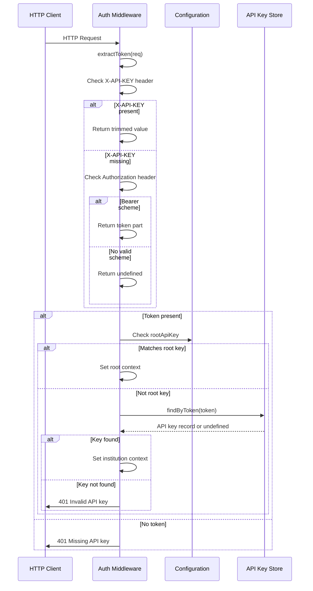
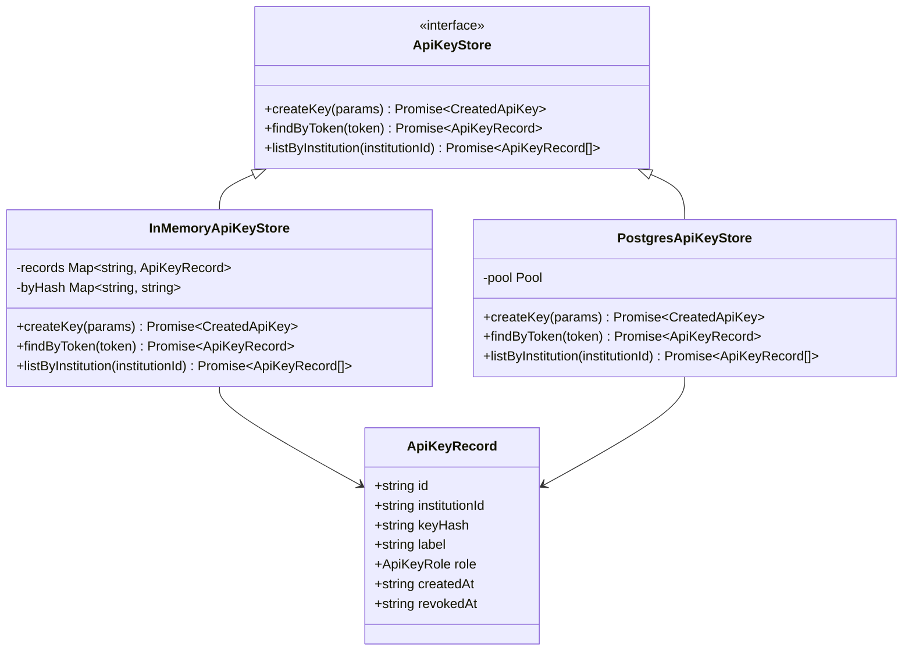
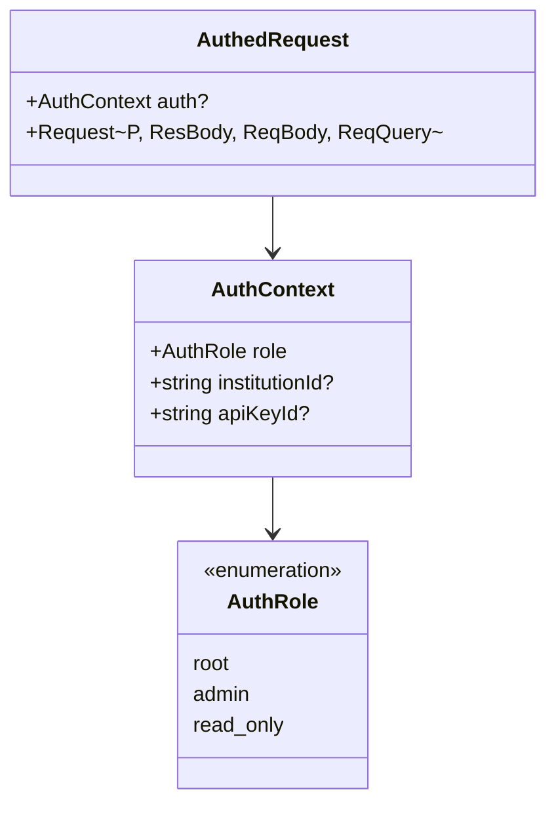

# Authentication Flow

<cite>
**Referenced Files in This Document**
- [src/middleware/auth.ts](file://src/middleware/auth.ts)
- [src/infra/apiKeyStore.ts](file://src/infra/apiKeyStore.ts)
- [src/config.ts](file://src/config.ts)
- [src/server.ts](file://src/server.ts)
- [src/domain/types.ts](file://src/domain/types.ts)
- [src/api/apiKeys.ts](file://src/api/apiKeys.ts)
- [src/openapi.ts](file://src/openapi.ts)
- [README.md](file://README.md)
</cite>

## Table of Contents
1. [Introduction](#introduction)
2. [Authentication Architecture](#authentication-architecture)
3. [Auth Middleware Implementation](#auth-middleware-implementation)
4. [Token Extraction and Validation](#token-extraction-and-validation)
5. [Bypass Rules for Public Endpoints](#bypass-rules-for-public-endpoints)
6. [Integration with apiKeyStore](#integration-with-apikeystore)
7. [Authentication Context Population](#authentication-context-population)
8. [Error Handling and Responses](#error-handling-and-responses)
9. [Security Considerations](#security-considerations)
10. [Environment Configuration](#environment-configuration)
11. [Best Practices](#best-practices)
12. [Troubleshooting Guide](#troubleshooting-guide)

## Introduction

The escrowgrid authentication system implements a robust API key-based authentication mechanism designed for institutional access to the Tokenization-as-a-Service (TAAS) platform. The system supports multiple authentication modes including root API keys for administrative access and institution-specific API keys with role-based permissions.

The authentication flow intercepts all incoming HTTP requests, validates API tokens against stored credentials, and populates the request context with authentication information for downstream middleware and route handlers.

## Authentication Architecture

The authentication system follows a layered architecture with clear separation of concerns:



**Diagram sources**
- [src/middleware/auth.ts](file://src/middleware/auth.ts#L35-L95)
- [src/server.ts](file://src/server.ts#L21-L24)
- [src/infra/apiKeyStore.ts](file://src/infra/apiKeyStore.ts#L174-L183)

**Section sources**
- [src/middleware/auth.ts](file://src/middleware/auth.ts#L1-L95)
- [src/server.ts](file://src/server.ts#L1-L100)

## Auth Middleware Implementation

The authentication middleware serves as the primary entry point for all API requests, implementing a comprehensive validation pipeline:



**Diagram sources**
- [src/middleware/auth.ts](file://src/middleware/auth.ts#L35-L95)

The middleware implementation provides several key features:

- **Dual Header Support**: Accepts API keys via `X-API-KEY` header or `Authorization: Bearer <token>` scheme
- **Public Endpoint Bypass**: Automatically allows access to health checks and documentation endpoints
- **Root Key Validation**: Special handling for administrative root API keys
- **Store Abstraction**: Supports both in-memory and PostgreSQL storage backends
- **Context Population**: Attaches authentication information to the request object

**Section sources**
- [src/middleware/auth.ts](file://src/middleware/auth.ts#L35-L95)

## Token Extraction and Validation

The token extraction process implements a flexible approach to accommodate different client preferences:



**Diagram sources**
- [src/middleware/auth.ts](file://src/middleware/auth.ts#L23-L32)
- [src/middleware/auth.ts](file://src/middleware/auth.ts#L52-L95)

The token extraction function demonstrates careful handling of different authentication schemes:

- **X-API-KEY Header Priority**: Takes precedence over Authorization header
- **Bearer Scheme Support**: Recognizes `Authorization: Bearer <token>` format
- **Whitespace Normalization**: Trims extracted tokens for consistency
- **Null Safety**: Returns undefined when no valid token is found

**Section sources**
- [src/middleware/auth.ts](file://src/middleware/auth.ts#L23-L32)

## Bypass Rules for Public Endpoints

The authentication system implements intelligent bypass rules for essential public endpoints that should remain accessible without authentication:

| Endpoint Pattern | Purpose | Security Level |
|------------------|---------|----------------|
| `/health` | Liveness check | Public |
| `/ready` | Readiness check | Public |
| `/openapi.json` | API specification | Public |
| `/docs` | Swagger UI documentation | Public |
| `/docs/` | Swagger UI documentation | Public |
| `/docs/redoc` | ReDoc documentation | Public |

These endpoints serve critical operational and informational functions:

- **Health Checks**: Enable monitoring systems to verify service availability
- **Documentation**: Provide interactive API exploration capabilities
- **Specification**: Expose OpenAPI schema for automated tooling

The bypass logic ensures that these endpoints remain accessible while maintaining security for all protected routes.

**Section sources**
- [src/middleware/auth.ts](file://src/middleware/auth.ts#L40-L48)

## Integration with apiKeyStore

The authentication system integrates seamlessly with the API key storage abstraction, supporting multiple backend implementations:



**Diagram sources**
- [src/infra/apiKeyStore.ts](file://src/infra/apiKeyStore.ts#L13-L23)
- [src/infra/apiKeyStore.ts](file://src/infra/apiKeyStore.ts#L41-L86)
- [src/infra/apiKeyStore.ts](file://src/infra/apiKeyStore.ts#L88-L171)

The storage abstraction provides:

- **Hash-Based Lookup**: Uses SHA-256 hashing for secure token comparison
- **Revocation Support**: Tracks revoked keys with timestamps
- **Role-Based Access**: Associates keys with institution roles (admin/read_only)
- **Backend Flexibility**: Supports both in-memory and persistent storage

**Section sources**
- [src/infra/apiKeyStore.ts](file://src/infra/apiKeyStore.ts#L1-L184)

## Authentication Context Population

The authentication system populates a rich context object that provides downstream components with comprehensive authentication information:



**Diagram sources**
- [src/middleware/auth.ts](file://src/middleware/auth.ts#L6-L21)

The context object structure enables fine-grained access control:

- **Role Information**: Identifies the type of access granted (root, admin, read_only)
- **Institution Context**: Links the key to its owning institution for scoped operations
- **Key Identity**: Provides traceability and audit capabilities

**Section sources**
- [src/middleware/auth.ts](file://src/middleware/auth.ts#L6-L21)

## Error Handling and Responses

The authentication system implements comprehensive error handling with appropriate HTTP status codes and informative messages:

| Scenario | HTTP Status | Response Body | Security Consideration |
|----------|-------------|---------------|----------------------|
| Missing API key | 401 | `{ error: 'Missing API key' }` | Information leakage prevention |
| Invalid API key | 401 | `{ error: 'Invalid API key' }` | Consistent error messaging |
| Backend failure | 500 | `{ error: 'Authentication failed', details: ... }` | Generic error for security |
| Write access violation | 403 | `{ error: 'Write access forbidden for read_only API key' }` | Role-based enforcement |

The error handling strategy prioritizes security while maintaining usability:

- **Consistent Messaging**: Uses standardized error formats across all scenarios
- **Information Leakage Prevention**: Avoids revealing sensitive backend details
- **Role-Based Responses**: Provides specific feedback for access violations
- **Generic Backend Errors**: Masks internal implementation details

**Section sources**
- [src/middleware/auth.ts](file://src/middleware/auth.ts#L53-L95)

## Security Considerations

The authentication system incorporates several security measures to protect against various attack vectors:

### Timing Attack Resistance

The system implements constant-time comparisons to prevent timing attacks:

- **Hash-Based Comparison**: Uses SHA-256 hashed tokens for secure comparison
- **Uniform Execution Path**: Maintains consistent execution time regardless of key validity
- **No Early Termination**: Processes all validation logic uniformly

### Error Message Leakage Prevention

Careful attention to error messaging prevents information disclosure:

- **Generic Error Messages**: Uses consistent, non-specific error responses
- **Minimal Metadata**: Avoids exposing internal system details
- **Consistent Status Codes**: Applies standard HTTP status codes appropriately

### Key Management Security

Robust key management practices ensure secure credential handling:

- **Secure Generation**: Uses cryptographically secure random token generation
- **Hash Storage**: Never stores plaintext API keys
- **Revocation Support**: Enables immediate key invalidation
- **Audit Trail**: Maintains comprehensive logging of key operations

**Section sources**
- [src/infra/apiKeyStore.ts](file://src/infra/apiKeyStore.ts#L33-L39)
- [src/middleware/auth.ts](file://src/middleware/auth.ts#L53-L95)

## Environment Configuration

The authentication system supports flexible configuration through environment variables:

| Variable | Purpose | Required | Default |
|----------|---------|----------|---------|
| `ROOT_API_KEY` | Administrative root key | No | undefined |
| `STORE_BACKEND` | Storage backend choice | No | 'memory' |
| `DATABASE_URL` | PostgreSQL connection string | When postgres backend | undefined |

### Root API Key Configuration

The root API key provides administrative access and should be configured with special care:

```bash
# Production deployment
export ROOT_API_KEY="your_secure_root_key_here"

# Development (optional)
export ROOT_API_KEY="development_root_key"
```

### Storage Backend Selection

The system supports multiple storage backends for different deployment scenarios:

- **Memory Backend**: Suitable for development and testing
- **PostgreSQL Backend**: Required for production deployments

**Section sources**
- [src/config.ts](file://src/config.ts#L23-L47)
- [README.md](file://README.md#L96-L112)

## Best Practices

### Key Distribution and Rotation

Implement these best practices for secure API key management:

1. **Principle of Least Privilege**: Assign minimal required permissions
2. **Regular Rotation**: Establish automated key rotation schedules
3. **Secure Storage**: Use dedicated secrets management systems
4. **Monitoring**: Track key usage and detect anomalies
5. **Revocation**: Immediately revoke compromised keys

### Configuration Management

Follow secure configuration practices:

1. **Environment Separation**: Use different keys for different environments
2. **Secrets Management**: Avoid storing keys in configuration files
3. **Access Control**: Restrict root key access to authorized personnel only
4. **Audit Logging**: Maintain comprehensive logs of key operations

### Development and Testing

Establish secure development practices:

1. **Separate Credentials**: Use distinct keys for development and testing
2. **Automated Testing**: Include authentication tests in CI/CD pipelines
3. **Mock Services**: Use appropriate mocking for offline development
4. **Security Scanning**: Regularly scan for vulnerabilities

**Section sources**
- [README.md](file://README.md#L96-L112)
- [product.md](file://product.md#L63-L85)

## Troubleshooting Guide

### Common Authentication Issues

#### Issue: 401 Unauthorized - Missing API Key

**Symptoms**: Requests receive 401 status with "Missing API key" message

**Causes**:
- Missing `X-API-KEY` or `Authorization` header
- Empty header values
- Incorrect header casing

**Solutions**:
- Verify header presence in request
- Check header spelling and casing
- Ensure non-empty token values
- Test with both header formats

#### Issue: 401 Unauthorized - Invalid API Key

**Symptoms**: Requests receive 401 status with "Invalid API key" message

**Causes**:
- Expired or revoked API key
- Incorrect token format
- Key not found in database
- Hash mismatch

**Solutions**:
- Verify key is not revoked
- Check key expiration dates
- Regenerate problematic keys
- Review key storage configuration

#### Issue: 500 Internal Server Error

**Symptoms**: Unexpected server errors during authentication

**Causes**:
- Database connectivity issues
- Storage backend misconfiguration
- Cryptographic failures
- Resource exhaustion

**Solutions**:
- Check database connectivity
- Verify storage backend configuration
- Review server logs for specific errors
- Monitor system resources

### Debugging Authentication Flow

Enable detailed logging to troubleshoot authentication issues:

1. **Request Logging**: Monitor request patterns and headers
2. **Authentication Events**: Track successful and failed authentications
3. **Storage Operations**: Verify key lookup operations
4. **Error Patterns**: Identify recurring error conditions

**Section sources**
- [src/middleware/auth.ts](file://src/middleware/auth.ts#L53-L95)
- [src/infra/apiKeyStore.ts](file://src/infra/apiKeyStore.ts#L125-L150)