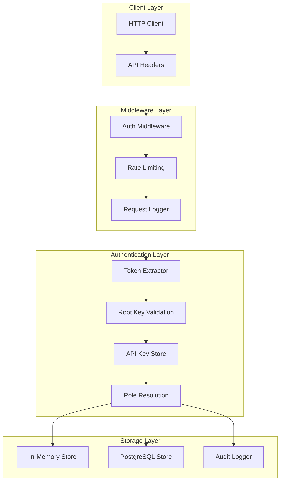
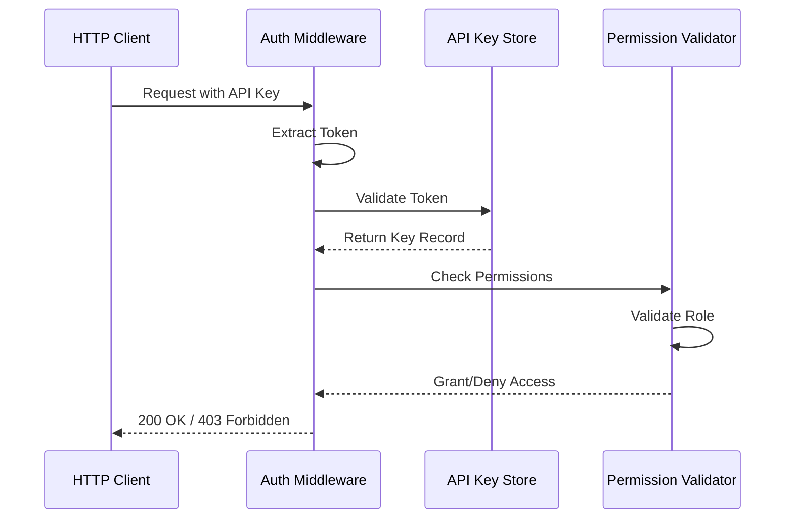
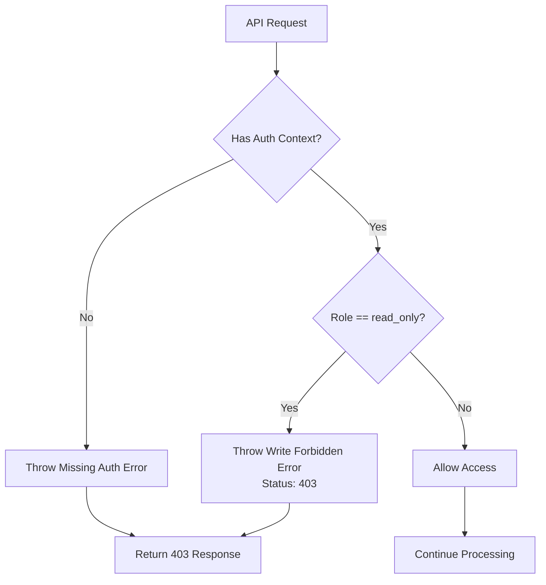
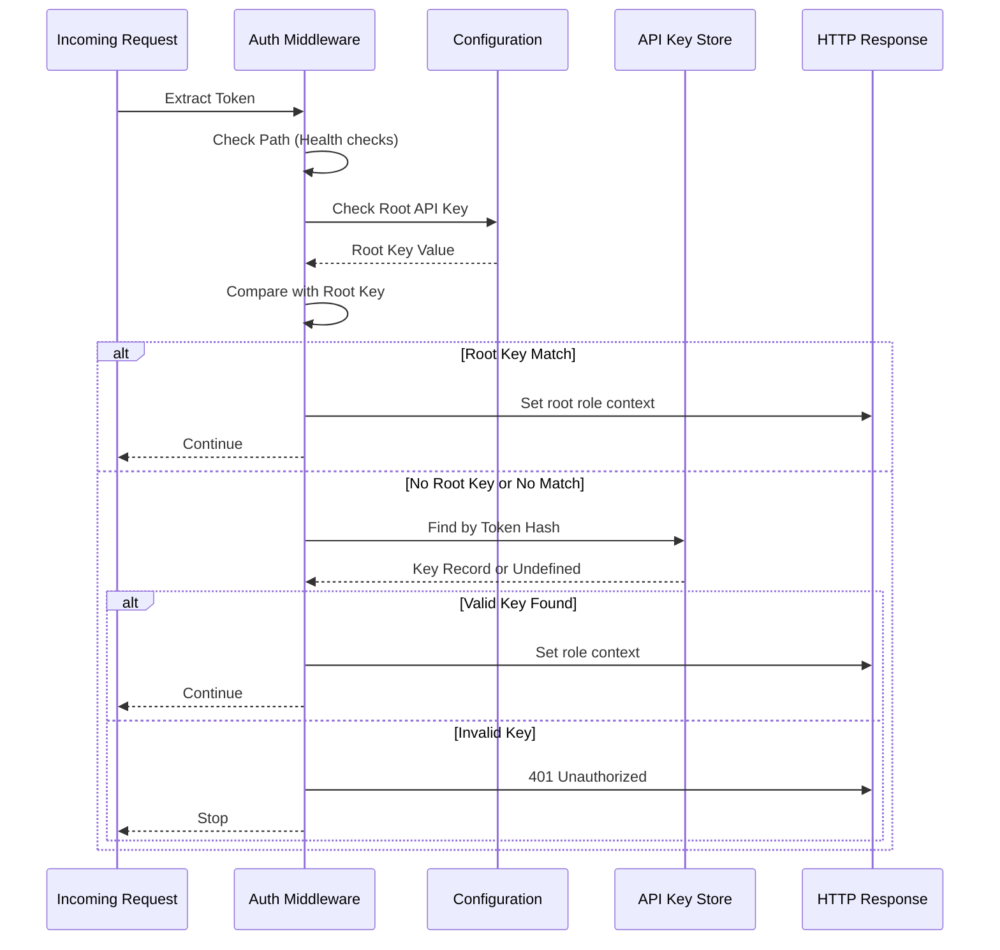
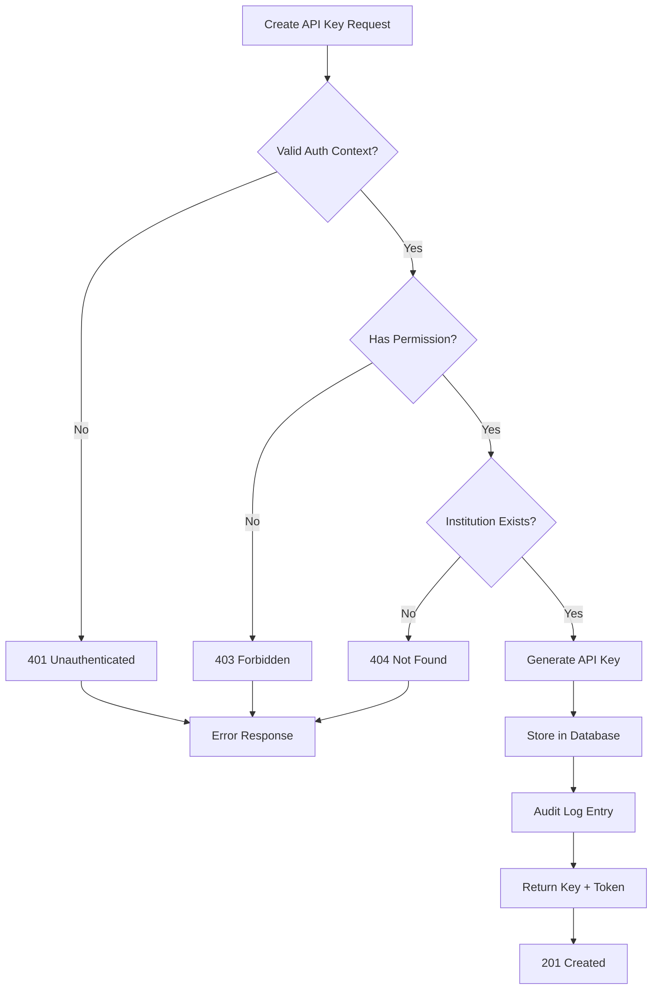
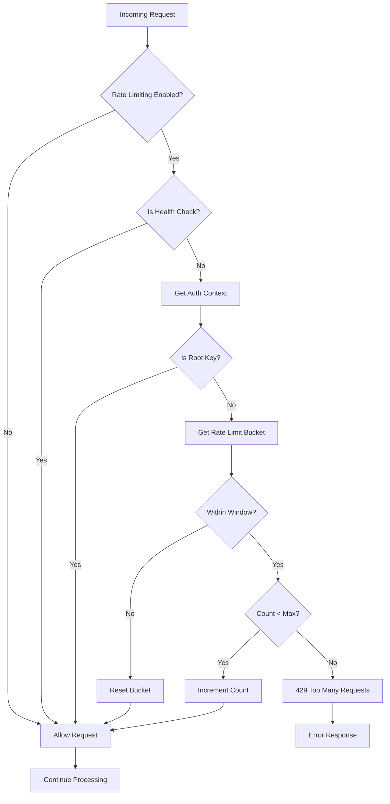
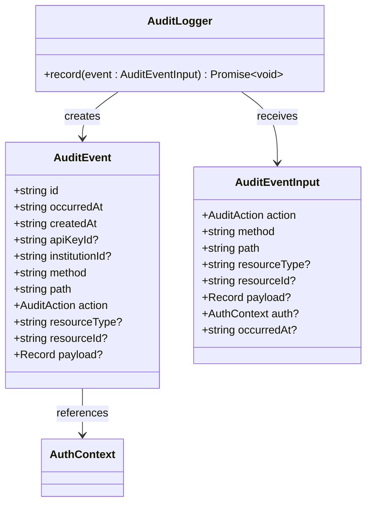
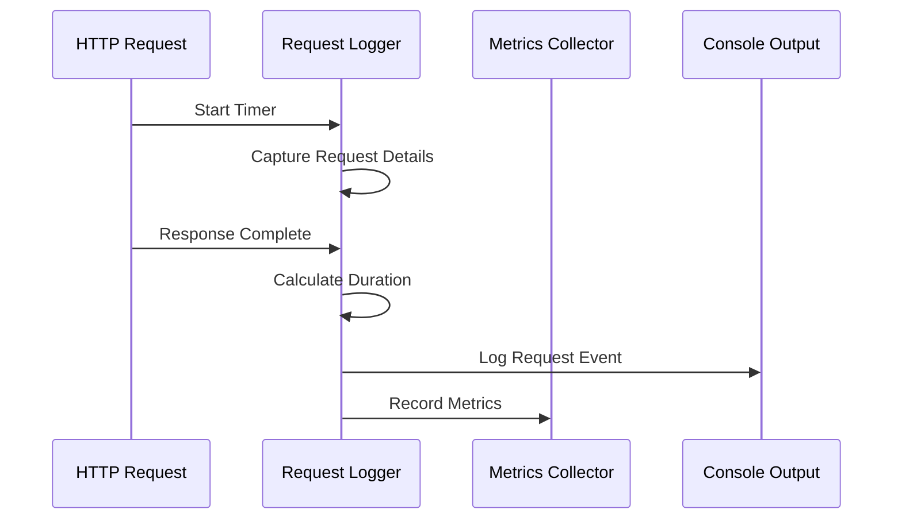
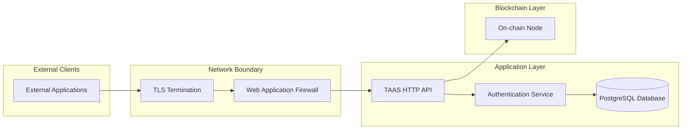

# Security & Authentication

<cite>
**Referenced Files in This Document**
- [auth.ts](file://src/middleware/auth.ts)
- [apiKeys.ts](file://src/api/apiKeys.ts)
- [apiKeyStore.ts](file://src/infra/apiKeyStore.ts)
- [config.ts](file://src/config.ts)
- [types.ts](file://src/domain/types.ts)
- [auditLogger.ts](file://src/infra/auditLogger.ts)
- [server.ts](file://src/server.ts)
- [rateLimit.ts](file://src/middleware/rateLimit.ts)
- [requestLogger.ts](file://src/middleware/requestLogger.ts)
- [audit.ts](file://src/domain/audit.ts)
- [postgresStore.ts](file://src/store/postgresStore.ts)
</cite>

## Table of Contents
1. [Introduction](#introduction)
2. [Authentication Architecture](#authentication-architecture)
3. [API Key System](#api-key-system)
4. [Role-Based Access Control](#role-based-access-control)
5. [Authentication Middleware](#authentication-middleware)
6. [API Key Lifecycle Management](#api-key-lifecycle-management)
7. [Security Features](#security-features)
8. [Audit and Monitoring](#audit-and-monitoring)
9. [Security Best Practices](#security-best-practices)
10. [Threat Model](#threat-model)
11. [Troubleshooting](#troubleshooting)

## Introduction

EscrowGrid implements a comprehensive security and authentication system designed for institutional use cases. The platform employs a multi-layered approach combining API key-based authentication, role-based access control, and robust security measures to protect sensitive financial data and ensure tenant isolation.

The authentication system supports two primary authentication methods:
- **Root API Keys**: Full administrative access for system administrators
- **Institutional API Keys**: Role-based access scoped to specific institutions

## Authentication Architecture

The authentication system follows a layered architecture with clear separation of concerns:



**Diagram sources**
- [auth.ts](file://src/middleware/auth.ts#L35-L95)
- [apiKeyStore.ts](file://src/infra/apiKeyStore.ts#L13-L23)
- [server.ts](file://src/server.ts#L21-L24)

**Section sources**
- [auth.ts](file://src/middleware/auth.ts#L1-L95)
- [server.ts](file://src/server.ts#L19-L24)

## API Key System

### Key Generation and Storage

The API key system generates cryptographically secure tokens using industry-standard cryptographic practices:

```mermaid
flowchart TD
Start([Key Creation Request]) --> GenID[Generate Unique ID]
GenID --> GenToken[Generate Random Token<br/>ak_{24-byte-hex}]
GenToken --> HashToken[SHA-256 Hash Token]
HashToken --> StoreHash[Store Hashed Token]
StoreHash --> StoreMeta[Store Metadata]
StoreMeta --> ReturnToken[Return Plain Token]
ReturnToken --> Client[Client Receives Token]
Client --> StoreHash
StoreHash --> Verify[Verify During Auth]
Verify --> CompareHash[Compare Hashes]
CompareHash --> GrantAccess[Grant Access]
```

**Diagram sources**
- [apiKeyStore.ts](file://src/infra/apiKeyStore.ts#L33-L39)
- [apiKeyStore.ts](file://src/infra/apiKeyStore.ts#L41-L94)

### Token Format and Security

API tokens follow a specific format and security pattern:
- **Format**: `ak_{24-byte-hex-string}`
- **Generation**: Cryptographically secure random bytes (24 bytes = 48 hex characters)
- **Storage**: Only hashed tokens stored in database (SHA-256)
- **Comparison**: Secure constant-time comparison during authentication

**Section sources**
- [apiKeyStore.ts](file://src/infra/apiKeyStore.ts#L33-L39)
- [apiKeyStore.ts](file://src/infra/apiKeyStore.ts#L41-L94)

## Role-Based Access Control

### Available Roles

The system implements a hierarchical role-based access control (RBAC) model:

| Role | Permissions | Scope | Description |
|------|-------------|-------|-------------|
| `root` | Full system access | Global | System administrators with unrestricted access |
| `admin` | Full CRUD operations | Institution-scoped | Institutional administrators with full access to their institution |
| `read_only` | Read-only access | Institution-scoped | Limited access for monitoring and reporting |

### Role Validation Flow



**Diagram sources**
- [auth.ts](file://src/middleware/auth.ts#L35-L95)
- [apiKeys.ts](file://src/api/apiKeys.ts#L25-L30)

### Write Access Protection

The system includes explicit write access protection for read-only keys:



**Diagram sources**
- [auth.ts](file://src/middleware/auth.ts#L84-L95)

**Section sources**
- [auth.ts](file://src/middleware/auth.ts#L84-L95)
- [types.ts](file://src/domain/types.ts#L5)

## Authentication Middleware

### Token Extraction

The authentication middleware supports multiple token extraction methods:

| Header Type | Format | Priority |
|-------------|--------|----------|
| `x-api-key` | Plain API key | High |
| `Authorization` | Bearer token | Medium |
| Root API Key | Environment variable | Highest |

### Authentication Flow



**Diagram sources**
- [auth.ts](file://src/middleware/auth.ts#L35-L95)

### Health Check Bypass

The authentication middleware automatically bypasses authentication for essential health and documentation endpoints to ensure system monitoring and API discovery remain accessible.

**Section sources**
- [auth.ts](file://src/middleware/auth.ts#L35-L95)

## API Key Lifecycle Management

### Key Creation

API keys are created through a controlled process with institutional validation:



**Diagram sources**
- [apiKeys.ts](file://src/api/apiKeys.ts#L15-L68)

### Key Listing and Management

The system provides comprehensive key management capabilities:

| Operation | Endpoint | Permissions Required |
|-----------|----------|---------------------|
| List Keys | GET `/institutions/{id}/api-keys` | Same institution or root |
| Create Key | POST `/institutions/{id}/api-keys` | Same institution (admin) or root |
| Revoke Key | DELETE `/api-keys/{id}` | Same institution (admin) or root |

### Revocation Mechanism

API keys can be revoked by setting the `revokedAt` timestamp in the database. The system automatically filters out revoked keys during authentication.

**Section sources**
- [apiKeys.ts](file://src/api/apiKeys.ts#L15-L110)
- [apiKeyStore.ts](file://src/infra/apiKeyStore.ts#L125-L182)

## Security Features

### Rate Limiting

The system implements distributed rate limiting to prevent abuse:



**Diagram sources**
- [rateLimit.ts](file://src/middleware/rateLimit.ts#L12-L67)

### Configuration-Based Security

Security features are configurable through environment variables:

| Setting | Purpose | Default |
|---------|---------|---------|
| `RATE_LIMIT_ENABLED` | Enable/disable rate limiting | `false` |
| `RATE_LIMIT_WINDOW_MS` | Time window for rate limiting | `60000` (1 minute) |
| `RATE_LIMIT_MAX_REQUESTS` | Maximum requests per window | `1000` |
| `STORE_BACKEND` | Storage backend selection | `'memory'` |

**Section sources**
- [rateLimit.ts](file://src/middleware/rateLimit.ts#L12-L67)
- [config.ts](file://src/config.ts#L3-L16)

## Audit and Monitoring

### Audit Logging

The system maintains comprehensive audit trails for all security-relevant actions:



**Diagram sources**
- [auditLogger.ts](file://src/infra/auditLogger.ts#L13-L109)
- [audit.ts](file://src/domain/audit.ts#L11-L36)

### Supported Audit Actions

The system logs the following security-relevant actions:

| Action | Description |
|--------|-------------|
| `API_KEY_CREATED` | New API key creation |
| `INSTITUTION_CREATED` | New institution creation |
| `ASSET_TEMPLATE_CREATED` | New asset template creation |
| `ASSET_CREATED` | New asset creation |
| `POSITION_CREATED` | New position creation |
| `POSITION_TRANSITIONED` | Position state changes |

### Request Logging

Every request is logged with detailed metadata for monitoring and debugging:



**Diagram sources**
- [requestLogger.ts](file://src/middleware/requestLogger.ts#L5-L29)

**Section sources**
- [auditLogger.ts](file://src/infra/auditLogger.ts#L1-L109)
- [audit.ts](file://src/domain/audit.ts#L1-L36)
- [requestLogger.ts](file://src/middleware/requestLogger.ts#L1-L29)

## Security Best Practices

### Key Management

1. **Secure Storage**: API keys are stored as SHA-256 hashes only, never in plaintext
2. **Rotation**: Regular key rotation is recommended for enhanced security
3. **Revocation**: Immediate revocation of compromised keys
4. **Environment Variables**: All secrets should be managed through environment variables or dedicated secret management systems

### Network Security

1. **TLS Only**: All communications should occur over HTTPS/TLS
2. **IP Restrictions**: Deployments should implement IP-based access controls
3. **WAF Integration**: Web Application Firewalls should be deployed at the network boundary

### Operational Security

1. **Principle of Least Privilege**: Use read-only keys when possible
2. **Monitoring**: Implement comprehensive monitoring and alerting
3. **Incident Response**: Establish procedures for key compromise scenarios

**Section sources**
- [config.ts](file://src/config.ts#L1-L47)

## Threat Model

### Protected Assets

The system protects several critical assets:

| Asset Category | Examples | Protection Level |
|----------------|----------|------------------|
| **API Keys** | Root keys, institutional keys | Cryptographic hashing, secure storage |
| **Database Content** | Positions, ledger events, audit trails | Role-based access control |
| **On-chain Private Key** | When enabled | Environment variable storage |

### Primary Threats and Mitigations

| Threat | Likelihood | Impact | Mitigation |
|--------|------------|--------|------------|
| **API Key Theft** | High | Critical | Strong random keys, TLS-only transport |
| **Brute Force Attacks** | Medium | High | Rate limiting, key complexity |
| **Abuse via Valid Keys** | Medium | Medium | Per-key rate limiting |
| **Data Exfiltration** | Low | Critical | Role-based access, audit logging |

### Trust Boundaries



**Section sources**
- [product.md](file://product.md#L63-L85)

## Troubleshooting

### Common Authentication Issues

| Error | Cause | Solution |
|-------|-------|----------|
| `401 Missing API key` | No token provided | Include `x-api-key` or `Authorization: Bearer` header |
| `401 Invalid API key` | Token not found or revoked | Verify key validity and check revocation status |
| `403 Write access forbidden` | Using read-only key for write operation | Use admin key or remove write operation |
| `403 Forbidden` | Insufficient permissions | Verify institutional ownership or root access |

### Debugging Authentication

1. **Check Token Format**: Ensure tokens follow `ak_{hex}` format
2. **Verify Role**: Confirm the key has appropriate role permissions
3. **Review Logs**: Check audit logs for authentication attempts
4. **Test Connectivity**: Verify database connectivity for key validation

### Performance Considerations

1. **Key Lookup Performance**: API key validation involves database lookups
2. **Rate Limiting**: Monitor rate limit bucket growth for potential abuse
3. **Audit Logging**: Production deployments should use PostgreSQL for audit logging

**Section sources**
- [auth.ts](file://src/middleware/auth.ts#L52-L95)
- [apiKeyStore.ts](file://src/infra/apiKeyStore.ts#L125-L182)