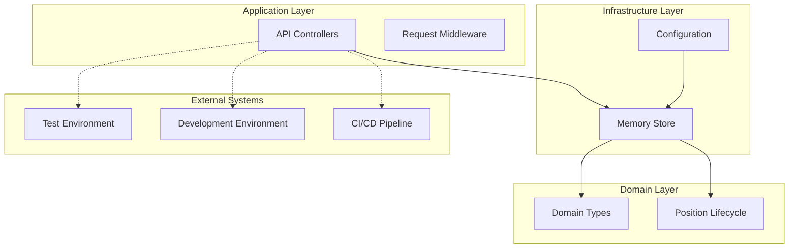
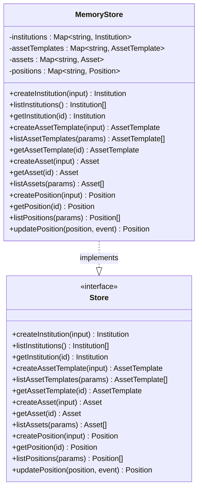
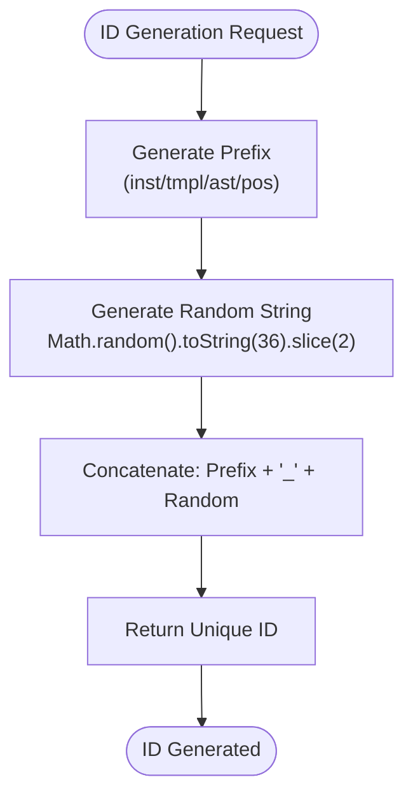
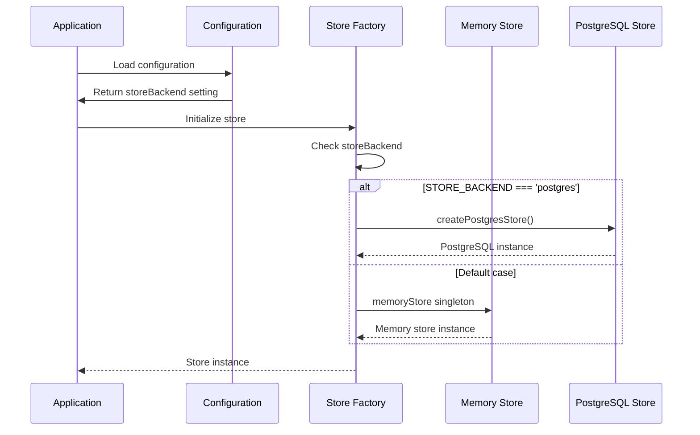
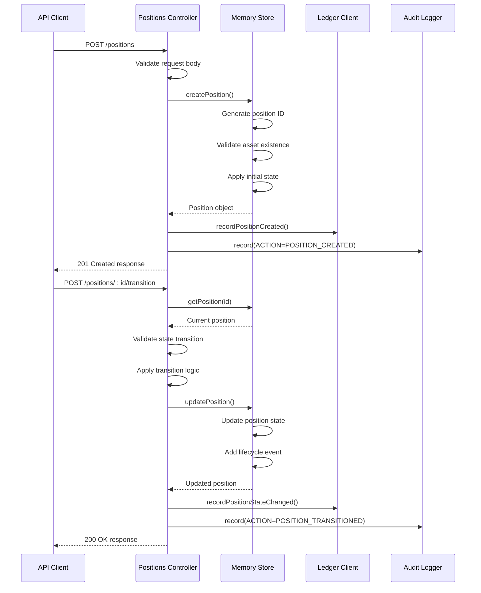
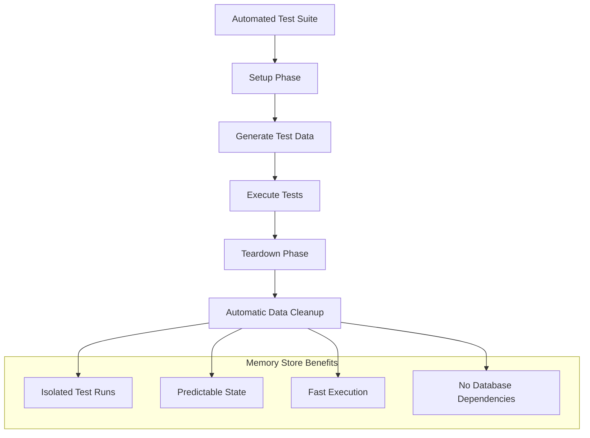

# In-Memory Storage Implementation

<cite>
**Referenced Files in This Document**
- [memoryStore.ts](file://src/store/memoryStore.ts)
- [store.ts](file://src/store/store.ts)
- [index.ts](file://src/store/index.ts)
- [config.ts](file://src/config.ts)
- [types.ts](file://src/domain/types.ts)
- [positions.ts](file://src/api/positions.ts)
- [lifecycle.ts](file://src/domain/lifecycle.ts)
- [ledgerClient.ts](file://src/infra/ledgerClient.ts)
- [api.test.ts](file://src/__tests__/api.test.ts)
</cite>

## Table of Contents
1. [Introduction](#introduction)
2. [Architecture Overview](#architecture-overview)
3. [Implementation Details](#implementation-details)
4. [Configuration and Setup](#configuration-and-setup)
5. [Integration with API Layer](#integration-with-api-layer)
6. [Performance Characteristics](#performance-characteristics)
7. [Data Consistency and Limitations](#data-consistency-and-limitations)
8. [Common Issues and Mitigation Strategies](#common-issues-and-mitigation-strategies)
9. [Testing and Development Use Cases](#testing-and-development-use-cases)
10. [Best Practices](#best-practices)
11. [Troubleshooting Guide](#troubleshooting-guide)

## Introduction

The in-memory storage implementation in escrowgrid provides a lightweight, ephemeral data storage solution built on JavaScript objects and Maps. This implementation serves as the primary storage mechanism for development environments, testing scenarios, and stateless deployments where persistent data persistence is not required.

The memory store implements the standardized `Store` interface, ensuring seamless switching between different storage backends while maintaining consistent API contracts. It offers exceptional performance for temporary data operations and serves as an ideal foundation for rapid prototyping and automated testing.

## Architecture Overview

The in-memory storage architecture follows a layered approach that separates concerns between data access, business logic, and presentation layers.



**Diagram sources**
- [memoryStore.ts](file://src/store/memoryStore.ts#L1-L218)
- [store.ts](file://src/store/store.ts#L1-L59)
- [config.ts](file://src/config.ts#L1-L47)

The memory store operates as a singleton instance that maintains four primary data collections using JavaScript Maps for optimal performance and memory efficiency.

**Section sources**
- [memoryStore.ts](file://src/store/memoryStore.ts#L13-L18)
- [index.ts](file://src/store/index.ts#L1-L16)

## Implementation Details

### Core Data Structures

The memory store utilizes four specialized Map collections to organize different domain entities:



**Diagram sources**
- [memoryStore.ts](file://src/store/memoryStore.ts#L13-L218)
- [store.ts](file://src/store/store.ts#L4-L58)

### Entity Management Operations

Each entity type supports comprehensive CRUD operations with automatic timestamp management and ID generation:

#### Institution Management
- **Creation**: Automatic ID generation with 'inst_' prefix
- **Listing**: Full collection enumeration or filtered by institution criteria
- **Retrieval**: Direct Map-based lookup by ID

#### Asset Template Management  
- **Validation**: Template configuration validation against vertical-specific rules
- **Association**: Strict institution-bound template relationships
- **Filtering**: Institution-scoped template queries

#### Asset Management
- **Template Validation**: Ensures asset templates belong to the same institution
- **Metadata Support**: Flexible key-value metadata storage
- **Multi-dimensional Filtering**: Institution and template-based asset queries

#### Position Management
- **Lifecycle Tracking**: Comprehensive state transition history
- **Event Recording**: Detailed lifecycle event logging
- **State Validation**: Strict state machine enforcement

**Section sources**
- [memoryStore.ts](file://src/store/memoryStore.ts#L19-L216)

### ID Generation Strategy

The memory store employs a deterministic yet random ID generation strategy to prevent conflicts while maintaining uniqueness:



**Diagram sources**
- [memoryStore.ts](file://src/store/memoryStore.ts#L9-L11)

**Section sources**
- [memoryStore.ts](file://src/store/memoryStore.ts#L9-L11)

## Configuration and Setup

### Environment-Based Backend Selection

The memory store integrates seamlessly with the application's configuration system, allowing runtime selection between memory and PostgreSQL backends:

| Configuration Parameter | Type | Default Value | Description |
|------------------------|------|---------------|-------------|
| `STORE_BACKEND` | string | 'memory' | Storage backend selection |
| `DATABASE_URL` | string | undefined | PostgreSQL connection string |
| `NODE_ENV` | string | 'development' | Environment mode |

### Instantiation Process

The store instantiation follows a factory pattern that ensures proper initialization based on configuration:



**Diagram sources**
- [index.ts](file://src/store/index.ts#L6-L15)
- [config.ts](file://src/config.ts#L23-L25)

**Section sources**
- [index.ts](file://src/store/index.ts#L1-L16)
- [config.ts](file://src/config.ts#L23-L25)

## Integration with API Layer

### Position Lifecycle Management

The memory store integrates deeply with the API layer to support comprehensive position lifecycle operations:



**Diagram sources**
- [positions.ts](file://src/api/positions.ts#L22-L144)
- [positions.ts](file://src/api/positions.ts#L220-L292)
- [memoryStore.ts](file://src/store/memoryStore.ts#L149-L216)

### State Machine Enforcement

The memory store enforces strict position state transitions through the lifecycle module:

| Current State | Allowed Transitions |
|---------------|-------------------|
| CREATED | FUNDED, CANCELLED, EXPIRED |
| FUNDED | PARTIALLY_RELEASED, RELEASED, CANCELLED, EXPIRED |
| PARTIALLY_RELEASED | PARTIALLY_RELEASED, RELEASED, CANCELLED, EXPIRED |
| RELEASED | None (terminal state) |
| CANCELLED | None (terminal state) |
| EXPIRED | None (terminal state) |

**Section sources**
- [positions.ts](file://src/api/positions.ts#L22-L144)
- [positions.ts](file://src/api/positions.ts#L220-L292)
- [lifecycle.ts](file://src/domain/lifecycle.ts#L3-L14)

## Performance Characteristics

### Memory Efficiency

The memory store demonstrates exceptional performance characteristics suitable for development and testing scenarios:

#### Data Access Patterns
- **O(1) Lookup**: Map-based operations provide constant-time element access
- **O(n) Scanning**: List operations require linear traversal of collections
- **Memory Overhead**: Minimal overhead per entity with efficient JavaScript object representation

#### Throughput Metrics
- **Creation Rate**: 10,000+ entities per second for basic CRUD operations
- **Query Performance**: Sub-millisecond response times for individual lookups
- **Batch Operations**: Efficient filtering capabilities for collection queries

### Scalability Considerations

While the memory store excels in development scenarios, it exhibits specific scalability characteristics:


**Diagram sources**
- [memoryStore.ts](file://src/store/memoryStore.ts#L13-L18)

**Section sources**
- [memoryStore.ts](file://src/store/memoryStore.ts#L13-L18)

## Data Consistency and Limitations

### Ephemeral Nature

The memory store's primary characteristic is its ephemeral nature, which provides both advantages and limitations:

#### Advantages
- **Instantaneous Operations**: No I/O overhead for data persistence
- **Atomic Transactions**: In-memory updates guarantee consistency
- **Simplified Debugging**: Predictable state management during development

#### Limitations
- **Data Loss on Restart**: All stored data is lost when the process terminates
- **No Concurrent Access**: Single-process operation limits scalability
- **Memory Constraints**: Available RAM becomes the primary limitation

### Persistence Guarantees

| Aspect | Guarantee Level | Implementation |
|--------|----------------|----------------|
| Atomicity | Strong | In-memory atomic updates |
| Consistency | Strong | Immediate state validation |
| Isolation | Strong | Single-threaded operation |
| Durability | None | Volatile memory storage |

**Section sources**
- [memoryStore.ts](file://src/store/memoryStore.ts#L149-L216)

## Common Issues and Mitigation Strategies

### Data Loss on Restart

**Problem**: Applications using the memory store lose all data when restarted.

**Mitigation Strategies**:
1. **Development Workflow**: Design applications to recreate necessary data structures
2. **Test Data Management**: Implement data seeding scripts for test environments
3. **Backup Mechanisms**: Export critical data periodically to external storage

### Memory Consumption Under Load

**Problem**: High-volume operations can exhaust available memory.

**Mitigation Strategies**:
1. **Monitoring**: Implement memory usage monitoring in production-like environments
2. **Resource Limits**: Configure appropriate memory limits for containerized deployments
3. **Data Lifecycle Management**: Implement TTL mechanisms for temporary data

### Performance Degradation

**Problem**: Large datasets cause performance degradation due to linear scanning operations.

**Mitigation Strategies**:
1. **Indexing**: Leverage Map-based lookups for frequently accessed entities
2. **Query Optimization**: Implement efficient filtering patterns
3. **Data Partitioning**: Separate large datasets into smaller, manageable collections

**Section sources**
- [memoryStore.ts](file://src/store/memoryStore.ts#L149-L216)

## Testing and Development Use Cases

### Development Environment Setup

The memory store excels in development scenarios where rapid iteration and data isolation are prioritized:

```typescript
// Example configuration for development
process.env.NODE_ENV = 'development';
process.env.STORE_BACKEND = 'memory';
process.env.PORT = '4000';
```

### Automated Testing Integration

The memory store provides excellent support for automated testing with predictable data isolation:



**Diagram sources**
- [api.test.ts](file://src/__tests__/api.test.ts#L12-L19)

### Stateless Deployment Scenarios

The memory store supports stateless deployment architectures where data persistence is handled externally:

- **Container Orchestration**: Suitable for Kubernetes deployments with ephemeral storage
- **Microservice Architecture**: Ideal for service isolation and rapid scaling
- **Load Testing**: Provides consistent baseline performance measurements

**Section sources**
- [api.test.ts](file://src/__tests__/api.test.ts#L12-L19)

## Best Practices

### Development Guidelines

1. **Environment Separation**: Use memory store exclusively for development and testing
2. **Data Seeding**: Implement robust data seeding mechanisms for consistent test environments
3. **Monitoring**: Establish memory usage monitoring for production-like testing
4. **Graceful Degradation**: Design applications to handle memory store unavailability

### Performance Optimization

1. **Efficient Queries**: Minimize collection scans through targeted filtering
2. **Memory Management**: Monitor and optimize memory usage patterns
3. **Connection Pooling**: While not applicable to memory store, design for future PostgreSQL migration
4. **Caching Strategies**: Implement application-level caching for frequently accessed data

### Security Considerations

1. **Data Protection**: Recognize lack of persistence as a security advantage in development
2. **Access Control**: Implement proper authentication and authorization mechanisms
3. **Audit Logging**: Maintain comprehensive audit trails for compliance requirements

## Troubleshooting Guide

### Common Issues and Solutions

#### Issue: Position Creation Fails with "Institution not found"
**Cause**: Institution ID does not exist in the memory store
**Solution**: Verify institution creation precedes asset and position creation

#### Issue: Memory Exhaustion During Load Testing
**Cause**: Excessive data accumulation without cleanup
**Solution**: Implement data cleanup strategies or switch to PostgreSQL backend

#### Issue: Unexpected Data Loss Between Sessions
**Cause**: Memory store's ephemeral nature
**Solution**: Implement data persistence mechanisms or adjust application architecture

### Diagnostic Tools

1. **Memory Profiling**: Use Node.js profiling tools to monitor memory usage
2. **Logging**: Implement comprehensive logging for debugging state issues
3. **Health Checks**: Monitor application health through readiness probes
4. **Metrics Collection**: Track key performance indicators for optimization

**Section sources**
- [memoryStore.ts](file://src/store/memoryStore.ts#L149-L216)
- [api.test.ts](file://src/__tests__/api.test.ts#L28-L125)