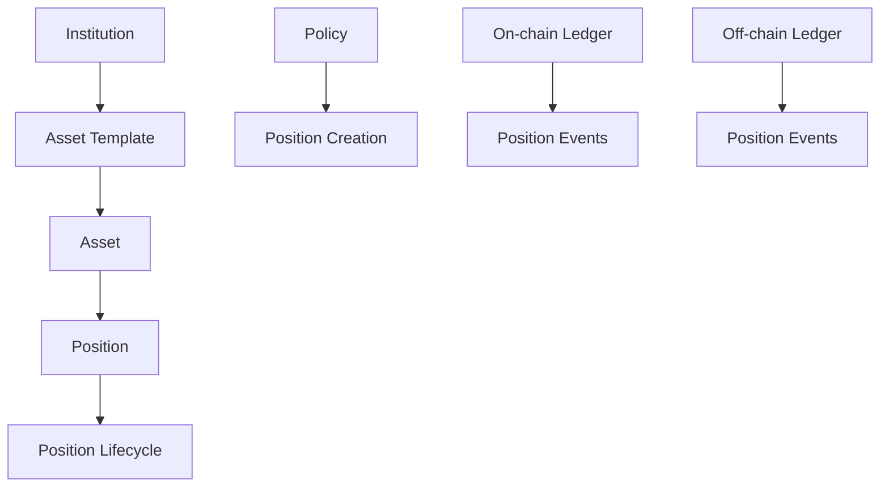
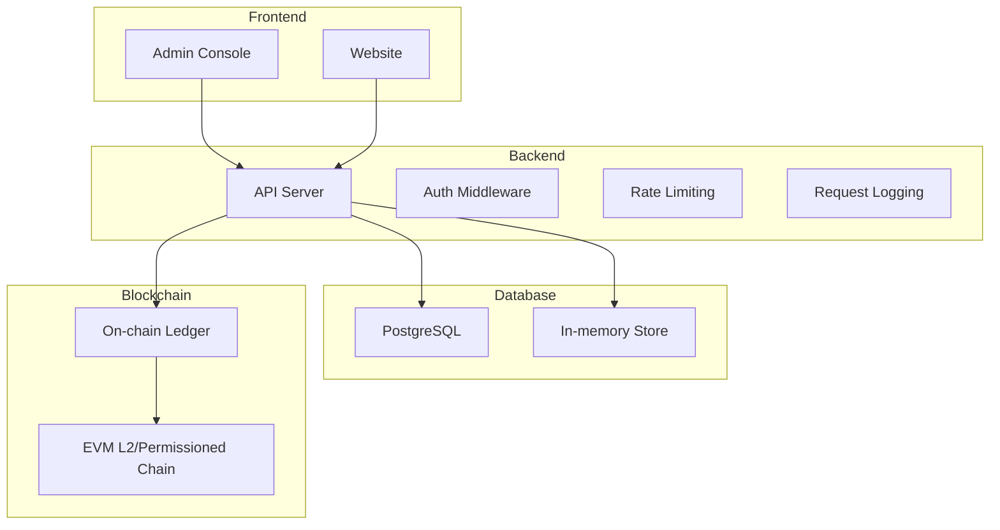
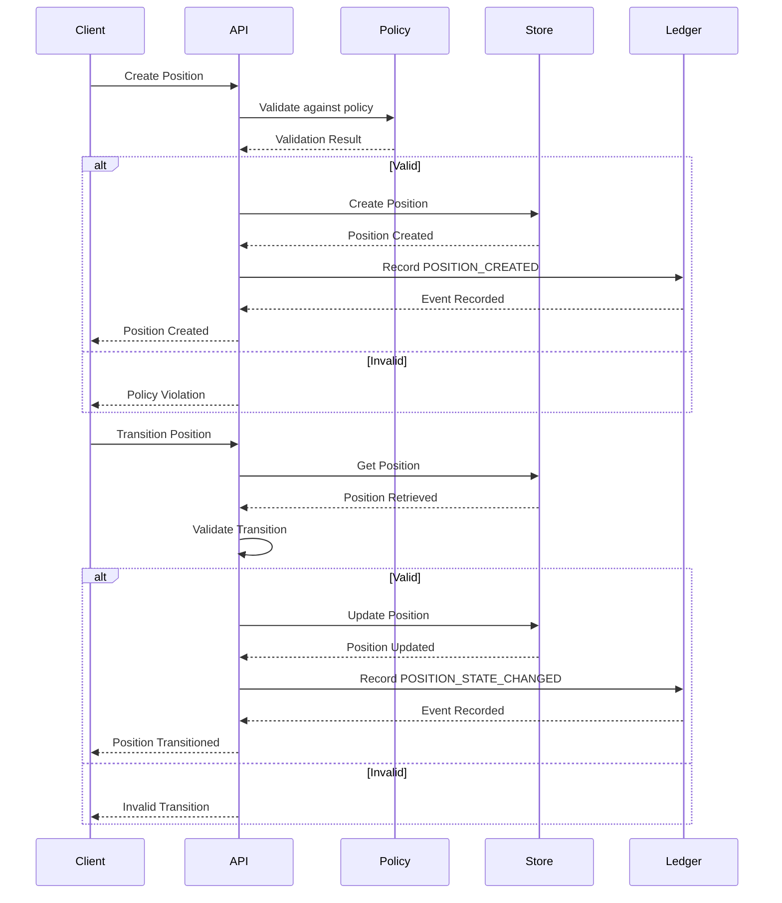

# System Overview

<cite>
**Referenced Files in This Document**   
- [README.md](file://README.md)
- [product.md](file://product.md)
- [config.ts](file://src/config.ts)
- [server.ts](file://src/server.ts)
- [openapi.ts](file://src/openapi.ts)
- [types.ts](file://src/domain/types.ts)
- [positions.ts](file://src/api/positions.ts)
- [assets.ts](file://src/api/assets.ts)
- [store.ts](file://src/store/store.ts)
- [lifecycle.ts](file://src/domain/lifecycle.ts)
- [ledgerClient.ts](file://src/infra/ledgerClient.ts)
- [onchainLedger.ts](file://src/infra/onchainLedger.ts)
- [docker-compose.yml](file://docker-compose.yml)
</cite>

## Table of Contents
1. [Introduction](#introduction)
2. [Core Concepts](#core-concepts)
3. [Architecture Overview](#architecture-overview)
4. [Data Flow and Lifecycle Management](#data-flow-and-lifecycle-management)
5. [Security and Access Control](#security-and-access-control)
6. [Target Audience](#target-audience)
7. [Key Features and Components](#key-features-and-components)
8. [Admin Console & Guided Onboarding](#admin-console--guided-onboarding)

## Introduction
The EscrowGrid platform is a Trust-as-a-Service (TaaS) system designed to provide financial escrow, asset tokenization, and position lifecycle management for institutional clients. Built as a scalable backend infrastructure, EscrowGrid enables banks, funds, and enterprises to manage tokenizable real-world assets in construction and trade finance. The platform offers a secure, multi-tenant environment with robust policy enforcement, dual ledger design (on-chain and off-chain), and comprehensive institutional access control. This document provides a high-level overview of the system's architecture, core concepts, and operational model to guide developers, financial institutions, and compliance officers in understanding and utilizing the platform effectively.

**Section sources**
- [README.md](file://README.md#L1-L378)
- [product.md](file://product.md#L1-L96)

## Core Concepts
EscrowGrid is built around several core concepts that define its functionality and operational model. An **Institution** represents a bank, fund, or enterprise using the platform, each operating in isolation through multi-tenancy. **Asset templates** describe tokenizable asset types such as construction escrow or invoice claims, with specific configurations for different verticals like construction and trade finance. An **Asset** is a specific instance under an asset template, such as a particular project escrow. A **Position** represents a holder-specific claim on an asset with a defined lifecycle (CREATED, FUNDED, RELEASED, etc.). The platform supports policy enforcement at the institution and region level, governing position creation with constraints on amount, currency, and other parameters. The dual ledger design allows for both off-chain (PostgreSQL or in-memory) and on-chain ledger writes, providing flexibility for different use cases and regulatory requirements.

**Diagram sources**
- [README.md](file://README.md#L61-L275)
- [product.md](file://product.md#L5-L11)

## Architecture Overview
The EscrowGrid platform follows a modular architecture with distinct frontend, backend, database, and blockchain integration layers. The backend is built using TypeScript with Node.js runtime and Express framework, exposing a RESTful API surface for managing institutions, asset templates, assets, positions, and policies. The system supports multiple storage backends, including in-memory and PostgreSQL, with configuration via environment variables. The frontend consists of an admin console built with React and a website component, both served through Docker containers. Blockchain integration is achieved through an on-chain ledger adapter that can write selected events to an EVM L2 or permissioned chain when enabled. The architecture is containerized using Docker Compose, with services for the database, API, and admin console, enabling easy deployment and scaling. Authentication is handled through API keys with role-based access control, ensuring secure access to platform resources.

**Diagram sources**
- [docker-compose.yml](file://docker-compose.yml#L1-L55)
- [server.ts](file://src/server.ts#L1-L100)
- [config.ts](file://src/config.ts#L1-L47)

## Data Flow and Lifecycle Management
The EscrowGrid platform manages data flow and position lifecycle through a well-defined sequence of operations. When a position is created, the system first validates the request against institution-specific policies, checking constraints such as minimum and maximum amounts and allowed currencies. If the policy check passes, the position is created in the selected storage backend (PostgreSQL or in-memory) and a POSITION_CREATED event is recorded in the ledger. Position lifecycle transitions follow a state machine model with predefined valid transitions between states (e.g., CREATED → FUNDED, FUNDED → RELEASED). Each transition is validated against the allowed transitions defined in the system, and upon successful validation, a POSITION_STATE_CHANGED event is recorded in the ledger. The dual ledger design allows these events to be written to both off-chain and on-chain ledgers simultaneously when configured. The system also maintains a complete audit trail of all operations, including position creation and transitions, providing transparency and accountability.

**Diagram sources**
- [positions.ts](file://src/api/positions.ts#L1-L298)
- [lifecycle.ts](file://src/domain/lifecycle.ts#L1-L51)
- [ledgerClient.ts](file://src/infra/ledgerClient.ts#L1-L64)

## Security and Access Control
EscrowGrid implements a comprehensive security model with multiple layers of access control and authentication. The platform uses an API key-based authentication system with three roles: root, admin, and read_only. The root API key, configured via environment variables, has full access to all institutions and can create institutions and manage API keys. Institution API keys are created per institution and are scoped to that institution's data, ensuring tenant isolation. Admin keys have full read/write access within their institution, while read_only keys are restricted to GET operations. All API routes (except health checks and documentation endpoints) require a valid API key, which is validated through middleware. The system also implements per-key rate limiting to prevent abuse, with configurable limits for request windows and maximum requests. For on-chain operations, the private key is stored as an environment variable and used to sign transactions, with additional safeguards to prevent unauthorized access.

**Section sources**
- [README.md](file://README.md#L94-L112)
- [server.ts](file://src/server.ts#L22-L24)
- [config.ts](file://src/config.ts#L13-L15)

## Target Audience
The EscrowGrid platform serves multiple target audiences with different needs and use cases. **Developers** can leverage the platform's RESTful API and OpenAPI documentation to integrate escrow and asset tokenization functionality into their applications. The well-defined API surface and comprehensive documentation make it easy for developers to understand and implement the platform's features. **Financial institutions** such as banks and funds can use EscrowGrid to manage their escrow arrangements and tokenized assets, taking advantage of the multi-tenancy and policy enforcement features to ensure compliance with regulatory requirements. The platform's support for different regions and verticals allows institutions to customize their workflows according to local regulations. **Compliance officers** benefit from the platform's auditability features, including structured request logging and immutable ledger records, which provide a clear trail of all operations for regulatory compliance and internal audits.

**Section sources**
- [README.md](file://README.md#L1-L378)
- [product.md](file://product.md#L1-L96)

## Key Features and Components
The EscrowGrid platform consists of several key features and components that work together to provide a comprehensive Trust-as-a-Service solution. The **API surface** includes endpoints for managing institutions, asset templates, assets, positions, and policies, with OpenAPI documentation for self-discovery and exploration. The **storage abstraction** supports both in-memory and PostgreSQL backends, allowing for flexibility in deployment scenarios. The **policy engine** enables configurable rules per institution and region, enforcing constraints on position creation and transitions. The **dual ledger design** allows for both off-chain and on-chain ledger writes, providing options for different use cases and regulatory requirements. The **admin console** provides a web-based interface for managing platform resources, while the **monitoring and observability** features include health checks, readiness probes, and request metrics. These components work together to create a robust and scalable platform for financial escrow and asset tokenization.

**Section sources**
- [README.md](file://README.md#L1-L378)
- [product.md](file://product.md#L1-L96)
- [openapi.ts](file://src/openapi.ts#L1-L800)

## Admin Console & Guided Onboarding
While the core of EscrowGrid is an API-first backend, the admin console plays a critical role in making the platform
usable for non-technical operators and in simplifying initial onboarding flows.

The admin console is a React-based single-page application that connects to the same API endpoints described above and
provides a guided experience for bootstrapping new environments:

- **Automatic API URL alignment**: In Docker demos, the console is built with a `VITE_API_URL` that matches the API
  container’s host/port. For custom deployments, the console can be pointed at any API base URL without code changes.
- **Key-aware context**: On login, the console detects whether the user is using a root key or an institution key
  (by probing root-only endpoints) and surfaces that context in the UI. This helps operators understand whether they
  are performing global bootstrap tasks or tenant-scoped work.
- **Getting Started checklist**: A dedicated “Getting Started” tab presents a step-by-step checklist for:
  1. Creating an institution.
  2. Issuing an institution API key.
  3. Creating an asset template.
  4. Creating an asset.
  5. Creating and transitioning a position.
  Each step has status (done/pending) and a direct navigation action to the relevant tab, reducing friction for
  first-time users.
- **Field-level guidance**: Forms across institutions, templates, assets, positions, and policies include inline
  explanations and required markers, so operators do not need prior knowledge of the domain model to input valid data.

Together, these features ensure that the platform can be explored end-to-end (from institution creation through
position lifecycle events) without manual environment plumbing or deep familiarity with the API surface, while still
reflecting the same underlying concepts and constraints as the backend.

**Section sources**
- [admin-console/README.md](file://admin-console/README.md)
- [admin-console/src/App.tsx](file://admin-console/src/App.tsx)
- [admin-console/src/components/InstitutionsTab.tsx](file://admin-console/src/components/InstitutionsTab.tsx)
- [admin-console/src/components/AssetsTab.tsx](file://admin-console/src/components/AssetsTab.tsx)
- [admin-console/src/components/PositionsTab.tsx](file://admin-console/src/components/PositionsTab.tsx)
