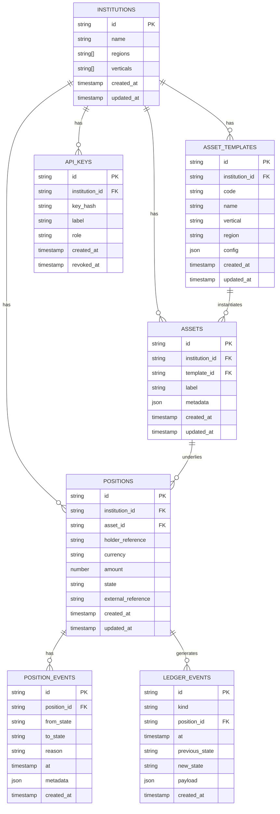
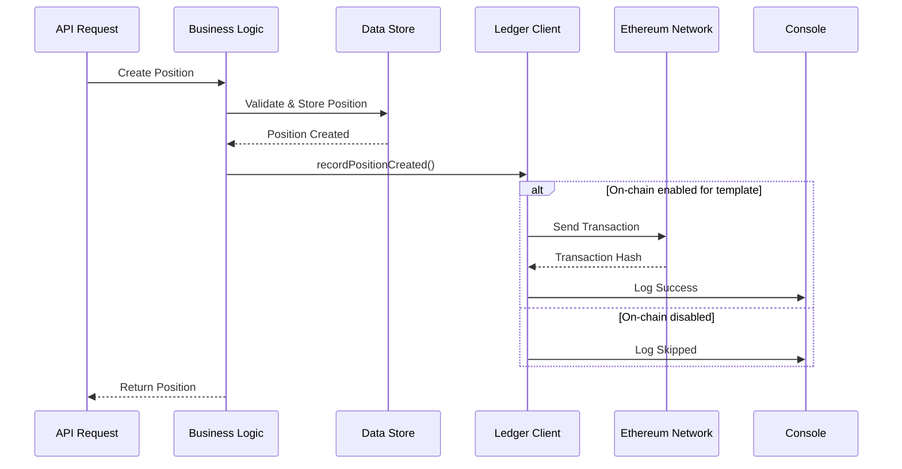

# Technology Stack

<cite>
**Referenced Files in This Document**   
- [package.json](file://package.json)
- [admin-console/package.json](file://admin-console/package.json)
- [website/package.json](file://website/package.json)
- [tsconfig.json](file://tsconfig.json)
- [vitest.config.ts](file://vitest.config.ts)
- [src/server.ts](file://src/server.ts)
- [src/config.ts](file://src/config.ts)
- [src/store/postgresStore.ts](file://src/store/postgresStore.ts)
- [src/infra/onchainLedger.ts](file://src/infra/onchainLedger.ts)
- [src/infra/postgresLedger.ts](file://src/infra/postgresLedger.ts)
- [src/domain/types.ts](file://src/domain/types.ts)
- [src/openapi.ts](file://src/openapi.ts)
- [admin-console/vite.config.ts](file://admin-console/vite.config.ts)
- [website/vite.config.ts](file://website/vite.config.ts)
</cite>

## Table of Contents
1. [Backend Stack](#backend-stack)
2. [Frontend Stack](#frontend-stack)
3. [Database Integration](#database-integration)
4. [Blockchain Integration](#blockchain-integration)
5. [Full-Stack TypeScript Usage](#full-stack-typescript-usage)
6. [Development Tooling](#development-tooling)
7. [Framework-Specific Patterns](#framework-specific-patterns)

## Backend Stack

The backend of EscrowGrid is built on a modern Node.js stack using Express as the web framework and TypeScript for type safety. The architecture follows a clean separation of concerns with distinct layers for API routes, domain logic, infrastructure, and data storage.

Node.js v24.x serves as the runtime environment, providing excellent ES2020+ support and performance optimizations. Express 5.1.0 is used as the web framework, offering a robust set of features for building RESTful APIs with middleware support, routing, and error handling. The use of Express 5.x brings improved TypeScript support, better error handling with async/await, and enhanced routing capabilities.

TypeScript 5.9.3 is leveraged throughout the backend to ensure type safety, improve developer experience with better autocompletion and refactoring, and catch errors at compile time. The `tsconfig.json` configuration enforces strict type checking with options like `strict`, `noUncheckedIndexedAccess`, and `exactOptionalPropertyTypes`, ensuring high code quality and reducing runtime errors.

The backend architecture follows a modular pattern with clear separation between API routes, domain logic, and infrastructure components. API routes in the `src/api/` directory handle HTTP request/response cycles, while domain logic in `src/domain/` contains business rules and validation. Infrastructure components in `src/infra/` manage external integrations with databases and blockchain.

**Section sources**
- [package.json](file://package.json#L18-L24)
- [tsconfig.json](file://tsconfig.json#L3-L48)
- [src/server.ts](file://src/server.ts#L1-L100)
- [src/config.ts](file://src/config.ts#L1-L47)

## Frontend Stack

The frontend ecosystem of EscrowGrid consists of two distinct React applications: an admin console and a public website. Both applications leverage React 18+/19 with TypeScript for type safety and modern React features.

The admin console, located in the `admin-console/` directory, uses React 19.2.0 and is built with Vite as the build tool. This application provides administrative functionality for managing institutions, API keys, asset templates, and other platform resources. The use of React 19 enables access to the latest React features and performance improvements.

The public website, in the `website/` directory, uses React 18.3.1 and serves as the customer-facing interface for the platform. This separation allows for independent development, deployment, and scaling of administrative and customer-facing interfaces.

Both frontend applications use TypeScript to ensure type safety across the UI components, reducing bugs and improving developer productivity. The type definitions from the backend are shared or mirrored to maintain consistency between frontend and backend data structures.

Vite is used as the build tool for both frontend applications, providing fast development server startup, hot module replacement, and optimized production builds. The Vite configuration is minimal and focused on developer experience.

**Section sources**
- [admin-console/package.json](file://admin-console/package.json#L13-L15)
- [website/package.json](file://website/package.json#L11-L13)
- [admin-console/vite.config.ts](file://admin-console/vite.config.ts#L1-L8)
- [website/vite.config.ts](file://website/vite.config.ts#L1-L15)

## Database Integration

EscrowGrid uses PostgreSQL as its primary relational database for persistent data storage. The database schema, defined in `db/schema.sql`, includes tables for institutions, asset templates, assets, positions, position events, ledger events, and API keys, establishing a comprehensive data model for the escrow platform.

The application implements a flexible storage backend system that supports both in-memory storage (for development and testing) and PostgreSQL (for production). This is configured through the `STORE_BACKEND` environment variable in `src/config.ts`, allowing seamless switching between storage options.

The PostgreSQL integration is handled through the `pg` library (version 8.16.3), which provides a robust PostgreSQL client for Node.js. The `PostgresStore` class in `src/store/postgresStore.ts` implements the data access layer with proper connection pooling, transaction management, and error handling.

Key design patterns in the database integration include:
- Repository pattern for data access
- Connection pooling for performance
- Parameterized queries to prevent SQL injection
- Transaction management for data consistency
- Type-safe database interactions through TypeScript

The schema design follows normalization principles while optimizing for the access patterns of the application. Foreign key relationships maintain data integrity, and appropriate indexes ensure query performance.

**Diagram sources**
- [db/schema.sql](file://db/schema.sql)
- [src/store/postgresStore.ts](file://src/store/postgresStore.ts#L1-L417)

**Section sources**
- [package.json](file://package.json#L22)
- [src/config.ts](file://src/config.ts#L1-L47)
- [src/store/postgresStore.ts](file://src/store/postgresStore.ts#L1-L417)

## Blockchain Integration

EscrowGrid features a sophisticated blockchain integration layer that enables recording of critical events on-chain for enhanced transparency and auditability. This integration is powered by Ethers.js (version 6.15.0), a comprehensive library for interacting with the Ethereum blockchain.

The blockchain integration is implemented in `src/infra/onchainLedger.ts` through the `OnchainLedger` class, which implements the `LedgerClient` interface. This design allows for seamless switching between off-chain and on-chain ledger recording based on configuration.

Key features of the blockchain integration include:
- Conditional on-chain recording based on asset template configuration
- Support for multiple blockchain networks through configurable RPC URLs and chain IDs
- Secure private key management through environment variables
- Smart contract interaction for recording position events
- Error handling and logging for failed transactions
- Chain ID validation to prevent cross-chain errors

The integration follows a selective approach where only specific asset templates can enable on-chain recording. This is controlled through the `onchain` property in the asset template configuration, allowing institutions to choose which assets should have on-chain verification.

The system records two types of events on-chain:
1. Position creation events
2. Position state change events

Each event includes relevant metadata about the position and the transition, providing a verifiable audit trail. The integration includes safeguards to prevent recording events for invalid or missing assets/templates, and handles network errors gracefully.

Configuration for the blockchain integration is managed through environment variables in `src/config.ts`, including:
- `ONCHAIN_LEDGER_ENABLED`: Global toggle for on-chain recording
- `ONCHAIN_RPC_URL`: Ethereum node RPC endpoint
- `ONCHAIN_PRIVATE_KEY`: Wallet private key for transaction signing
- `ONCHAIN_CONTRACT_ADDRESS`: Smart contract address
- `ONCHAIN_CHAIN_ID`: Target blockchain network ID

**Diagram sources**
- [src/infra/onchainLedger.ts](file://src/infra/onchainLedger.ts#L1-L221)
- [src/config.ts](file://src/config.ts#L1-L47)

**Section sources**
- [package.json](file://package.json#L20)
- [src/infra/onchainLedger.ts](file://src/infra/onchainLedger.ts#L1-L221)
- [src/config.ts](file://src/config.ts#L1-L47)

## Full-Stack TypeScript Usage

EscrowGrid implements a comprehensive full-stack TypeScript strategy, ensuring type safety and consistency across all layers of the application. TypeScript is used uniformly in the backend, frontend, and shared type definitions, creating a seamless development experience.

In the backend, TypeScript 5.9.3 is configured with strict type checking in `tsconfig.json`, enforcing best practices such as:
- Strict null checks
- No implicit any
- Exact optional property types
- No unchecked indexed access

The domain types in `src/domain/types.ts` define the core data structures used throughout the application, including interfaces for institutions, asset templates, assets, positions, and related entities. These types are leveraged across the codebase to ensure data consistency.

On the frontend, both the admin console and public website use TypeScript to provide type safety for React components, props, and state. The type definitions are aligned with the backend types to minimize serialization/deserialization errors and ensure data integrity.

Shared type definitions could be extracted to a common package to further enhance consistency, though currently each application maintains its own type definitions that mirror the backend structures.

The API surface is documented using OpenAPI 3.0 in `src/openapi.ts`, which provides machine-readable documentation of all endpoints, request/response formats, and error conditions. This specification is served at `/openapi.json` and powers the interactive API documentation at `/docs`.

The full-stack TypeScript approach provides several benefits:
- Early detection of type-related errors
- Improved developer experience with better tooling support
- Self-documenting code through type annotations
- Reduced runtime errors due to type mismatches
- Easier refactoring and maintenance

**Section sources**
- [tsconfig.json](file://tsconfig.json#L3-L48)
- [src/domain/types.ts](file://src/domain/types.ts#L1-L85)
- [src/openapi.ts](file://src/openapi.ts#L1-L800)

## Development Tooling

EscrowGrid employs a modern development toolchain that emphasizes developer productivity, code quality, and testing. The tooling stack is configured through npm scripts in the various `package.json` files across the repository.

For the backend, the development workflow is managed through npm scripts in the root `package.json`:
- `dev`: Starts the server in development mode using ts-node
- `build`: Compiles TypeScript to JavaScript
- `start`: Runs the compiled application
- `test`: Runs unit tests with Vitest
- `test:postgres`: Runs integration tests with PostgreSQL

Vitest (version 4.0.13) is used as the testing framework, providing a fast and modern testing experience with excellent TypeScript support. Two separate configuration files, `vitest.config.ts` and `vitest.postgres.config.ts`, allow for running different test suites with different environments.

For the frontend applications, Vite serves as the build tool and development server, providing:
- Lightning-fast development server startup
- Hot module replacement for instant updates
- Optimized production builds
- Built-in support for TypeScript and JSX

The admin console uses the React plugin for Vite (`@vitejs/plugin-react`), while the website uses the SWC plugin (`@vitejs/plugin-react-swc`) for even faster compilation.

Linting is handled by ESLint with a modern configuration that enforces code quality and best practices. The admin console uses the latest ESLint configuration with TypeScript ESLint and React hooks plugins.

The development tooling also includes:
- Swagger UI for interactive API documentation
- Redoc for API reference documentation
- CORS middleware for development flexibility
- Rate limiting for API protection
- Health and readiness probes for monitoring

**Section sources**
- [package.json](file://package.json#L6-L12)
- [vitest.config.ts](file://vitest.config.ts#L1-L10)
- [vitest.postgres.config.ts](file://vitest.postgres.config.ts#L1-L10)
- [admin-console/package.json](file://admin-console/package.json#L7-L10)
- [admin-console/vite.config.ts](file://admin-console/vite.config.ts#L1-L8)
- [website/vite.config.ts](file://website/vite.config.ts#L1-L15)

## Framework-Specific Patterns

EscrowGrid implements several framework-specific patterns that demonstrate effective use of the chosen technologies. These patterns contribute to the maintainability, scalability, and reliability of the application.

In the backend, the Express application in `src/server.ts` follows a middleware-based architecture with clear separation of concerns:
- CORS middleware for cross-origin requests
- JSON parsing middleware
- Authentication middleware
- Request logging middleware
- Rate limiting middleware
- Route handlers for specific resources

The application uses a modular routing approach, with separate router files for each resource type (institutions, asset templates, assets, positions, etc.) that are mounted under appropriate paths.

The domain-driven design is evident in the separation of concerns between:
- API layer (`src/api/`): Handles HTTP request/response
- Domain layer (`src/domain/`): Contains business logic and rules
- Infrastructure layer (`src/infra/`): Manages external integrations
- Data layer (`src/store/`): Handles data persistence

The repository pattern is implemented in `src/store/postgresStore.ts`, providing an abstraction over the database operations with methods like `createInstitution`, `listAssets`, and `getPosition`. This pattern decouples the business logic from the data access implementation.

For error handling, the application uses a combination of try-catch blocks for synchronous errors and promise rejection handling for asynchronous operations. The PostgreSQL store implementation includes proper transaction management with BEGIN/COMMIT/ROLLBACK semantics.

The configuration system in `src/config.ts` demonstrates environment-based configuration with sensible defaults and type safety. The configuration is exported as a singleton object that can be imported throughout the application.

On the frontend, both React applications follow modern React patterns:
- Functional components with hooks
- TypeScript interfaces for props and state
- Vite for fast development and optimized builds
- Proper separation of UI components and business logic

The API integration layer could be further enhanced with a custom hook pattern for data fetching, but currently relies on standard HTTP client patterns.

**Section sources**
- [src/server.ts](file://src/server.ts#L1-L100)
- [src/store/postgresStore.ts](file://src/store/postgresStore.ts#L1-L417)
- [src/config.ts](file://src/config.ts#L1-L47)
- [src/domain/types.ts](file://src/domain/types.ts#L1-L85)