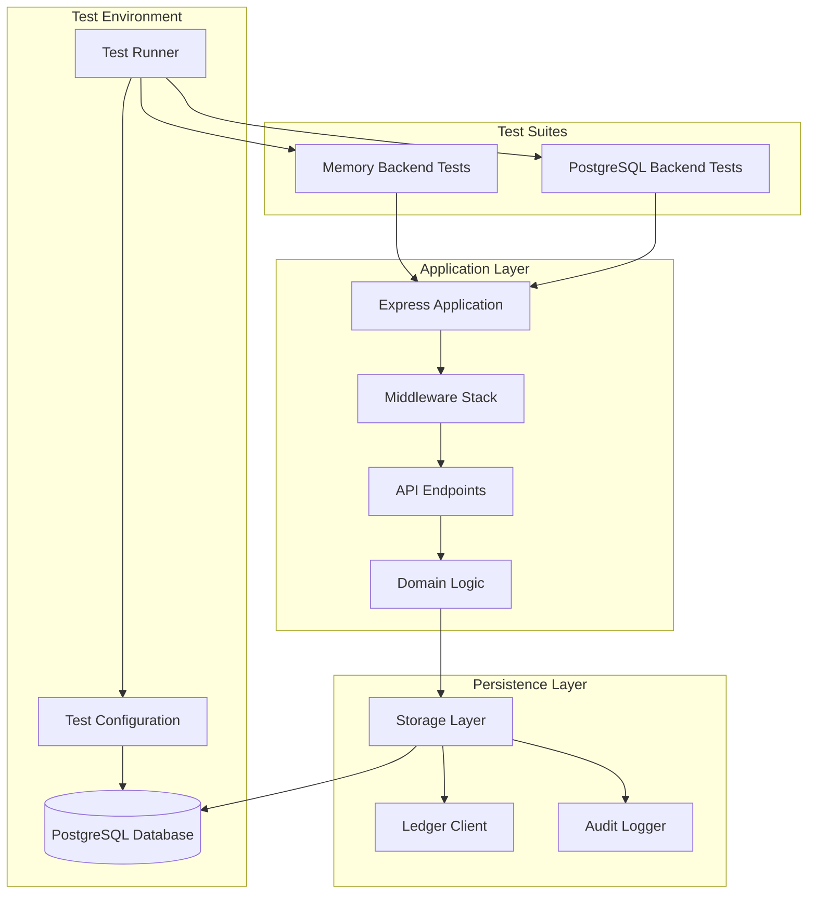
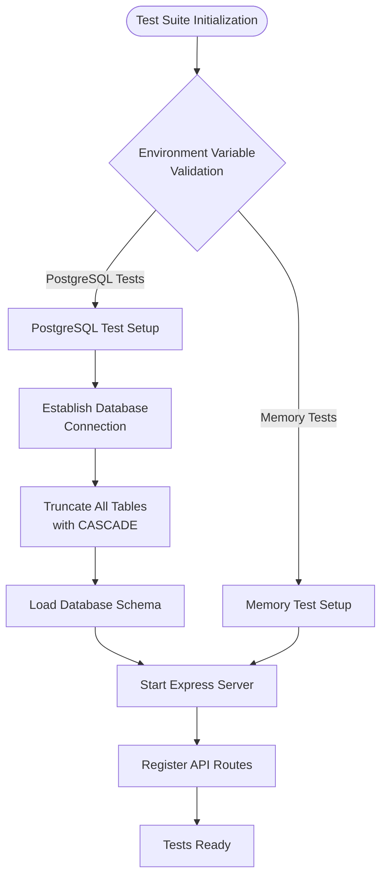
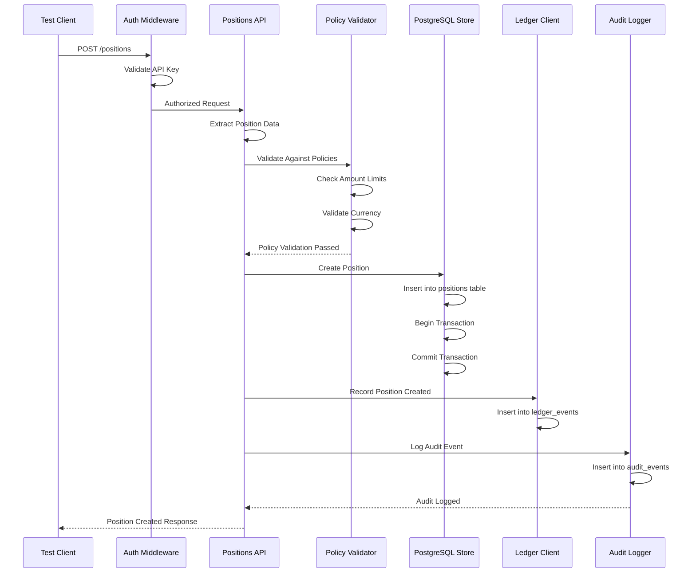
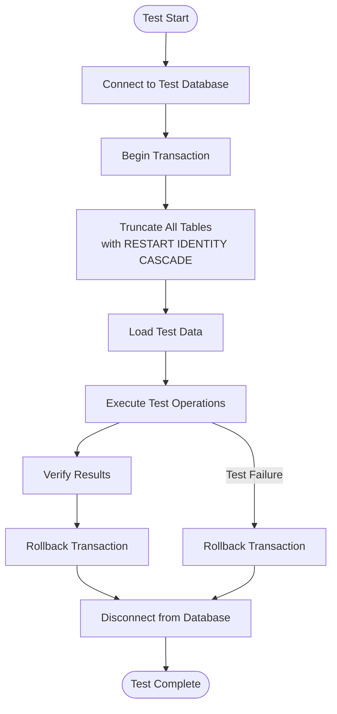
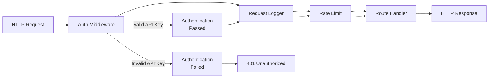
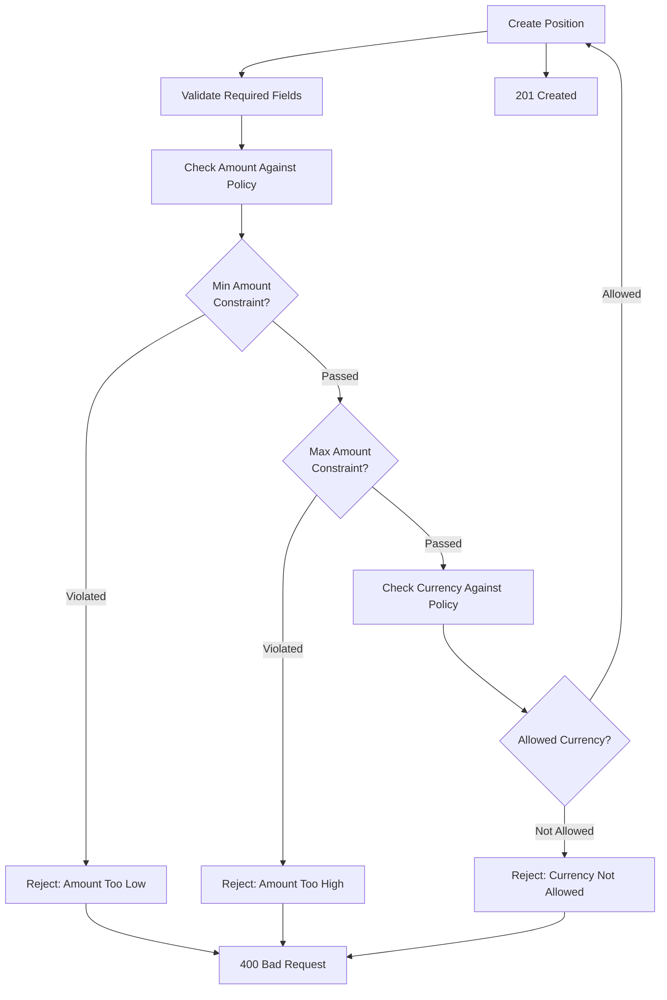
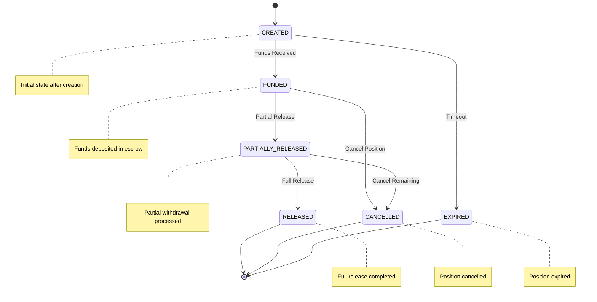

# Integration Testing

<cite>
**Referenced Files in This Document**
- [api.postgres.test.ts](file://src/__tests__/api.postgres.test.ts)
- [api.test.ts](file://src/__tests__/api.test.ts)
- [vitest.postgres.config.ts](file://vitest.postgres.config.ts)
- [vitest.config.ts](file://vitest.config.ts)
- [server.ts](file://src/server.ts)
- [positions.ts](file://src/api/positions.ts)
- [auth.ts](file://src/middleware/auth.ts)
- [policy.ts](file://src/domain/policy.ts)
- [postgresStore.ts](file://src/store/postgresStore.ts)
- [schema.sql](file://db/schema.sql)
- [postgresLedger.ts](file://src/infra/postgresLedger.ts)
- [auditLogger.ts](file://src/infra/auditLogger.ts)
- [config.ts](file://src/config.ts)
- [types.ts](file://src/domain/types.ts)
</cite>

## Table of Contents
1. [Introduction](#introduction)
2. [Testing Architecture Overview](#testing-architecture-overview)
3. [Test Configuration and Setup](#test-configuration-and-setup)
4. [Integration Test Scenarios](#integration-test-scenarios)
5. [Transaction Management and Data Isolation](#transaction-management-and-data-isolation)
6. [Authentication and Authorization Testing](#authentication-and-authorization-testing)
7. [Policy Validation and Access Control](#policy-validation-and-access-control)
8. [End-to-End Workflow Testing](#end-to-end-workflow-testing)
9. [Database Schema and Migration Testing](#database-schema-and-migration-testing)
10. [Performance and Scalability Considerations](#performance-and-scalability-considerations)
11. [Debugging and Troubleshooting](#debugging-and-troubleshooting)
12. [Best Practices and Recommendations](#best-practices-and-recommendations)

## Introduction

Integration testing in the escrowgrid platform serves as a critical verification layer that ensures seamless coordination between API endpoints, domain logic, and PostgreSQL persistence. Unlike unit tests that isolate individual components, integration tests validate the complete data flow from HTTP requests through middleware, business logic, and database operations.

The escrowgrid integration testing framework focuses on validating end-to-end interactions involving position creation with policy validation, institution-scoped access control, and ledger-audit consistency. These tests operate with real database connections, employing sophisticated transaction rollback strategies and comprehensive data seeding approaches.

## Testing Architecture Overview

The escrowgrid testing architecture implements a dual-tier approach with separate test suites for different backend storage configurations:

**Diagram sources**
- [server.ts](file://src/server.ts#L19-L99)
- [vitest.config.ts](file://vitest.config.ts#L1-L10)
- [vitest.postgres.config.ts](file://vitest.postgres.config.ts#L1-L10)

**Section sources**
- [server.ts](file://src/server.ts#L1-L100)
- [vitest.config.ts](file://vitest.config.ts#L1-L10)
- [vitest.postgres.config.ts](file://vitest.postgres.config.ts#L1-L10)

## Test Configuration and Setup

### Environment Configuration

The integration tests utilize environment-specific configurations to support both memory and PostgreSQL backends. The primary distinction lies in the `STORE_BACKEND` environment variable and corresponding database connectivity settings.

**Diagram sources**
- [api.postgres.test.ts](file://src/__tests__/api.postgres.test.ts#L15-L46)
- [api.test.ts](file://src/__tests__/api.test.ts#L12-L19)

### Database Connection Management

The PostgreSQL integration tests establish real database connections with comprehensive cleanup strategies. The test suite employs a sophisticated truncation approach that ensures complete isolation between test runs while maintaining referential integrity through cascade operations.

**Section sources**
- [api.postgres.test.ts](file://src/__tests__/api.postgres.test.ts#L15-L46)
- [config.ts](file://src/config.ts#L40-L47)

## Integration Test Scenarios

### Position Creation with Policy Validation

The core integration test scenario validates the complete position creation workflow, including policy enforcement and state transitions. This scenario demonstrates how integration tests verify middleware chaining and domain logic coordination.

**Diagram sources**
- [positions.ts](file://src/api/positions.ts#L22-L151)
- [postgresStore.ts](file://src/store/postgresStore.ts#L260-L300)
- [postgresLedger.ts](file://src/infra/postgresLedger.ts#L22-L46)
- [auditLogger.ts](file://src/infra/auditLogger.ts#L55-L80)

### Institution-Scoped Access Control

Integration tests validate that API operations respect institutional boundaries, ensuring that users can only access resources within their authorized institutions. This demonstrates the effectiveness of middleware-based access control.

**Section sources**
- [positions.ts](file://src/api/positions.ts#L53-L82)
- [auth.ts](file://src/middleware/auth.ts#L35-L81)

## Transaction Management and Data Isolation

### PostgreSQL Transaction Rollback Strategy

The PostgreSQL integration tests implement a comprehensive transaction management strategy that ensures complete test isolation. The approach involves truncating all relevant tables before each test run to prevent data leakage between test cases.

**Diagram sources**
- [api.postgres.test.ts](file://src/__tests__/api.postgres.test.ts#L26-L43)
- [postgresStore.ts](file://src/store/postgresStore.ts#L356-L410)

### Data Seeding and Cleanup

The test suite implements a systematic data seeding approach that creates realistic test scenarios while ensuring complete cleanup between test executions. This approach maintains test reliability and prevents cross-contamination of test data.

**Section sources**
- [api.postgres.test.ts](file://src/__tests__/api.postgres.test.ts#L26-L43)
- [schema.sql](file://db/schema.sql#L1-L138)

## Authentication and Authorization Testing

### Middleware Chaining Verification

Integration tests validate the complete middleware chain, ensuring that authentication, logging, and rate limiting middleware operate correctly in sequence. The tests verify that unauthorized requests are properly rejected and that authorized requests receive appropriate processing.

**Diagram sources**
- [server.ts](file://src/server.ts#L21-L24)
- [auth.ts](file://src/middleware/auth.ts#L35-L81)

### Root Key vs Institution API Key Testing

The integration tests demonstrate the distinction between root-level operations and institution-scoped operations, validating that root keys can perform operations across all institutions while institution keys are restricted to their own resources.

**Section sources**
- [auth.ts](file://src/middleware/auth.ts#L58-L75)
- [api.postgres.test.ts](file://src/__tests__/api.postgres.test.ts#L56-L81)

## Policy Validation and Access Control

### Position Policy Enforcement

Integration tests validate that position creation respects institutional policies, including minimum/maximum amount limits and allowed currencies. This demonstrates the coordination between policy validation and position creation workflows.

**Diagram sources**
- [positions.ts](file://src/api/positions.ts#L75-L118)
- [policy.ts](file://src/domain/policy.ts#L1-L23)

### State Transition Validation

Integration tests verify that position state transitions respect business rules and policy constraints, ensuring that invalid transitions are properly rejected.

**Section sources**
- [positions.ts](file://src/api/positions.ts#L220-L293)

## End-to-End Workflow Testing

### Complete Position Lifecycle

The integration tests validate the complete position lifecycle, from creation through multiple state transitions, ensuring that all intermediate steps maintain data consistency and audit trail integrity.

**Diagram sources**
- [positions.ts](file://src/api/positions.ts#L120-L144)
- [types.ts](file://src/domain/types.ts#L38-L44)

### Ledger-Audit Consistency

Integration tests verify that all position operations generate corresponding ledger events and audit records, ensuring complete traceability and compliance with financial regulations.

**Section sources**
- [postgresLedger.ts](file://src/infra/postgresLedger.ts#L22-L71)
- [auditLogger.ts](file://src/infra/auditLogger.ts#L55-L80)

## Database Schema and Migration Testing

### Schema Integrity Verification

Integration tests validate that the database schema supports all required operations and maintains referential integrity across the complete data model.

| Table | Purpose | Key Constraints | Foreign Keys |
|-------|---------|-----------------|--------------|
| institutions | Organization management | Unique name constraint | None |
| asset_templates | Asset definition templates | Institution-region uniqueness | institution_id |
| assets | Individual asset instances | Template association | institution_id, template_id |
| positions | Escrow position records | Amount validation | institution_id, asset_id |
| position_events | State change history | Timestamp ordering | position_id |
| ledger_events | Financial transaction records | Kind categorization | position_id |
| api_keys | Authentication credentials | Hash uniqueness | institution_id |
| audit_events | Operational audit trail | Timestamp indexing | api_key_id, institution_id |

**Section sources**
- [schema.sql](file://db/schema.sql#L1-L138)

### Data Type and Constraint Validation

Integration tests verify that database constraints properly enforce business rules and data integrity requirements.

**Section sources**
- [postgresStore.ts](file://src/store/postgresStore.ts#L260-L300)

## Performance and Scalability Considerations

### Test Data Management

Integration tests implement efficient test data management strategies that balance thoroughness with performance. The approach includes selective data seeding and cleanup to minimize test execution time while maintaining comprehensive coverage.

### Concurrent Test Execution

The testing framework supports concurrent execution of independent test suites, enabling parallel processing of memory-based and PostgreSQL-based tests to improve overall test suite performance.

**Section sources**
- [vitest.config.ts](file://vitest.config.ts#L1-L10)
- [vitest.postgres.config.ts](file://vitest.postgres.config.ts#L1-L10)

## Debugging and Troubleshooting

### Test Environment Debugging

Integration tests provide comprehensive debugging capabilities through environment variable configuration and detailed logging. The framework supports multiple debugging modes for different development scenarios.

### Common Integration Test Issues

| Issue | Symptoms | Solution |
|-------|----------|----------|
| Database connection timeout | Tests fail with connection errors | Verify DATABASE_URL environment variable |
| Transaction conflicts | Tests fail intermittently | Review transaction isolation strategies |
| Schema mismatch | Migration-related failures | Run database migrations before tests |
| Authentication failures | 401/403 errors in tests | Verify API key generation and validation |
| Policy violations | Unexpected 400 errors | Review policy configuration and test data |

### Logging and Monitoring

Integration tests implement comprehensive logging that captures all HTTP requests, database operations, and middleware processing steps, enabling detailed debugging of test failures.

**Section sources**
- [auditLogger.ts](file://src/infra/auditLogger.ts#L38-L44)
- [postgresLedger.ts](file://src/infra/postgresLedger.ts#L71-L72)

## Best Practices and Recommendations

### Test Design Principles

1. **Isolation**: Each test should be independent and not rely on the state left by previous tests
2. **Completeness**: Integration tests should cover the complete data flow from API to database
3. **Reliability**: Tests should pass consistently across different environments and execution orders
4. **Maintainability**: Test code should be well-structured and easy to modify as requirements evolve

### Performance Optimization

1. **Selective Cleanup**: Only truncate tables that are actually used in the test
2. **Connection Pooling**: Reuse database connections within test suites
3. **Parallel Execution**: Leverage concurrent test execution where possible
4. **Mock External Dependencies**: Mock third-party services when appropriate

### Maintenance Strategies

1. **Regular Schema Validation**: Periodically verify that integration tests align with current database schema
2. **Policy Testing Updates**: Keep policy validation tests synchronized with business rule changes
3. **Middleware Testing**: Regularly validate middleware chain functionality
4. **Performance Monitoring**: Monitor test execution times and optimize as needed

### Security Considerations

1. **Secure Test Data**: Never include sensitive information in test fixtures
2. **API Key Management**: Use dedicated test API keys with limited permissions
3. **Database Security**: Ensure test databases are isolated from production environments
4. **Audit Trail Validation**: Verify that all security-sensitive operations generate appropriate audit records

The escrowgrid integration testing framework provides comprehensive validation of end-to-end workflows while maintaining the reliability and performance characteristics necessary for continuous integration and deployment pipelines. Through careful attention to transaction management, data isolation, and comprehensive test coverage, these integration tests serve as a critical quality assurance mechanism for the platform's core financial operations.