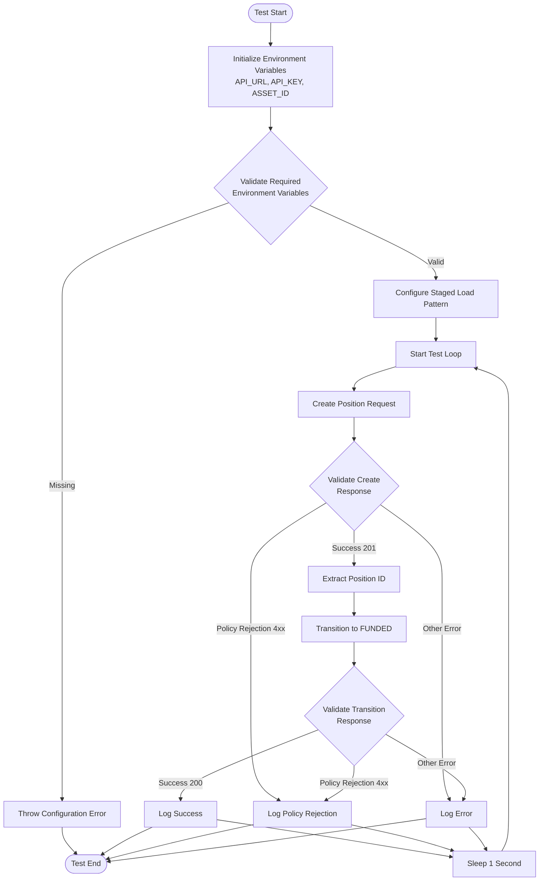
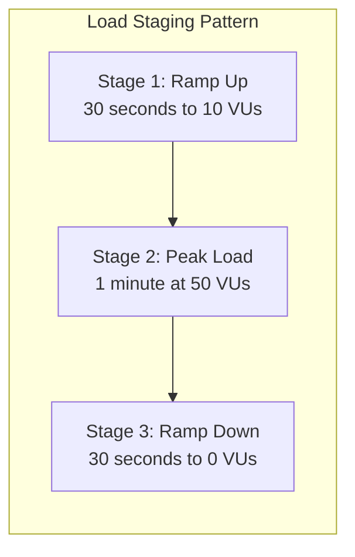
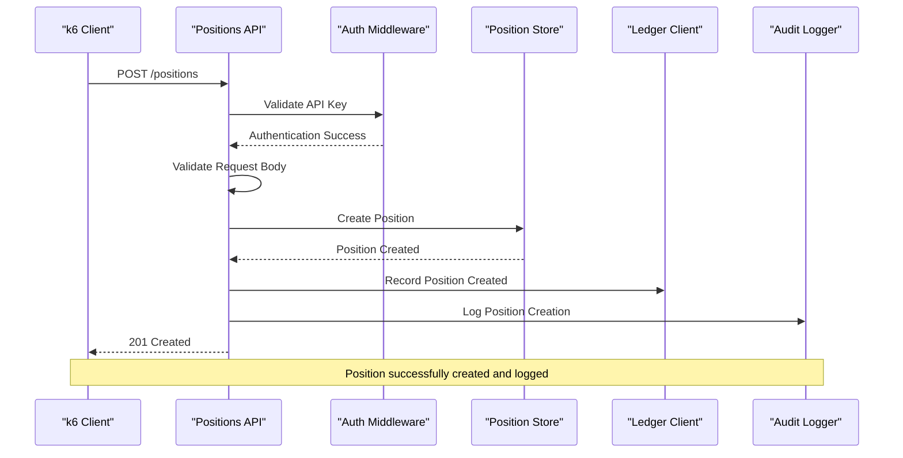
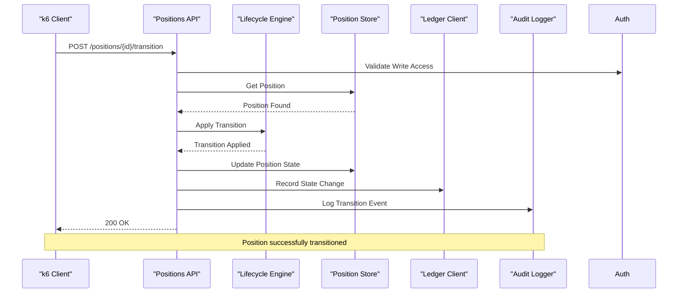
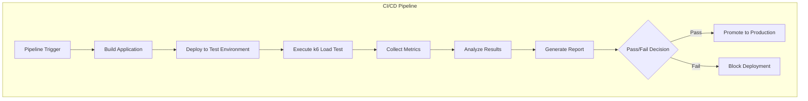
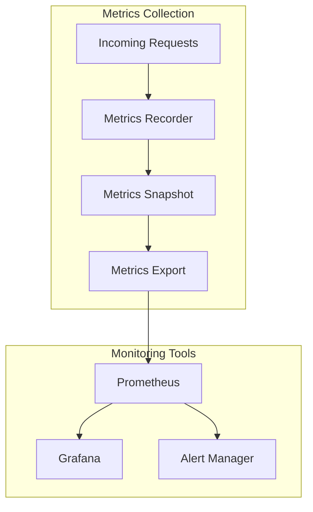

# Load Testing

<cite>
**Referenced Files in This Document**
- [positions-k6.js](file://load/positions-k6.js)
- [positions.ts](file://src/api/positions.ts)
- [types.ts](file://src/domain/types.ts)
- [auth.ts](file://src/middleware/auth.ts)
- [postgresStore.ts](file://src/store/postgresStore.ts)
- [metrics.ts](file://src/infra/metrics.ts)
- [README.md](file://README.md)
- [docker-compose.yml](file://docker-compose.yml)
- [package.json](file://package.json)
</cite>

## Table of Contents
1. [Introduction](#introduction)
2. [Script Overview](#script-overview)
3. [Configuration and Environment Variables](#configuration-and-environment-variables)
4. [Staged Load Pattern](#staged-load-pattern)
5. [API Workflow Implementation](#api-workflow-implementation)
6. [Response Validation and Error Handling](#response-validation-and-error-handling)
7. [Integration with CI/CD Pipelines](#integration-with-cicd-pipelines)
8. [Performance Metrics and Monitoring](#performance-metrics-and-monitoring)
9. [Usage Examples](#usage-examples)
10. [Troubleshooting](#troubleshooting)
11. [Customization Guide](#customization-guide)
12. [Best Practices](#best-practices)

## Introduction

The k6 load testing script in the escrowgrid project is designed to simulate high-volume position creation and state transitions in the Tokenization-as-a-Service (TAAS) platform. This comprehensive load test evaluates the system's ability to handle concurrent position lifecycle operations under realistic stress conditions, helping identify performance bottlenecks and validate scalability improvements.

The script focuses on the core position management workflow: creating positions with specific asset references and transitioning them through their lifecycle states. It incorporates sophisticated error handling to validate both successful operations and expected policy rejections, providing valuable insights into system resilience and policy enforcement mechanisms.

## Script Overview

The positions-k6.js script implements a continuous load testing pattern that creates positions and immediately transitions them to the FUNDED state. This workflow mirrors real-world usage scenarios where positions are established and quickly funded, providing a realistic stress test for the position lifecycle management system.



**Diagram sources**
- [positions-k6.js](file://load/positions-k6.js#L39-L86)

**Section sources**
- [positions-k6.js](file://load/positions-k6.js#L1-L87)

## Configuration and Environment Variables

The script relies on three critical environment variables for operation:

### Required Environment Variables

| Variable | Description | Example Value | Purpose |
|----------|-------------|---------------|---------|
| `API_URL` | Base URL of the TAAS backend API | `http://localhost:4000` | Specifies the target API endpoint |
| `API_KEY` | Institution admin API key for authentication | `your-institution-api-key` | Provides authorization for position operations |
| `ASSET_ID` | Valid asset identifier for position creation | `ast_constr_escrow_123` | References the asset template for position creation |

### Environment Variable Validation

The script implements robust validation to ensure proper configuration before execution begins. Missing or invalid environment variables result in immediate termination with descriptive error messages, preventing failed test runs and enabling quick identification of configuration issues.

**Section sources**
- [positions-k6.js](file://load/positions-k6.js#L28-L37)

## Staged Load Pattern

The script employs a sophisticated staged load pattern designed to gradually increase and then decrease load, providing comprehensive stress testing across different load scenarios:



**Diagram sources**
- [positions-k6.js](file://load/positions-k6.js#L20-L25)

### Staging Configuration Details

| Stage | Duration | Target Virtual Users | Purpose |
|-------|----------|---------------------|---------|
| Ramp Up | 30 seconds | 10 VUs | Gradually introduce load to establish baseline |
| Peak Load | 1 minute | 50 VUs | Maximum sustained load testing |
| Ramp Down | 30 seconds | 0 VUs | Clean exit and metric collection |

This staged approach enables:
- **Warm-up Period**: Establishes baseline performance metrics
- **Peak Stress Testing**: Validates system limits under maximum load
- **Gradual Cleanup**: Allows system recovery and metric stabilization

**Section sources**
- [positions-k6.js](file://load/positions-k6.js#L20-L25)

## API Workflow Implementation

The script implements a complete position lifecycle workflow with sophisticated request handling and validation:

### Position Creation Workflow



**Diagram sources**
- [positions.ts](file://src/api/positions.ts#L22-L144)
- [auth.ts](file://src/middleware/auth.ts#L35-L82)

### Position Transition Workflow



**Diagram sources**
- [positions.ts](file://src/api/positions.ts#L220-L292)

### Request Headers and Authentication

Both API operations utilize standardized authentication and content-type headers:
- **Content-Type**: `application/json` for JSON payload transmission
- **X-API-KEY**: Institution API key for authorization
- **Bearer Token**: Alternative authentication method supported

**Section sources**
- [positions-k6.js](file://load/positions-k6.js#L40-L85)
- [positions.ts](file://src/api/positions.ts#L22-L144)

## Response Validation and Error Handling

The script implements comprehensive response validation to ensure both successful operations and expected failure modes are properly handled:

### Validation Criteria

| Response Type | Status Codes | Validation Logic | Purpose |
|---------------|--------------|------------------|---------|
| Successful Creation | 201 | `r.status === 201` | Confirms position was successfully created |
| Policy Rejection | 4xx | `(r.status >= 400 && r.status < 500)` | Validates policy enforcement and rejection handling |
| Unexpected Errors | Other | Fails test execution | Identifies system failures requiring investigation |

### Validation Implementation

The script uses k6's `check()` function to validate responses with descriptive labels:

```javascript
check(createRes, {
  'position created or rejected with 4xx (policy)': (r) =>
    r.status === 201 || (r.status >= 400 && r.status < 500),
});
```

This validation approach ensures that:
- **Successful Operations**: Positions are created successfully
- **Policy Compliance**: Expected policy rejections are properly handled
- **Error Detection**: Unexpected failures are identified and reported

### Error Handling Strategies

The script handles various error scenarios gracefully:
- **Network Failures**: k6 automatically retries failed requests
- **Authentication Errors**: Immediate failure with descriptive error message
- **Rate Limiting**: Built-in backoff and retry mechanisms
- **System Overload**: Graceful degradation with appropriate error reporting

**Section sources**
- [positions-k6.js](file://load/positions-k6.js#L56-L82)

## Integration with CI/CD Pipelines

The load testing script is designed for seamless integration with continuous integration and deployment pipelines:

### Pipeline Integration Patterns



### Integration Benefits

| Benefit | Description | Impact |
|---------|-------------|--------|
| Automated Testing | Load tests execute automatically with deployments | Consistent quality assurance |
| Performance Regression Detection | Identifies performance degradation early | Prevents production issues |
| Scalability Validation | Tests system capacity under load | Ensures infrastructure readiness |
| Resource Optimization | Identifies bottlenecks and optimization opportunities | Reduces operational costs |

### Pipeline Configuration Examples

**GitHub Actions Integration:**
```yaml
- name: Run k6 Load Tests
  run: |
    k6 run \
      -e API_URL=https://api.example.com \
      -e API_KEY=${{ secrets.API_KEY }} \
      -e ASSET_ID=${{ secrets.ASSET_ID }} \
      load/positions-k6.js
```

**Jenkins Pipeline Integration:**
```groovy
stage('Load Testing') {
    steps {
        sh '''
            k6 run \
              -e API_URL=$API_URL \
              -e API_KEY=$API_KEY \
              -e ASSET_ID=$ASSET_ID \
              load/positions-k6.js
        '''
    }
}
```

**Section sources**
- [README.md](file://README.md#L276-L325)

## Performance Metrics and Monitoring

The script integrates with the platform's comprehensive monitoring infrastructure to provide detailed performance insights:

### Built-in Metrics Collection

The platform exposes several key metrics endpoints for monitoring:

| Endpoint | Purpose | Access Level | Data Provided |
|----------|---------|--------------|---------------|
| `/health` | Liveness check | Public | Service health status |
| `/ready` | Readiness check | Public | Database connectivity status |
| `/metrics` | Performance metrics | Root-only | Request counts, durations, error rates |

### Metrics Infrastructure



**Diagram sources**
- [metrics.ts](file://src/infra/metrics.ts#L17-L38)

### Key Performance Indicators

| Metric Category | Specific Metrics | Purpose | Thresholds |
|-----------------|------------------|---------|------------|
| Throughput | Requests per second, Concurrent users | Measure system capacity | > 100 RPS typical |
| Latency | Average, 95th percentile, 99th percentile | Assess responsiveness | < 300ms avg, < 1s 99th |
| Availability | Success rate, Error rate | Monitor reliability | > 99.9% success rate |
| Resource Utilization | CPU, Memory, Database connections | Identify bottlenecks | < 80% utilization |

### Monitoring Recommendations

For effective load testing monitoring:
- **Baseline Establishment**: Capture metrics during normal operation
- **Load Testing Baseline**: Compare with load test results
- **Regression Detection**: Identify performance degradation
- **Capacity Planning**: Determine optimal scaling thresholds

**Section sources**
- [metrics.ts](file://src/infra/metrics.ts#L1-L39)
- [README.md](file://README.md#L355-L378)

## Usage Examples

### Basic Execution

Execute the load test with minimal configuration:

```bash
k6 run \
  -e API_URL=http://localhost:4000 \
  -e API_KEY=your-institution-api-key \
  -e ASSET_ID=valid-asset-id \
  load/positions-k6.js
```

### Docker Environment Execution

When running in a Docker environment, discover the API port first:

```bash
# Start the Docker stack
docker compose up --build

# Discover API port
docker compose ps | grep taas-api

# Execute load test
k6 run \
  -e API_URL=http://localhost:56888 \
  -e API_KEY=your-institution-api-key \
  -e ASSET_ID=valid-asset-id \
  load/positions-k6.js
```

### Advanced Configuration Options

```bash
# Extended configuration with custom stages
k6 run \
  -e API_URL=https://api.example.com \
  -e API_KEY=${API_KEY} \
  -e ASSET_ID=${ASSET_ID} \
  -e VUS=100 \
  -e DURATION=5m \
  load/positions-k6.js

# Output to JSON format for CI/CD integration
k6 run \
  -e API_URL=${API_URL} \
  -e API_KEY=${API_KEY} \
  -e ASSET_ID=${ASSET_ID} \
  -o json=results.json \
  load/positions-k6.js
```

### Environment-Specific Configurations

**Development Environment:**
```bash
k6 run \
  -e API_URL=http://localhost:4000 \
  -e API_KEY=${DEV_API_KEY} \
  -e ASSET_ID=${DEV_ASSET_ID} \
  load/positions-k6.js
```

**Production Environment:**
```bash
k6 run \
  -e API_URL=https://api.production.com \
  -e API_KEY=${PROD_API_KEY} \
  -e ASSET_ID=${PROD_ASSET_ID} \
  load/positions-k6.js
```

**Section sources**
- [positions-k6.js](file://load/positions-k6.js#L11-L16)
- [docker-compose.yml](file://docker-compose.yml#L23-L46)

## Troubleshooting

### Common Execution Errors

#### Configuration Issues

**Problem**: `API_KEY env var is required`
**Solution**: Verify API key is properly exported
```bash
export API_KEY=your-valid-api-key
k6 run load/positions-k6.js
```

**Problem**: `ASSET_ID env var is required`
**Solution**: Ensure asset ID corresponds to a valid, accessible asset
```bash
export ASSET_ID=valid-asset-id-from-your-instance
```

#### Network Connectivity Issues

**Problem**: Connection refused or timeout
**Solution**: Verify API endpoint accessibility
```bash
# Test API connectivity
curl -H "X-API-KEY: $API_KEY" "$API_URL/health"

# Check Docker port mapping
docker compose ps
```

#### Authentication Failures

**Problem**: 401 Unauthorized responses
**Solution**: Validate API key permissions and format
```bash
# Verify API key works
curl -H "X-API-KEY: $API_KEY" "$API_URL/positions"
```

### Performance Issues

#### Low Throughput

**Symptoms**: Fewer than expected requests per second
**Solutions**:
- Increase virtual users: `-e VUS=100`
- Extend test duration: `-e DURATION=10m`
- Optimize network configuration

#### High Error Rates

**Symptoms**: Frequent 4xx or 5xx responses
**Solutions**:
- Review policy configurations
- Check system resource availability
- Validate asset template settings

### Debugging Techniques

#### Enable Verbose Logging

```bash
k6 run \
  -e API_URL=${API_URL} \
  -e API_KEY=${API_KEY} \
  -e ASSET_ID=${ASSET_ID} \
  -d \
  load/positions-k6.js
```

#### Capture Detailed Metrics

```bash
k6 run \
  -e API_URL=${API_URL} \
  -e API_KEY=${API_KEY} \
  -e ASSET_ID=${ASSET_ID} \
  -o json=debug-results.json \
  load/positions-k6.js
```

**Section sources**
- [positions-k6.js](file://load/positions-k6.js#L32-L37)

## Customization Guide

### Modifying the Script for Different Workflows

#### Adding New Position States

To test additional position states, modify the transition request:

```javascript
const transitionRes = http.post(
  `${API_URL}/positions/${positionId}/transition`,
  JSON.stringify({
    toState: 'NEW_STATE_NAME', // Add desired state here
    reason: 'load test transition',
  }),
  // ... headers unchanged
);
```

#### Changing Asset Types

Modify the position creation payload to test different asset types:

```javascript
const createRes = http.post(
  `${API_URL}/positions`,
  JSON.stringify({
    assetId: ASSET_ID,
    holderReference: `LOAD_TEST_${__VU}_${Date.now()}`,
    currency: 'USD', // Change currency as needed
    amount: 10000,   // Adjust amount for different asset types
  }),
  // ... headers unchanged
);
```

### Extending Load Patterns

#### Custom Staging Configuration

```javascript
export const options = {
  stages: [
    { duration: '1m', target: 20 },
    { duration: '2m', target: 100 },
    { duration: '1m', target: 50 },
    { duration: '30s', target: 0 },
  ],
};
```

#### Mixed Workload Testing

```javascript
export default function () {
  // Randomly choose between different operations
  const operation = Math.floor(Math.random() * 3);
  
  switch (operation) {
    case 0:
      // Create position
      break;
    case 1:
      // List positions
      break;
    case 2:
      // Transition position
      break;
  }
}
```

### Integrating with Additional Endpoints

#### Testing Asset Management

```javascript
// Create asset test
const assetRes = http.post(
  `${API_URL}/assets`,
  JSON.stringify({
    templateId: TEMPLATE_ID,
    label: `Test Asset ${Date.now()}`,
    metadata: {},
  }),
  // ... headers
);
```

#### Testing Institution Management

```javascript
// Create institution test
const instRes = http.post(
  `${API_URL}/institutions`,
  JSON.stringify({
    name: `Test Institution ${Date.now()}`,
    regions: ['US'],
    verticals: ['CONSTRUCTION'],
  }),
  // ... headers
);
```

**Section sources**
- [positions-k6.js](file://load/positions-k6.js#L39-L86)

## Best Practices

### Load Testing Strategy

#### Gradual Load Introduction
- Start with minimal load and gradually increase
- Allow system to stabilize between load stages
- Monitor resource utilization during ramp-up

#### Realistic Workload Simulation
- Use representative data patterns
- Simulate typical user behavior sequences
- Include error scenarios and edge cases

#### Comprehensive Coverage
- Test both happy path and error scenarios
- Validate authentication and authorization
- Test policy enforcement mechanisms

### Performance Optimization

#### Resource Management
- Configure appropriate virtual user limits
- Monitor system resources during testing
- Implement graceful degradation strategies

#### Data Management
- Use realistic data sizes and patterns
- Implement data cleanup procedures
- Avoid data accumulation during testing

### Monitoring and Analysis

#### Metrics Collection
- Track key performance indicators continuously
- Establish baseline performance metrics
- Monitor system resource utilization

#### Result Analysis
- Analyze trends over time
- Identify performance regression patterns
- Correlate performance with system changes

### Security Considerations

#### API Key Management
- Use dedicated test API keys
- Rotate keys regularly in test environments
- Never expose production keys in test scripts

#### Data Privacy
- Use synthetic test data
- Implement data anonymization procedures
- Ensure test data isolation from production systems

**Section sources**
- [README.md](file://README.md#L355-L378)
- [auth.ts](file://src/middleware/auth.ts#L35-L95)