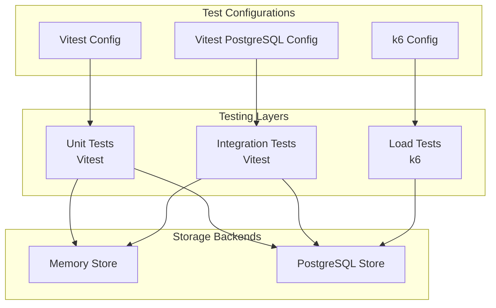
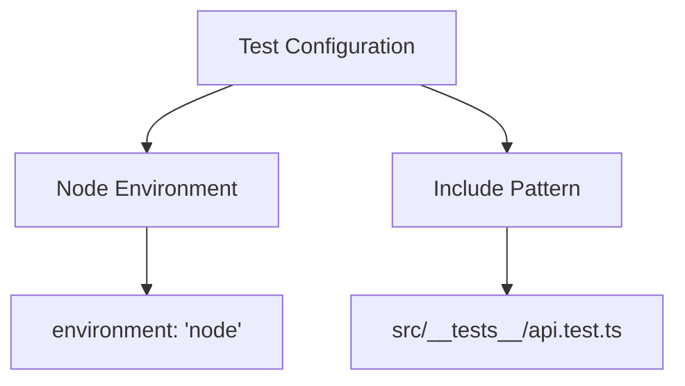
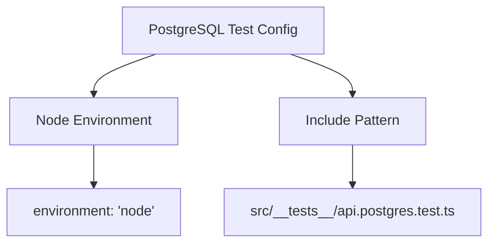
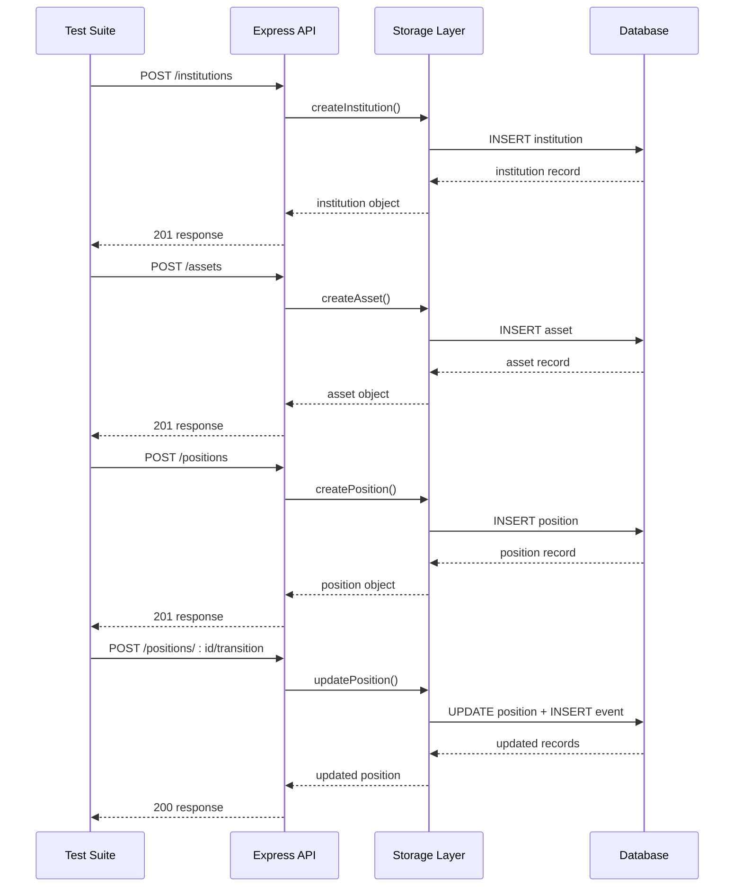
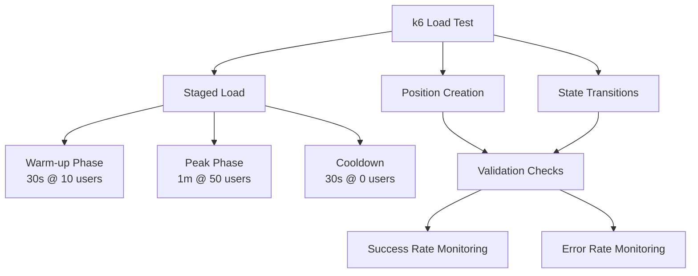
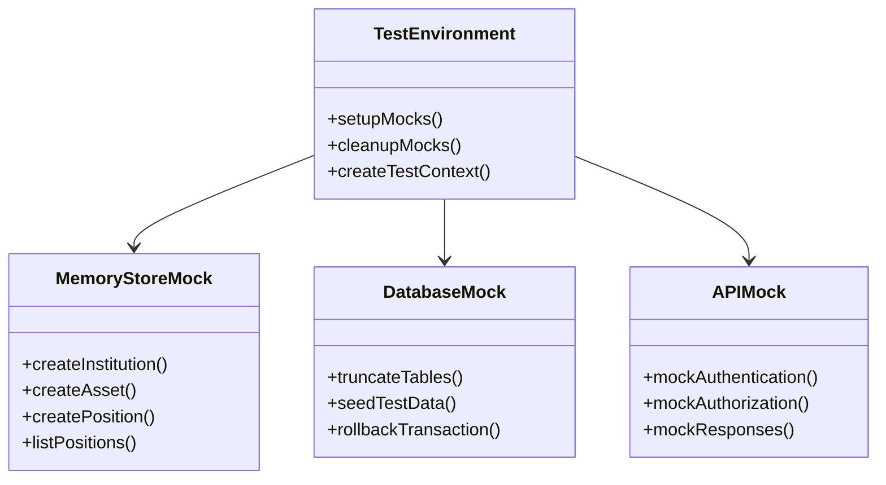
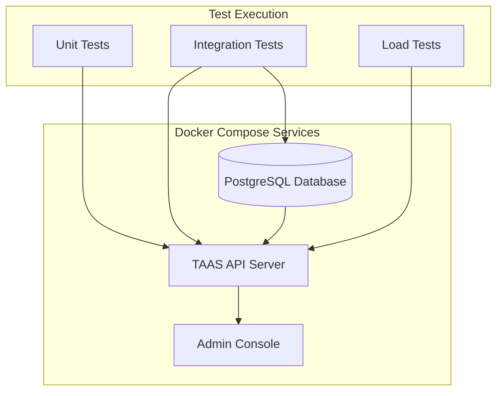
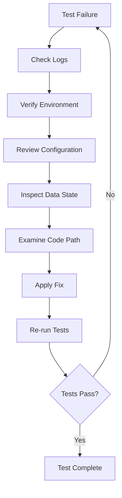

# Testing Strategy

<cite>
**Referenced Files in This Document**
- [vitest.config.ts](file://vitest.config.ts)
- [vitest.postgres.config.ts](file://vitest.postgres.config.ts)
- [load/positions-k6.js](file://load/positions-k6.js)
- [src/__tests__/api.test.ts](file://src/__tests__/api.test.ts)
- [src/__tests__/api.postgres.test.ts](file://src/__tests__/api.postgres.test.ts)
- [package.json](file://package.json)
- [src/server.ts](file://src/server.ts)
- [src/api/positions.ts](file://src/api/positions.ts)
- [src/store/index.ts](file://src/store/index.ts)
- [src/store/memoryStore.ts](file://src/store/memoryStore.ts)
- [src/store/postgresStore.ts](file://src/store/postgresStore.ts)
- [src/config.ts](file://src/config.ts)
- [docker-compose.yml](file://docker-compose.yml)
</cite>

## Table of Contents
1. [Introduction](#introduction)
2. [Testing Infrastructure](#testing-infrastructure)
3. [Unit Testing with Vitest](#unit-testing-with-vitest)
4. [Integration Testing Patterns](#integration-testing-patterns)
5. [Load Testing with k6](#load-testing-with-k6)
6. [Test Coverage and Quality Goals](#test-coverage-and-quality-goals)
7. [Mocking Strategies](#mocking-strategies)
8. [CI/CD Integration](#cicd-integration)
9. [Writing New Tests](#writing-new-tests)
10. [Debugging Test Failures](#debugging-test-failures)
11. [Best Practices](#best-practices)

## Introduction

EscrowGrid employs a comprehensive testing strategy that covers unit testing, integration testing, and load testing to ensure reliability, performance, and quality across all components. The testing framework is built around Vitest for unit and integration tests, and k6 for performance and load testing scenarios.

The testing strategy emphasizes:
- **Dual storage backend testing**: Both in-memory and PostgreSQL storage backends are tested
- **API endpoint validation**: Comprehensive testing of all REST API endpoints
- **Database interaction verification**: Ensuring proper data persistence and retrieval
- **Performance benchmarking**: Load testing critical paths like position creation and transitions
- **Environment isolation**: Proper test environment setup and cleanup

## Testing Infrastructure

The testing infrastructure is organized into multiple layers, each serving specific testing objectives:



**Diagram sources**
- [vitest.config.ts](file://vitest.config.ts#L1-L10)
- [vitest.postgres.config.ts](file://vitest.postgres.config.ts#L1-L10)
- [load/positions-k6.js](file://load/positions-k6.js#L1-L87)

**Section sources**
- [vitest.config.ts](file://vitest.config.ts#L1-L10)
- [vitest.postgres.config.ts](file://vitest.postgres.config.ts#L1-L10)
- [package.json](file://package.json#L6-L12)

## Unit Testing with Vitest

### Configuration Setup

The project uses Vitest as the primary testing framework with two distinct configurations for different testing scenarios:

#### Standard Test Configuration
The main Vitest configuration targets API tests with in-memory storage backend:



**Diagram sources**
- [vitest.config.ts](file://vitest.config.ts#L3-L7)

#### PostgreSQL Test Configuration
A separate configuration specifically for PostgreSQL integration tests:



**Diagram sources**
- [vitest.postgres.config.ts](file://vitest.postgres.config.ts#L3-L7)

### Test Organization Structure

Tests are organized in the `src/__tests__/` directory with clear separation between:
- **API tests**: [`api.test.ts`](file://src/__tests__/api.test.ts) - In-memory backend testing
- **PostgreSQL tests**: [`api.postgres.test.ts`](file://src/__tests__/api.postgres.test.ts) - Database backend testing

### Test Execution Commands

The project defines specific npm scripts for different testing scenarios:

| Command | Purpose | Storage Backend |
|---------|---------|----------------|
| `npm test` | Run standard API tests | Memory Store |
| `npm run test:postgres` | Run PostgreSQL integration tests | PostgreSQL Store |

**Section sources**
- [vitest.config.ts](file://vitest.config.ts#L1-L10)
- [vitest.postgres.config.ts](file://vitest.postgres.config.ts#L1-L10)
- [package.json](file://package.json#L6-L12)

## Integration Testing Patterns

### API Endpoint Testing Strategy

The integration tests follow a comprehensive pattern that validates the complete API lifecycle:



**Diagram sources**
- [src/__tests__/api.test.ts](file://src/__tests__/api.test.ts#L21-L126)
- [src/api/positions.ts](file://src/api/positions.ts#L22-L298)

### Authentication and Authorization Testing

The tests implement comprehensive authentication and authorization validation:

#### Root Key Operations
- Creating institutions with root API keys
- Managing institution-level resources
- Cross-institution access restrictions

#### Institution API Key Operations
- Role-based access control (admin vs. read-only)
- Institution-scoped resource access
- Policy enforcement validation

### Database Interaction Testing

Both storage backends are thoroughly tested to ensure consistency:

#### Memory Store Testing
- In-memory data persistence validation
- Transaction-like operations simulation
- Performance characteristics testing

#### PostgreSQL Store Testing
- Database connection and migration validation
- ACID transaction testing
- Concurrency and race condition handling
- Connection pooling and resource management

**Section sources**
- [src/__tests__/api.test.ts](file://src/__tests__/api.test.ts#L1-L126)
- [src/__tests__/api.postgres.test.ts](file://src/__tests__/api.postgres.test.ts#L1-L153)
- [src/store/memoryStore.ts](file://src/store/memoryStore.ts#L1-L218)
- [src/store/postgresStore.ts](file://src/store/postgresStore.ts#L1-L417)

## Load Testing with k6

### Performance Testing Strategy

The project implements k6-based load testing focused on critical position management operations:



**Diagram sources**
- [load/positions-k6.js](file://load/positions-k6.js#L20-L26)

### Load Test Implementation

The k6 script focuses on positions performance with the following characteristics:

#### Test Scenarios
1. **Continuous Position Creation**: Creates positions with random holder references
2. **State Transition Testing**: Transitions created positions to FUNDED state
3. **Error Handling Validation**: Validates both successful operations and policy rejections

#### Environment Configuration
The load test accepts environment variables for flexible deployment:

| Variable | Purpose | Example |
|----------|---------|---------|
| `API_URL` | Target API endpoint | `http://localhost:4000` (or the API URL printed by `run-demo.sh`) |
| `API_KEY` | Institution admin API key | `your-api-key-here` |
| `ASSET_ID` | Valid asset identifier | `ast_random_string` |

#### Performance Metrics
The test monitors:
- **Success rates**: Position creation and state transitions
- **Error rates**: Policy violations and system errors
- **Response times**: API endpoint latency
- **Throughput**: Requests per second handled

### Load Test Execution

To run the load test:

```bash
k6 run \
  -e API_URL=http://localhost:4000 \
  -e API_KEY=your-api-key \
  -e ASSET_ID=valid-asset-id \
  load/positions-k6.js
```

**Section sources**
- [load/positions-k6.js](file://load/positions-k6.js#L1-L87)

## Test Coverage and Quality Goals

### Coverage Targets

The testing strategy aims for comprehensive coverage across different layers:

#### Unit Test Coverage
- **Core business logic**: Domain models and lifecycle management
- **API endpoints**: Complete request/response validation
- **Storage operations**: CRUD operations and transaction handling
- **Middleware**: Authentication, logging, and rate limiting

#### Integration Test Coverage
- **End-to-end workflows**: Institution → Asset → Position creation
- **Cross-component communication**: API ↔ Storage layer interactions
- **Error propagation**: Exception handling and error responses
- **Data consistency**: Multi-operation transaction validation

#### Performance Test Coverage
- **Critical paths**: Position creation and state transitions
- **Scalability limits**: Maximum concurrent users and requests
- **Resource utilization**: CPU, memory, and database connection usage
- **Failure modes**: Graceful degradation under load

### Quality Metrics

| Metric | Target | Measurement Method |
|--------|--------|-------------------|
| Unit Test Pass Rate | 100% | Automated test execution |
| Integration Test Coverage | >90% | Code coverage analysis |
| API Response Time | <200ms | Load testing results |
| Error Rate | <0.1% | Production monitoring |
| Database Connection Pool | Monitor usage | Database metrics |

## Mocking Strategies

### Test Environment Isolation

The testing framework implements several mocking strategies to ensure test isolation:

#### Database Mocking
- **Memory Store**: In-memory collections for fast unit tests
- **PostgreSQL Cleanup**: Truncate tables before each test suite
- **Connection Management**: Separate test database connections

#### External Dependencies
- **API Keys**: Static test keys for authentication
- **External Services**: Mocked responses for third-party integrations
- **Time Dependencies**: Controlled timestamps for deterministic tests

### Mock Implementation Patterns



**Diagram sources**
- [src/store/memoryStore.ts](file://src/store/memoryStore.ts#L13-L218)
- [src/__tests__/api.postgres.test.ts](file://src/__tests__/api.postgres.test.ts#L25-L44)

**Section sources**
- [src/store/memoryStore.ts](file://src/store/memoryStore.ts#L1-L218)
- [src/__tests__/api.postgres.test.ts](file://src/__tests__/api.postgres.test.ts#L25-L44)

## CI/CD Integration

### Continuous Integration Pipeline

The testing strategy integrates seamlessly with CI/CD pipelines:

#### Build Pipeline Stages
1. **Code Quality Checks**: TypeScript compilation and linting
2. **Unit Test Execution**: Fast feedback on individual components
3. **Integration Test Execution**: End-to-end workflow validation
4. **Database Migration Testing**: Schema and data consistency checks
5. **Performance Regression Testing**: Load test baseline comparison

#### Deployment Pipeline
- **Automated Testing**: All tests run before deployment
- **Environment Validation**: Test environments match production
- **Rollback Triggers**: Failed tests prevent deployment
- **Monitoring Integration**: Test results feed into monitoring dashboards

### Containerized Testing

The project uses Docker Compose for consistent testing environments:



**Diagram sources**
- [docker-compose.yml](file://docker-compose.yml#L1-L55)

**Section sources**
- [docker-compose.yml](file://docker-compose.yml#L1-L55)
- [package.json](file://package.json#L6-L12)

## Writing New Tests

### Test Structure Guidelines

When writing new tests, follow these established patterns:

#### Test File Organization
- Place tests alongside the code they validate
- Use descriptive test file names ending with `.test.ts`
- Group related tests in logical modules

#### Test Naming Conventions
- Use descriptive test names that explain the scenario
- Follow the pattern: `should [behavior] when [condition]`
- Include expected outcomes in test names

#### Test Implementation Pattern

```typescript
describe('Feature Description', () => {
  let testContext: TestContext;
  
  beforeEach(async () => {
    // Setup test environment
    testContext = await setupTestEnvironment();
  });
  
  afterEach(async () => {
    // Cleanup test artifacts
    await cleanupTestEnvironment(testContext);
  });
  
  it('should perform expected behavior', async () => {
    // Arrange: Setup preconditions
    // Act: Execute the operation
    // Assert: Verify expected outcomes
  });
});
```

### Adding API Endpoint Tests

For new API endpoints, implement comprehensive testing:

#### Request Validation
- Parameter validation and type checking
- Required field presence and format
- Authorization and authentication

#### Business Logic Testing
- State transitions and lifecycle management
- Policy enforcement and validation
- Error handling and edge cases

#### Response Validation
- Status codes and response formats
- Data consistency and integrity
- Performance characteristics

### Adding Load Tests

For new critical paths, implement k6 load tests:

#### Scenario Definition
- Define realistic user workflows
- Set appropriate load profiles
- Establish performance baselines

#### Metrics Collection
- Response time monitoring
- Error rate tracking
- Resource utilization analysis

**Section sources**
- [src/__tests__/api.test.ts](file://src/__tests__/api.test.ts#L1-L126)
- [src/__tests__/api.postgres.test.ts](file://src/__tests__/api.postgres.test.ts#L1-L153)

## Debugging Test Failures

### Common Test Failure Patterns

Understanding common failure patterns helps in efficient debugging:

#### Database-Related Issues
- **Connection timeouts**: Verify database connectivity and credentials
- **Schema mismatches**: Check database migrations and schema versions
- **Constraint violations**: Review data validation and business rules
- **Race conditions**: Analyze concurrent access patterns

#### API-Related Issues
- **Authentication failures**: Verify API key validity and permissions
- **Authorization errors**: Check role-based access controls
- **Request validation**: Review input parameter requirements
- **Response parsing**: Ensure proper JSON handling

#### Environment Issues
- **Configuration problems**: Verify environment variables and settings
- **Resource limitations**: Check memory and CPU availability
- **Network connectivity**: Validate external service access
- **Timing issues**: Review asynchronous operation handling

### Debugging Tools and Techniques

#### Logging and Monitoring
- Enable detailed logging for failed tests
- Use structured logging for better analysis
- Monitor system resources during test execution
- Capture stack traces and error contexts

#### Test Isolation
- Run individual tests to isolate failures
- Use different test databases for parallel execution
- Clean up test artifacts between runs
- Reset environment state between test suites

#### Debugging Workflow



### Test Failure Resolution

#### Immediate Actions
1. **Reproduce locally**: Run failing tests in development environment
2. **Isolate the issue**: Narrow down the specific test case causing failure
3. **Check dependencies**: Verify external services and configurations
4. **Review recent changes**: Identify potential breaking modifications

#### Long-term Solutions
1. **Improve test robustness**: Add error handling and retry logic
2. **Enhance logging**: Add contextual information to test output
3. **Update documentation**: Document known issues and workarounds
4. **Refactor problematic code**: Address underlying architectural issues

## Best Practices

### Test Design Principles

#### Single Responsibility
Each test should verify one specific behavior or scenario. Avoid combining multiple assertions in a single test case.

#### Independent Execution
Tests should be able to run independently without relying on previous test execution order.

#### Clear Assertions
Use descriptive assertion messages that explain what was expected and what was actually observed.

#### Proper Cleanup
Ensure all test artifacts are properly cleaned up to prevent test interference.

### Performance Testing Guidelines

#### Realistic Workloads
Design load tests that reflect actual production usage patterns and traffic distributions.

#### Gradual Scaling
Implement staged load testing to identify scaling limits and performance degradation points.

#### Resource Monitoring
Monitor system resources (CPU, memory, database connections) during load testing.

#### Baseline Establishment
Establish performance baselines for regression testing and capacity planning.

### Security Testing Considerations

#### Authentication Testing
- Verify proper API key validation
- Test role-based access controls
- Validate cross-institution access restrictions

#### Authorization Testing
- Test permission escalation attempts
- Verify data isolation between tenants
- Validate administrative privilege boundaries

#### Data Protection Testing
- Test sensitive data handling
- Verify audit logging completeness
- Validate data retention policies

### Maintenance and Evolution

#### Regular Test Review
Periodically review and update tests to reflect changing requirements and system architecture.

#### Test Documentation
Maintain clear documentation for complex test scenarios and their rationale.

#### Dependency Management
Keep test dependencies up to date while maintaining backward compatibility.

#### Continuous Improvement
Regularly analyze test performance and coverage metrics to identify improvement opportunities.

**Section sources**
- [src/__tests__/api.test.ts](file://src/__tests__/api.test.ts#L1-L126)
- [src/__tests__/api.postgres.test.ts](file://src/__tests__/api.postgres.test.ts#L1-L153)
- [load/positions-k6.js](file://load/positions-k6.js#L1-L87)
