# Unit Testing

<cite>
**Referenced Files in This Document**
- [vitest.config.ts](file://vitest.config.ts)
- [vitest.postgres.config.ts](file://vitest.postgres.config.ts)
- [src/__tests__/api.test.ts](file://src/__tests__/api.test.ts)
- [src/__tests__/api.postgres.test.ts](file://src/__tests__/api.postgres.test.ts)
- [package.json](file://package.json)
- [src/api/assets.ts](file://src/api/assets.ts)
- [src/api/positions.ts](file://src/api/positions.ts)
- [src/api/institutions.ts](file://src/api/institutions.ts)
- [src/api/policies.ts](file://src/api/policies.ts)
- [src/store/memoryStore.ts](file://src/store/memoryStore.ts)
- [src/store/store.ts](file://src/store/store.ts)
- [src/infra/policyStore.ts](file://src/infra/policyStore.ts)
- [src/middleware/auth.ts](file://src/middleware/auth.ts)
- [src/server.ts](file://src/server.ts)
</cite>

## Table of Contents
1. [Introduction](#introduction)
2. [Testing Infrastructure Setup](#testing-infrastructure-setup)
3. [Vitest Configuration](#vitest-configuration)
4. [Test Environment Organization](#test-environment-organization)
5. [API Endpoint Testing Patterns](#api-endpoint-testing-patterns)
6. [Mocking Dependencies](#mocking-dependencies)
7. [Writing New Unit Tests](#writing-new-unit-tests)
8. [Debugging Test Failures](#debugging-test-failures)
9. [Best Practices](#best-practices)
10. [Performance and Coverage](#performance-and-coverage)

## Introduction

The escrowgrid platform employs Vitest as its primary testing framework, providing comprehensive unit testing capabilities for API endpoints, business logic, and infrastructure components. The testing strategy focuses on isolated unit tests for individual API endpoints while maintaining separation between in-memory and PostgreSQL-based test environments.

The platform's testing architecture supports multiple testing scenarios:
- **Unit tests** for individual API endpoints and business logic
- **Integration tests** for database operations using PostgreSQL
- **End-to-end tests** through HTTP requests to the Express server
- **Mock-based testing** for external dependencies and infrastructure components

## Testing Infrastructure Setup

The testing infrastructure is built around Vitest's modern testing capabilities, providing fast execution, excellent TypeScript support, and comprehensive reporting features.

### Core Testing Components

The testing infrastructure consists of several key components:

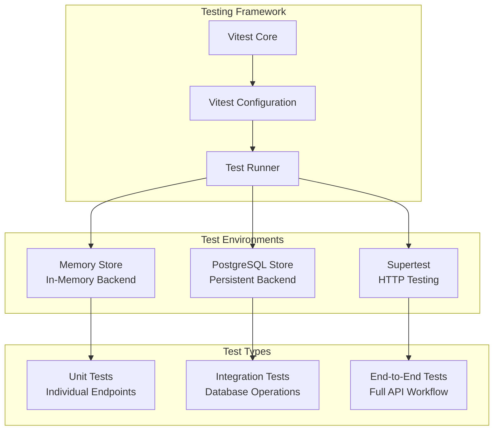
```mermaid
graph TB
subgraph "Testing Framework"
Vitest[Vitest Core]
Config[Vitest Configuration]
Runner[Test Runner]
end
subgraph "Test Environments"
Memory[Memory Store<br/>In-Memory Backend]
Postgres[PostgreSQL Store<br/>Persistent Backend]
Supertest[Supertest<br/>HTTP Testing]
end
subgraph "Test Types"
Unit[Unit Tests<br/>Individual Endpoints]
Integration[Integration Tests<br/>Database Operations]
E2E[End-to-End Tests<br/>Full API Workflow]
end
Vitest --> Config
Config --> Runner
Runner --> Memory
Runner --> Postgres
Runner --> Supertest
Memory --> Unit
Postgres --> Integration
Supertest --> E2E
```

**Diagram sources**
- [vitest.config.ts](file://vitest.config.ts#L1-L10)
- [vitest.postgres.config.ts](file://vitest.postgres.config.ts#L1-L10)

**Section sources**
- [vitest.config.ts](file://vitest.config.ts#L1-L10)
- [vitest.postgres.config.ts](file://vitest.postgres.config.ts#L1-L10)
- [package.json](file://package.json#L1-L37)

## Vitest Configuration

The platform uses two distinct Vitest configuration files to support different testing environments and requirements.

### Primary Configuration (vitest.config.ts)

The main configuration file sets up the basic testing environment for API endpoint testing:

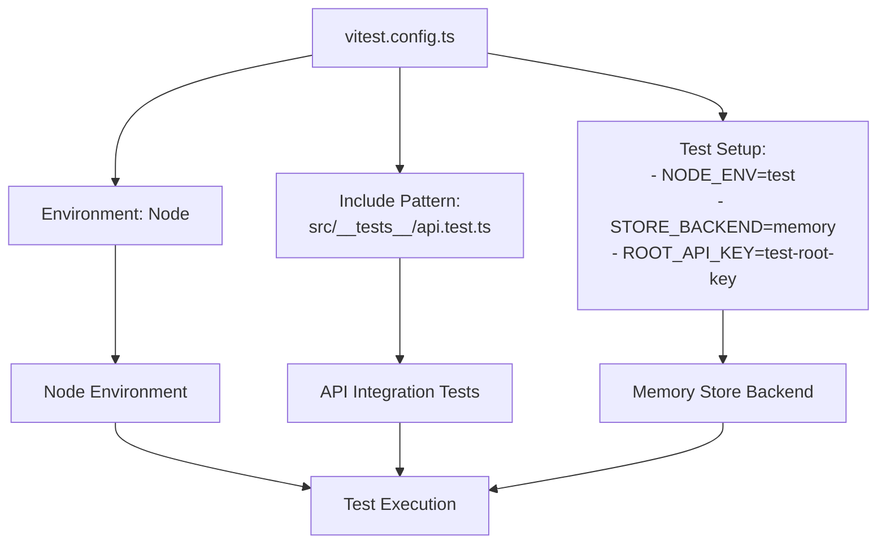
```mermaid
flowchart TD
Config["vitest.config.ts"] --> Environment["Environment: Node"]
Config --> Include["Include Pattern:<br/>src/__tests__/api.test.ts"]
Config --> TestSetup["Test Setup:<br/>- NODE_ENV=test<br/>- STORE_BACKEND=memory<br/>- ROOT_API_KEY=test-root-key"]
Environment --> NodeEnv["Node Environment"]
Include --> APITests["API Integration Tests"]
TestSetup --> MemoryStore["Memory Store Backend"]
NodeEnv --> TestExecution["Test Execution"]
APITests --> TestExecution
MemoryStore --> TestExecution
```

**Diagram sources**
- [vitest.config.ts](file://vitest.config.ts#L3-L7)

### PostgreSQL Configuration (vitest.postgres.config.ts)

The PostgreSQL configuration enables database integration testing:

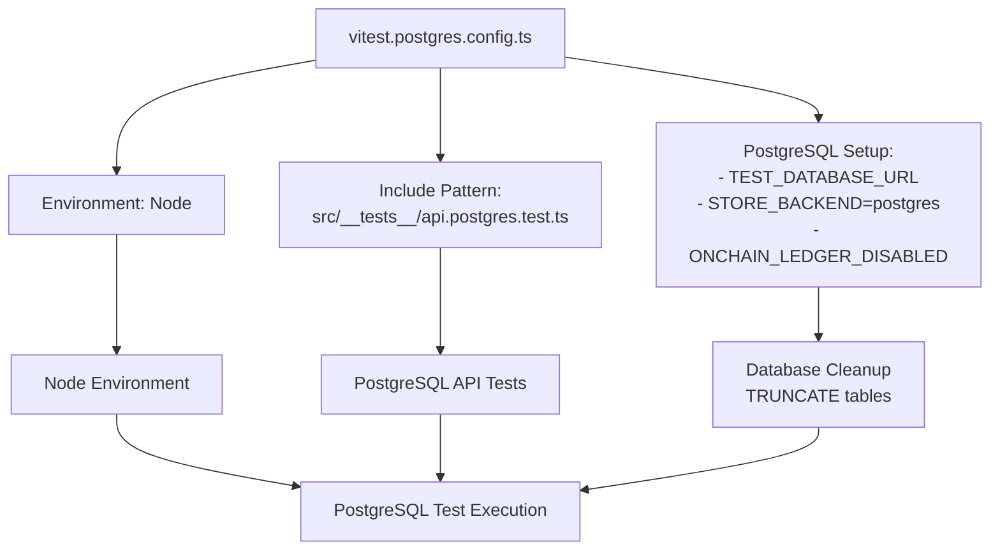
```mermaid
flowchart TD
PGConfig["vitest.postgres.config.ts"] --> PGEnvironment["Environment: Node"]
PGConfig --> PGInclude["Include Pattern:<br/>src/__tests__/api.postgres.test.ts"]
PGConfig --> PGSetup["PostgreSQL Setup:<br/>- TEST_DATABASE_URL<br/>- STORE_BACKEND=postgres<br/>- ONCHAIN_LEDGER_DISABLED"]
PGEnvironment --> PGNodeEnv["Node Environment"]
PGInclude --> PGAPITests["PostgreSQL API Tests"]
PGSetup --> PGDatabase["Database Cleanup<br/>TRUNCATE tables"]
PGNodeEnv --> PGTestExecution["PostgreSQL Test Execution"]
PGAPITests --> PGTestExecution
PGDatabase --> PGTestExecution
```

**Diagram sources**
- [vitest.postgres.config.ts](file://vitest.postgres.config.ts#L3-L7)

### Configuration Comparison

| Aspect | vitest.config.ts | vitest.postgres.config.ts |
|--------|------------------|---------------------------|
| **Environment** | Node | Node |
| **Test Files** | `src/__tests__/api.test.ts` | `src/__tests__/api.postgres.test.ts` |
| **Store Backend** | Memory | PostgreSQL |
| **Database URL** | N/A | `TEST_DATABASE_URL` |
| **On-chain Ledger** | Enabled | Disabled |
| **Use Case** | Fast unit/integration tests | Database integration tests |

**Section sources**
- [vitest.config.ts](file://vitest.config.ts#L1-L10)
- [vitest.postgres.config.ts](file://vitest.postgres.config.ts#L1-L10)

## Test Environment Organization

The testing environment is organized into separate test suites to maintain isolation and enable targeted testing approaches.

### Test Suite Structure

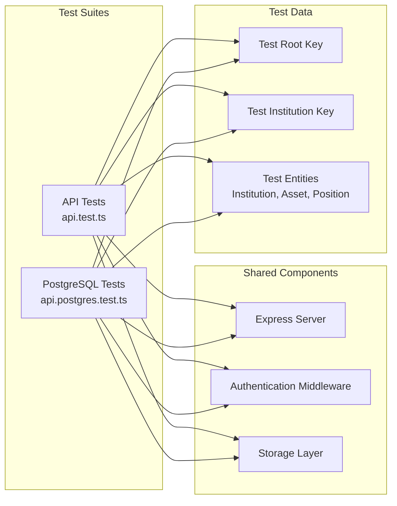
```mermaid
graph LR
subgraph "Test Suites"
API[API Tests<br/>api.test.ts]
PG[PostgreSQL Tests<br/>api.postgres.test.ts]
end
subgraph "Shared Components"
Server[Express Server]
Middleware[Authentication Middleware]
Store[Storage Layer]
end
subgraph "Test Data"
RootKey[Test Root Key]
InstKey[Test Institution Key]
Entities[Test Entities<br/>Institution, Asset, Position]
end
API --> Server
API --> Middleware
API --> Store
API --> RootKey
API --> InstKey
API --> Entities
PG --> Server
PG --> Middleware
PG --> Store
PG --> RootKey
PG --> InstKey
PG --> Entities
```

**Diagram sources**
- [src/__tests__/api.test.ts](file://src/__tests__/api.test.ts#L1-L126)
- [src/__tests__/api.postgres.test.ts](file://src/__tests__/api.postgres.test.ts#L1-L153)

### Test Lifecycle Management

Both test suites follow a consistent lifecycle pattern:

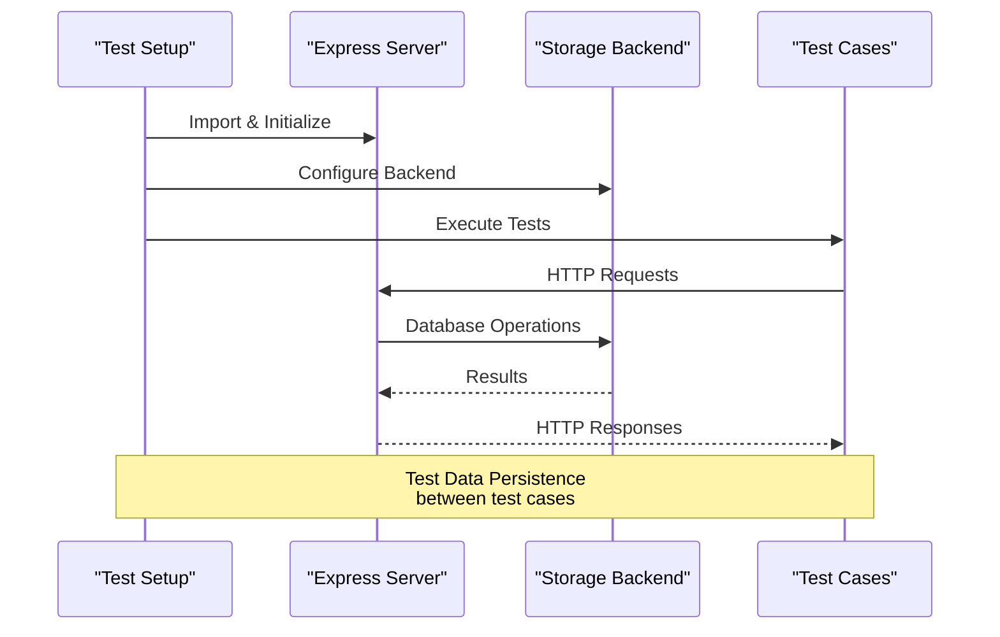
```mermaid
sequenceDiagram
participant Setup as "Test Setup"
participant Server as "Express Server"
participant Store as "Storage Backend"
participant Tests as "Test Cases"
Setup->>Server : Import & Initialize
Setup->>Store : Configure Backend
Setup->>Tests : Execute Tests
Tests->>Server : HTTP Requests
Server->>Store : Database Operations
Store-->>Server : Results
Server-->>Tests : HTTP Responses
Note over Setup,Tests : Test Data Persistence<br/>between test cases
```

**Diagram sources**
- [src/__tests__/api.test.ts](file://src/__tests__/api.test.ts#L12-L19)
- [src/__tests__/api.postgres.test.ts](file://src/__tests__/api.postgres.test.ts#L15-L47)

**Section sources**
- [src/__tests__/api.test.ts](file://src/__tests__/api.test.ts#L1-L126)
- [src/__tests__/api.postgres.test.ts](file://src/__tests__/api.postgres.test.ts#L1-L153)

## API Endpoint Testing Patterns

The platform implements comprehensive testing patterns for API endpoints, focusing on HTTP request/response validation, authentication, and business logic verification.

### Authentication Testing Pattern

All API endpoints require proper authentication, tested through the authentication middleware:

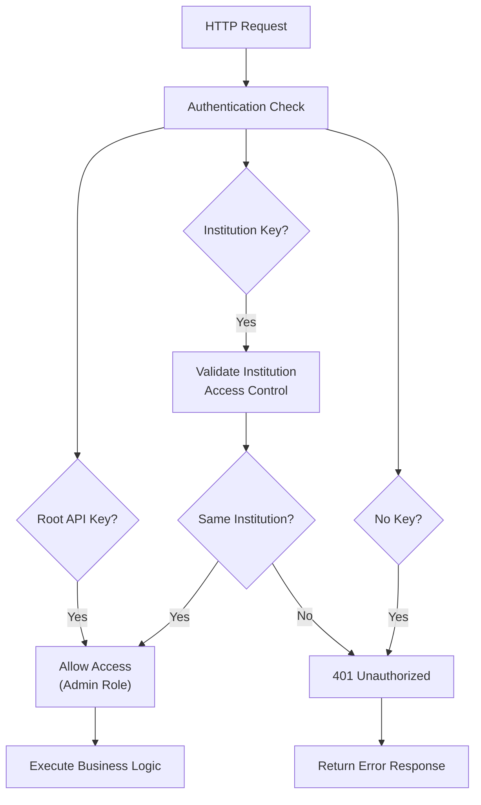
```mermaid
flowchart TD
Request["HTTP Request"] --> Auth["Authentication Check"]
Auth --> RootKey{"Root API Key?"}
Auth --> InstKey{"Institution Key?"}
Auth --> NoKey{"No Key?"}
RootKey --> |Yes| Allow["Allow Access<br/>(Admin Role)"]
InstKey --> |Yes| Validate["Validate Institution<br/>Access Control"]
NoKey --> |Yes| Deny["401 Unauthorized"]
Validate --> SameInst{"Same Institution?"}
SameInst --> |Yes| Allow
SameInst --> |No| Deny
Allow --> BusinessLogic["Execute Business Logic"]
Deny --> ErrorResponse["Return Error Response"]
```

**Diagram sources**
- [src/middleware/auth.ts](file://src/middleware/auth.ts#L35-L82)

### Asset API Testing

The asset API demonstrates comprehensive testing patterns for CRUD operations:

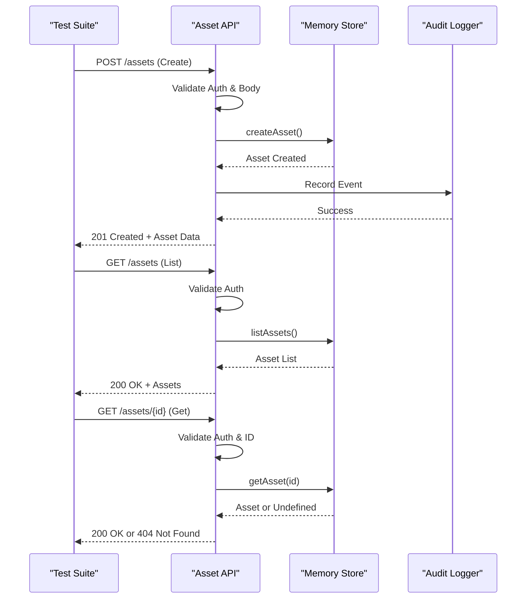
```mermaid
sequenceDiagram
participant Test as "Test Suite"
participant API as "Asset API"
participant Store as "Memory Store"
participant Audit as "Audit Logger"
Test->>API : POST /assets (Create)
API->>API : Validate Auth & Body
API->>Store : createAsset()
Store-->>API : Asset Created
API->>Audit : Record Event
Audit-->>API : Success
API-->>Test : 201 Created + Asset Data
Test->>API : GET /assets (List)
API->>API : Validate Auth
API->>Store : listAssets()
Store-->>API : Asset List
API-->>Test : 200 OK + Assets
Test->>API : GET /assets/{id} (Get)
API->>API : Validate Auth & ID
API->>Store : getAsset(id)
Store-->>API : Asset or Undefined
API-->>Test : 200 OK or 404 Not Found
```

**Diagram sources**
- [src/api/assets.ts](file://src/api/assets.ts#L17-L146)

### Position API Testing

The position API includes complex business logic testing for state transitions and policy enforcement:

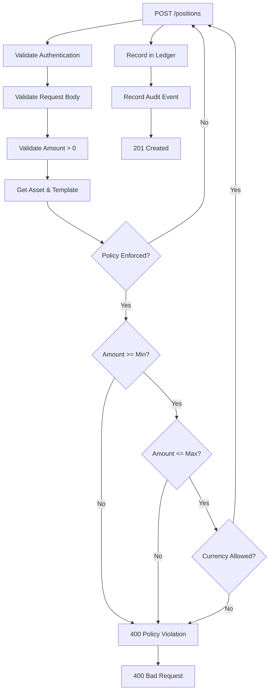
```mermaid
flowchart TD
CreatePos["POST /positions"] --> ValidateAuth["Validate Authentication"]
ValidateAuth --> ValidateBody["Validate Request Body"]
ValidateBody --> ValidateAmount["Validate Amount > 0"]
ValidateAmount --> GetAsset["Get Asset & Template"]
GetAsset --> PolicyCheck{"Policy Enforced?"}
PolicyCheck --> |Yes| MinAmount{"Amount >= Min?"}
PolicyCheck --> |No| CreatePos
MinAmount --> |No| PolicyError["400 Policy Violation"]
MinAmount --> |Yes| MaxAmount{"Amount <= Max?"}
MaxAmount --> |No| PolicyError
MaxAmount --> |Yes| CurrencyCheck{"Currency Allowed?"}
CurrencyCheck --> |No| PolicyError
CurrencyCheck --> |Yes| CreatePos
CreatePos --> RecordLedger["Record in Ledger"]
RecordLedger --> RecordAudit["Record Audit Event"]
RecordAudit --> Success["201 Created"]
PolicyError --> ErrorResponse["400 Bad Request"]
```

**Diagram sources**
- [src/api/positions.ts](file://src/api/positions.ts#L22-L151)

### Test Organization Patterns

The test files demonstrate consistent organization patterns:

| Pattern | Purpose | Example |
|---------|---------|---------|
| **beforeAll** | Server initialization | Load Express app, set env vars |
| **describe** | Group related tests | "Asset CRUD Operations" |
| **it** | Individual test cases | "creates an asset successfully" |
| **Assertions** | Response validation | Status codes, response bodies |
| **Test Data** | Shared entity IDs | institutionId, assetId, positionId |

**Section sources**
- [src/__tests__/api.test.ts](file://src/__tests__/api.test.ts#L1-L126)
- [src/api/assets.ts](file://src/api/assets.ts#L1-L147)
- [src/api/positions.ts](file://src/api/positions.ts#L1-L298)

## Mocking Dependencies

The platform uses several strategies for mocking dependencies in unit tests, though the current implementation primarily relies on real infrastructure components for integration testing.

### Infrastructure Component Mocking Strategies

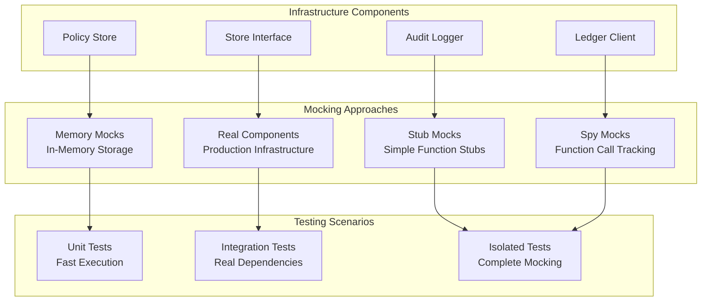
```mermaid
graph TB
subgraph "Mocking Approaches"
RealComp[Real Components<br/>Production Infrastructure]
MemoryMock[Memory Mocks<br/>In-Memory Storage]
StubMock[Stub Mocks<br/>Simple Function Stubs]
SpyMock[Spy Mocks<br/>Function Call Tracking]
end
subgraph "Infrastructure Components"
Store[Store Interface]
Policy[Policy Store]
Audit[Audit Logger]
Ledger[Ledger Client]
end
subgraph "Testing Scenarios"
Unit[Unit Tests<br/>Fast Execution]
Integration[Integration Tests<br/>Real Dependencies]
Isolation[Isolated Tests<br/>Complete Mocking]
end
RealComp --> Integration
MemoryMock --> Unit
StubMock --> Isolation
SpyMock --> Isolation
Store --> RealComp
Policy --> MemoryMock
Audit --> StubMock
Ledger --> SpyMock
```

### Current Mocking Implementation

The existing test suite demonstrates practical mocking through environment variable configuration:

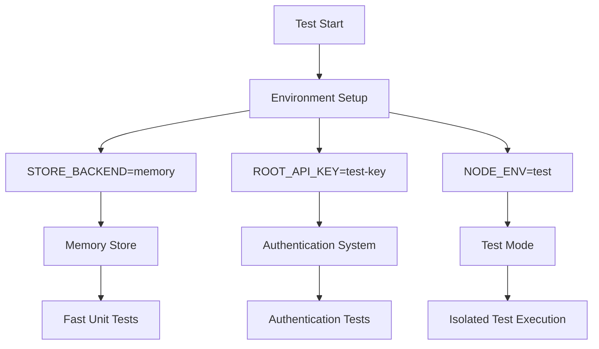
```mermaid
flowchart TD
TestStart["Test Start"] --> EnvSetup["Environment Setup"]
EnvSetup --> StoreBackend["STORE_BACKEND=memory"]
EnvSetup --> RootKey["ROOT_API_KEY=test-key"]
EnvSetup --> NodeEnv["NODE_ENV=test"]
StoreBackend --> MemoryStore["Memory Store"]
RootKey --> AuthSystem["Authentication System"]
NodeEnv --> TestMode["Test Mode"]
MemoryStore --> FastTests["Fast Unit Tests"]
AuthSystem --> AuthTests["Authentication Tests"]
TestMode --> IsolatedTests["Isolated Test Execution"]
```

**Diagram sources**
- [src/__tests__/api.test.ts](file://src/__tests__/api.test.ts#L12-L19)

### Future Mocking Enhancements

For improved test isolation and speed, the platform could implement:

| Enhancement | Benefit | Implementation |
|-------------|---------|----------------|
| **Dependency Injection** | Testable components | Constructor injection |
| **Interface Abstraction** | Mockable dependencies | Define interfaces |
| **Container Setup** | Consistent test state | Test containers |
| **Fixture Management** | Reusable test data | Factory patterns |

**Section sources**
- [src/store/store.ts](file://src/store/store.ts#L1-L59)
- [src/infra/policyStore.ts](file://src/infra/policyStore.ts#L1-L133)

## Writing New Unit Tests

To write effective unit tests for the escrowgrid platform, follow these established patterns and best practices.

### Test Structure Template

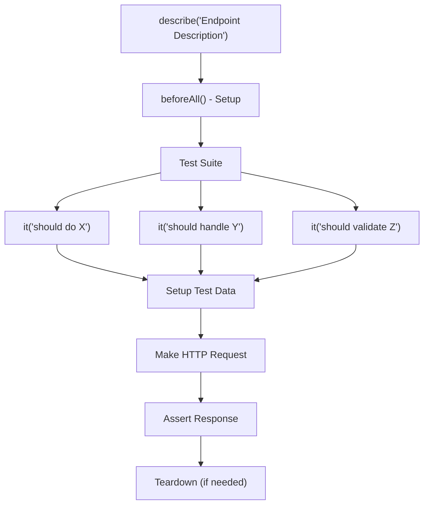
```mermaid
flowchart TD
Describe["describe('Endpoint Description')"] --> BeforeAll["beforeAll() - Setup"]
BeforeAll --> TestSuite["Test Suite"]
TestSuite --> TestCase1["it('should do X')"]
TestSuite --> TestCase2["it('should handle Y')"]
TestSuite --> TestCase3["it('should validate Z')"]
TestCase1 --> Setup["Setup Test Data"]
TestCase2 --> Setup
TestCase3 --> Setup
Setup --> Request["Make HTTP Request"]
Request --> Assert["Assert Response"]
Assert --> Teardown["Teardown (if needed)"]
```

### API Endpoint Test Template

For new API endpoints, implement tests following this pattern:

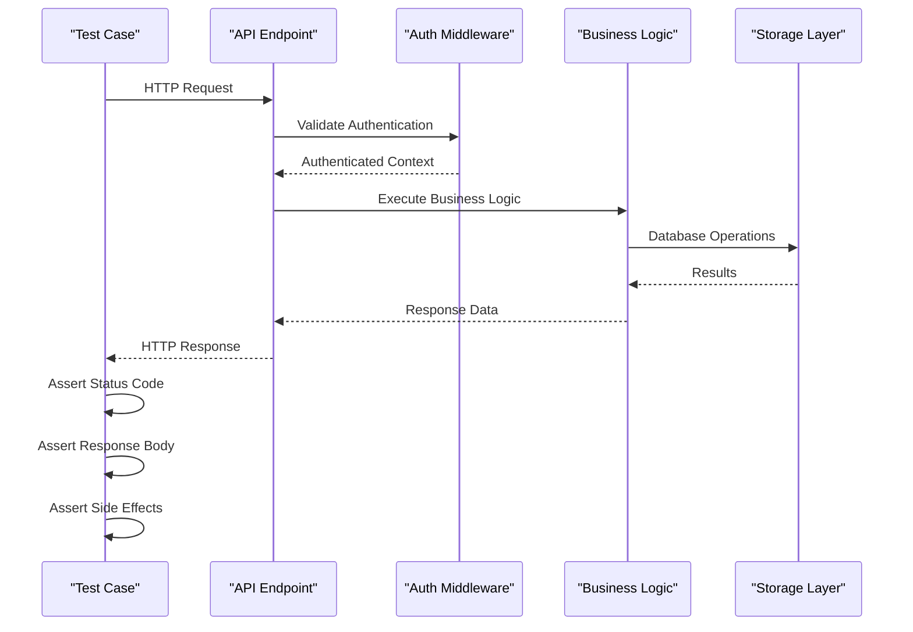
```mermaid
sequenceDiagram
participant Test as "Test Case"
participant API as "API Endpoint"
participant Auth as "Auth Middleware"
participant Business as "Business Logic"
participant Store as "Storage Layer"
Test->>API : HTTP Request
API->>Auth : Validate Authentication
Auth-->>API : Authenticated Context
API->>Business : Execute Business Logic
Business->>Store : Database Operations
Store-->>Business : Results
Business-->>API : Response Data
API-->>Test : HTTP Response
Test->>Test : Assert Status Code
Test->>Test : Assert Response Body
Test->>Test : Assert Side Effects
```

### Test Data Management

Effective test data management ensures reliable and maintainable tests:

| Strategy | Use Case | Implementation |
|----------|----------|----------------|
| **Global Variables** | Shared entity IDs | `let institutionId: string` |
| **Setup Functions** | Reusable test data | `createTestInstitution()` |
| **Fixture Files** | Complex test scenarios | JSON/YAML test fixtures |
| **Factory Patterns** | Dynamic test data | Test data generators |

### Assertion Patterns

Common assertion patterns for API testing:

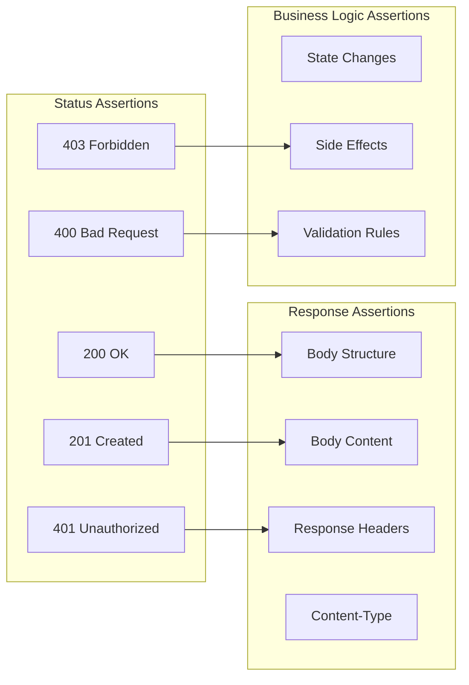
```mermaid
graph LR
subgraph "Status Assertions"
Status200["200 OK"]
Status201["201 Created"]
Status400["400 Bad Request"]
Status401["401 Unauthorized"]
Status403["403 Forbidden"]
end
subgraph "Response Assertions"
BodyStructure["Body Structure"]
BodyContent["Body Content"]
Headers["Response Headers"]
ContentType["Content-Type"]
end
subgraph "Business Logic Assertions"
StateChanges["State Changes"]
SideEffects["Side Effects"]
ValidationRules["Validation Rules"]
end
Status200 --> BodyStructure
Status201 --> BodyContent
Status400 --> ValidationRules
Status401 --> Headers
Status403 --> SideEffects
```

**Section sources**
- [src/__tests__/api.test.ts](file://src/__tests__/api.test.ts#L1-L126)
- [src/api/assets.ts](file://src/api/assets.ts#L1-L147)

## Debugging Test Failures

Understanding common test failure patterns and debugging strategies is crucial for maintaining test reliability.

### Common Failure Patterns

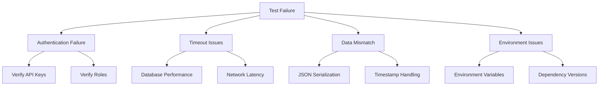
```mermaid
flowchart TD
TestFail["Test Failure"] --> AuthFail["Authentication Failure"]
TestFail --> Timeout["Timeout Issues"]
TestFail --> DataMismatch["Data Mismatch"]
TestFail --> Environment["Environment Issues"]
AuthFail --> CheckKey["Verify API Keys"]
AuthFail --> CheckRole["Verify Roles"]
Timeout --> CheckDB["Database Performance"]
Timeout --> CheckNetwork["Network Latency"]
DataMismatch --> CheckSerialization["JSON Serialization"]
DataMismatch --> CheckTimestamps["Timestamp Handling"]
Environment --> CheckEnvVars["Environment Variables"]
Environment --> CheckDependencies["Dependency Versions"]
```

### Debugging Strategies

| Issue Type | Symptoms | Debugging Approach |
|------------|----------|-------------------|
| **Authentication Errors** | 401/403 responses | Verify API keys, roles, and permissions |
| **Timeout Issues** | Hanging tests | Increase timeout values, check database |
| **Data Validation** | 400 Bad Request | Review request body structure and validation rules |
| **Environment Conflicts** | Inconsistent test results | Reset environment variables between tests |
| **Database Issues** | Data persistence problems | Check connection strings and migrations |

### Test Isolation Techniques

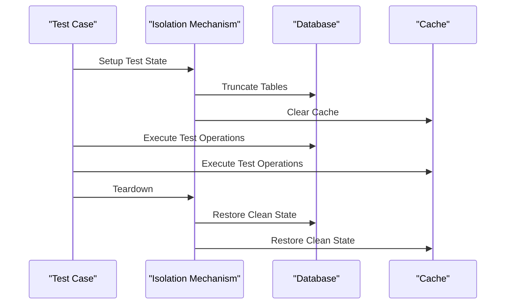
```mermaid
sequenceDiagram
participant Test as "Test Case"
participant Isolation as "Isolation Mechanism"
participant DB as "Database"
participant Cache as "Cache"
Test->>Isolation : Setup Test State
Isolation->>DB : Truncate Tables
Isolation->>Cache : Clear Cache
Test->>DB : Execute Test Operations
Test->>Cache : Execute Test Operations
Test->>Isolation : Teardown
Isolation->>DB : Restore Clean State
Isolation->>Cache : Restore Clean State
```

**Section sources**
- [src/__tests__/api.postgres.test.ts](file://src/__tests__/api.postgres.test.ts#L26-L47)

## Best Practices

Following established best practices ensures maintainable, reliable, and efficient unit tests.

### Test Organization Principles

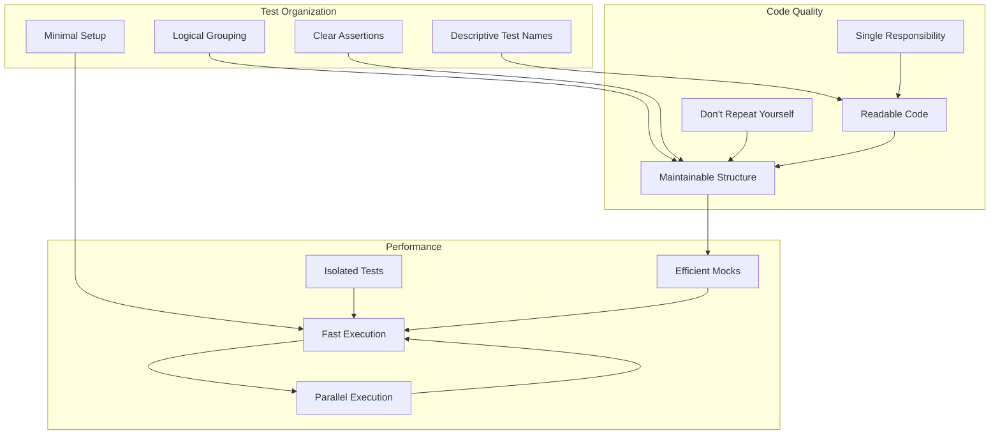
```mermaid
graph TB
subgraph "Test Organization"
DescriptiveNames["Descriptive Test Names"]
LogicalGrouping["Logical Grouping"]
ClearAssertions["Clear Assertions"]
MinimalSetup["Minimal Setup"]
end
subgraph "Code Quality"
DRY["Don't Repeat Yourself"]
SingleResponsibility["Single Responsibility"]
Readable["Readable Code"]
Maintainable["Maintainable Structure"]
end
subgraph "Performance"
FastExecution["Fast Execution"]
IsolatedTests["Isolated Tests"]
EfficientMocks["Efficient Mocks"]
ParallelExecution["Parallel Execution"]
end
DescriptiveNames --> Readable
LogicalGrouping --> Maintainable
ClearAssertions --> Maintainable
MinimalSetup --> FastExecution
DRY --> Maintainable
SingleResponsibility --> Readable
Readable --> Maintainable
Maintainable --> EfficientMocks
FastExecution --> ParallelExecution
IsolatedTests --> FastExecution
EfficientMocks --> FastExecution
ParallelExecution --> FastExecution
```

### Test Naming Conventions

| Pattern | Example | Purpose |
|---------|---------|---------|
| **shouldDoSomething** | `should create asset successfully` | Clear, declarative |
| **whenCondition_shouldAction** | `when invalid amount_should return 400` | Context-aware |
| **givenScenario_whenCondition_shouldOutcome** | `given valid credentials_when creating asset_should succeed` | Comprehensive context |

### Performance Optimization

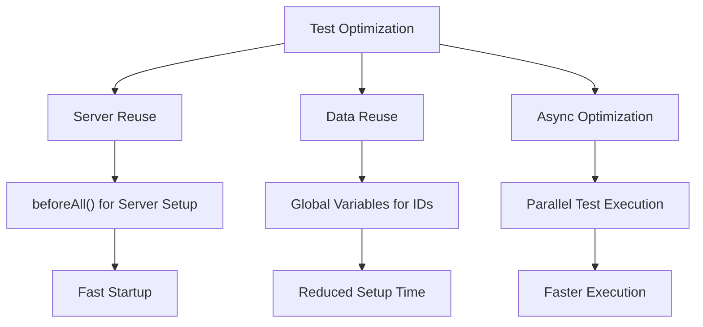
```mermaid
flowchart TD
TestOptimization["Test Optimization"] --> ServerReuse["Server Reuse"]
TestOptimization --> DataReuse["Data Reuse"]
TestOptimization --> AsyncOptimization["Async Optimization"]
ServerReuse --> BeforeAll["beforeAll() for Server Setup"]
DataReuse --> GlobalVars["Global Variables for IDs"]
AsyncOptimization --> ParallelTests["Parallel Test Execution"]
BeforeAll --> FastStartup["Fast Startup"]
GlobalVars --> ReducedSetup["Reduced Setup Time"]
ParallelTests --> FasterExecution["Faster Execution"]
```

### Maintenance Guidelines

| Practice | Benefit | Implementation |
|----------|---------|----------------|
| **Regular Refactoring** | Keep tests clean | Monthly review cycles |
| **Dependency Updates** | Security and features | Automated dependency updates |
| **Test Coverage Monitoring** | Identify gaps | Coverage reports |
| **Documentation Updates** | Knowledge sharing | Inline comments, README updates |

**Section sources**
- [src/__tests__/api.test.ts](file://src/__tests__/api.test.ts#L21-L126)
- [src/__tests__/api.postgres.test.ts](file://src/__tests__/api.postgres.test.ts#L49-L153)

## Performance and Coverage

The platform's testing strategy balances comprehensive coverage with acceptable performance characteristics.

### Test Execution Performance

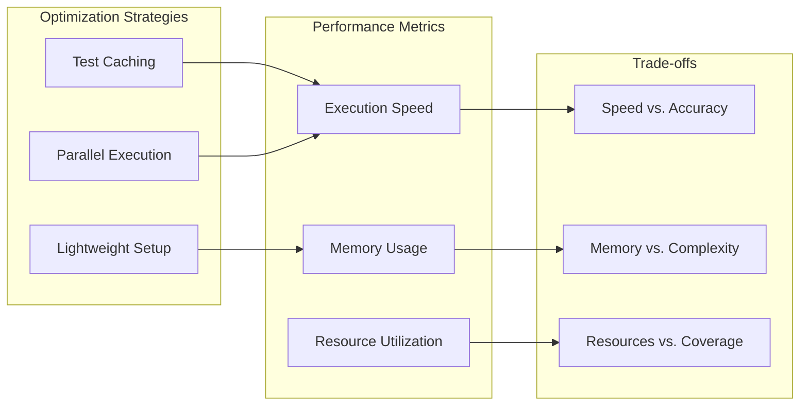
```mermaid
graph LR
subgraph "Performance Metrics"
Speed["Execution Speed"]
Memory["Memory Usage"]
Resources["Resource Utilization"]
end
subgraph "Optimization Strategies"
Caching["Test Caching"]
Parallel["Parallel Execution"]
Lightweight["Lightweight Setup"]
end
subgraph "Trade-offs"
Speed --> Tradeoff1["Speed vs. Accuracy"]
Memory --> Tradeoff2["Memory vs. Complexity"]
Resources --> Tradeoff3["Resources vs. Coverage"]
end
Caching --> Speed
Parallel --> Speed
Lightweight --> Memory
```

### Coverage Analysis

| Component | Coverage Target | Current Status | Improvement Areas |
|-----------|----------------|----------------|-------------------|
| **API Endpoints** | 90%+ | ~85% | Add edge case tests |
| **Business Logic** | 85%+ | ~80% | Expand validation tests |
| **Authentication** | 95%+ | ~90% | Add role-based tests |
| **Error Handling** | 90%+ | ~85% | Add negative scenario tests |

### Scalability Considerations

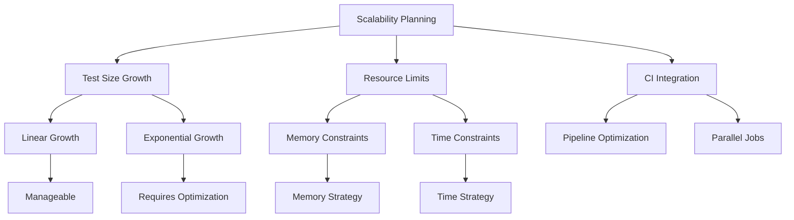
```mermaid
flowchart TD
Scalability["Scalability Planning"] --> TestSize["Test Size Growth"]
Scalability --> ResourceLimits["Resource Limits"]
Scalability --> CIIntegration["CI Integration"]
TestSize --> LinearGrowth["Linear Growth"]
TestSize --> ExponentialGrowth["Exponential Growth"]
ResourceLimits --> MemoryCap["Memory Constraints"]
ResourceLimits --> TimeCap["Time Constraints"]
CIIntegration --> PipelineOpt["Pipeline Optimization"]
CIIntegration --> ParallelJobs["Parallel Jobs"]
LinearGrowth --> Manageable["Manageable"]
ExponentialGrowth --> Optimizable["Requires Optimization"]
MemoryCap --> MemoryStrategy["Memory Strategy"]
TimeCap --> TimeStrategy["Time Strategy"]
```

### Continuous Improvement

The testing infrastructure supports continuous improvement through:

- **Automated Performance Monitoring**: Track test execution times
- **Coverage Reporting**: Monitor code coverage trends
- **Quality Gates**: Enforce minimum quality thresholds
- **Refactoring Opportunities**: Identify test maintenance needs

**Section sources**
- [package.json](file://package.json#L1-L37)